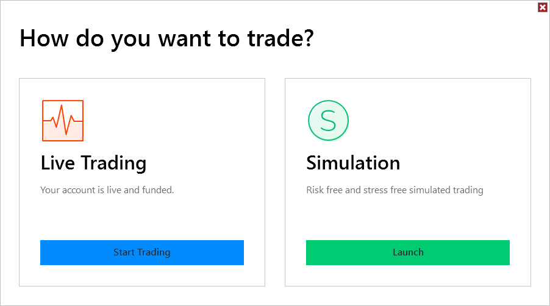

# Trading Mode

After Log In you will be presented with the Trading Mode window.

## Live Trading

The Live Trading section will display the current state of your live account. If your account is live and funded, you can select Start Trading to connect.

## Simulation

The Simulation section will display the current start of your simulation account. If your account is active your can select Launch to connect.

> **Note:** If Multi-provider is enabled the Trading Mode screen will be skipped. You can then select what to connect to under the Connections menu of the Control Center.
