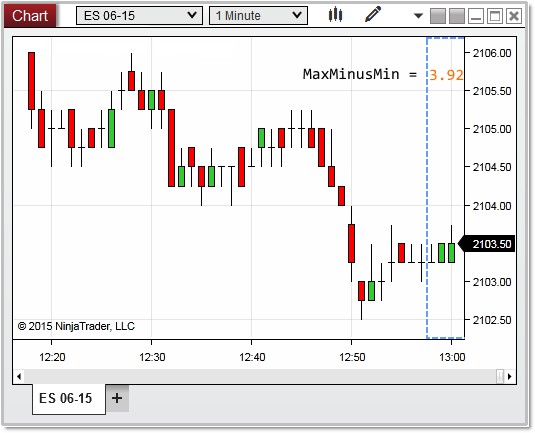

# MaxMinusMin

## Definition

The difference between the chart scale's [MaxValue](chartscale_maxvalue.md) and [MinValue](chartscale_minvalue.md) represented as a y value.

## Property Value

A double value representing the difference in scale as a y value.

## Syntax

<chartScale>.MaxMinusMin

## Examples


```csharp
protected override void OnRender(ChartControl chartControl, ChartScale chartScale)
{
    // the difference between the scales maximum and minimum value
    double
    maxMinusMin = chartScale.MaxMinusMin;
    Print("maxMinusMin: " + maxMinusMin); // maxMinusMin: 3.92
}
```

 

 

In the image below, the highest calculated value on the chart scale is 2106.21, with the lowest value being 2102.29;  the MaxMinusMin property therefore provides us calculated value of 3.92.

