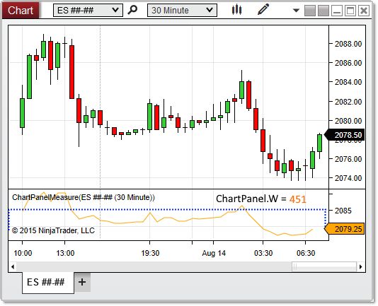

# W (Width)

## Definition

Indicates the width (in pixels) of the paintable area of the chart panel.

> **Note:** The paintable area does not extend all the way to the right edge of the panel itself, as seen in the image below.

## Property Value

A int representing the width of the panel in pixels

## Syntax

ChartPanel.W

## Example


```csharp
protected override void OnRender(ChartControl chartControl, ChartScale chartScale)
{
    base.OnRender(chartControl, chartScale);
    // Print the width of the panel
    Print(ChartPanel.W);
}
```

 

 

Based on the image below, W reveals that the chart panel is 451 pixels wide.

 

