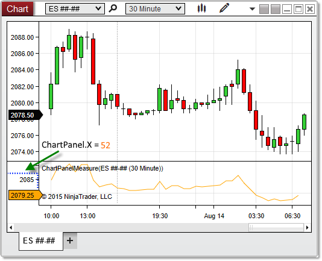

# X (Coordinate)

## Definition

Indicates the x-coordinate on the chart canvas at which the chart panel begins.

## Property Value

A int representing the x-coordinate at which the panel begins. This property will only contain a value greater than zero if the y-axis displays to the left of the paintable chart canvas area in the panel (if an object in the panel is using the "Left" scale justification).

## Syntax

ChartPanel.X

## Example

```csharp
protected override void OnRender(ChartControl chartControl, ChartScale chartScale)
{
    base.OnRender(chartControl, chartScale);
    // Print the coordinates of the top-left corner of the panel
    Print(String.Format("The panel begins at coordinates {0},{1}",ChartPanel.X ,ChartPanel.Y));
}
```

 

 

Based on the image below, X reveals that the chart panel begins at x-coordinate 52.

 


