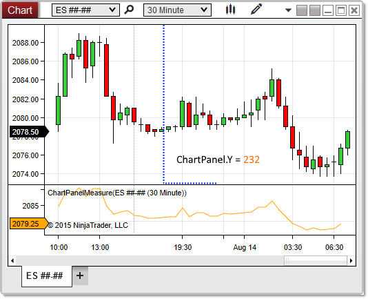

# Y (Coordinate)

## Definition

Indicates the y-coordinate on the chart canvas at which the chart panel begins.

## Property Value

A int representing the y-coordinate at which the panel begins.

## Syntax

ChartPanel.Y

## Example

```csharp
protected override void OnRender(ChartControl chartControl, ChartScale chartScale)
{
    base.OnRender(chartControl, chartScale);
    // Print the coordinates of the top-left corner of the panel
    Print(String.Format("The panel begins at coordinates {0},{1}",ChartPanel.X ,ChartPanel.Y));
}
```

 

 

Based on the image below, Y reveals that the chart panel begins at y-coordinate 232.

 


