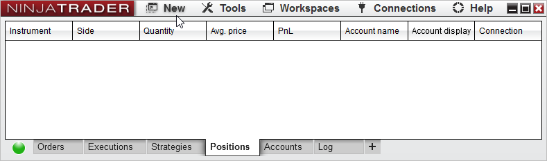
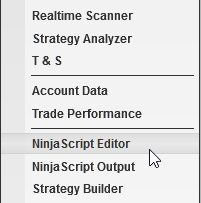
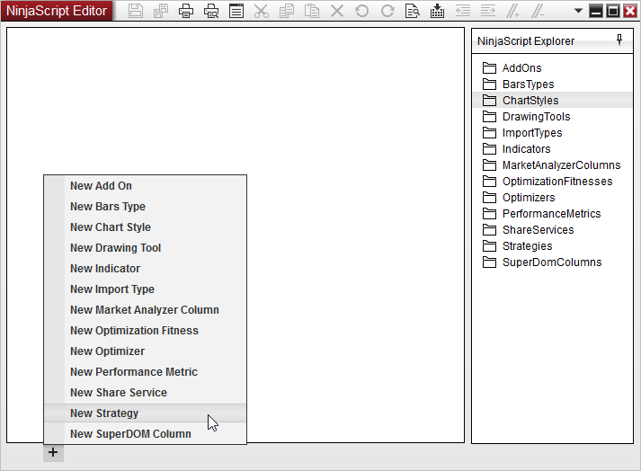
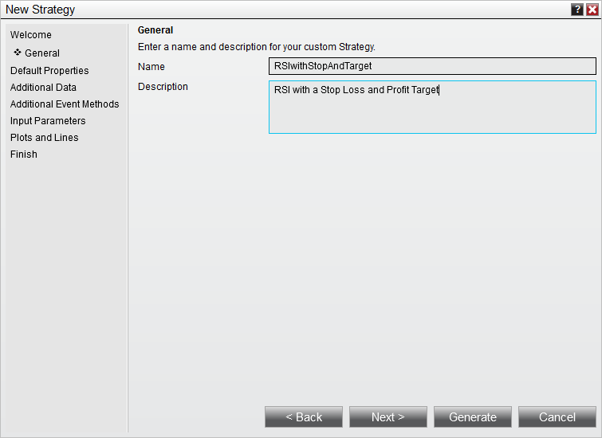
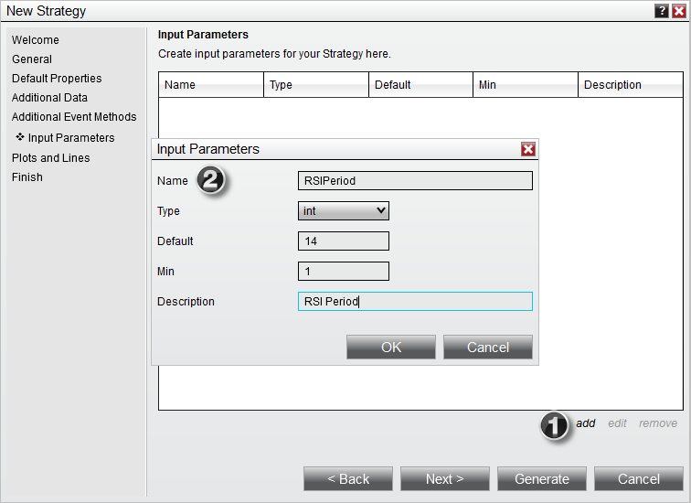
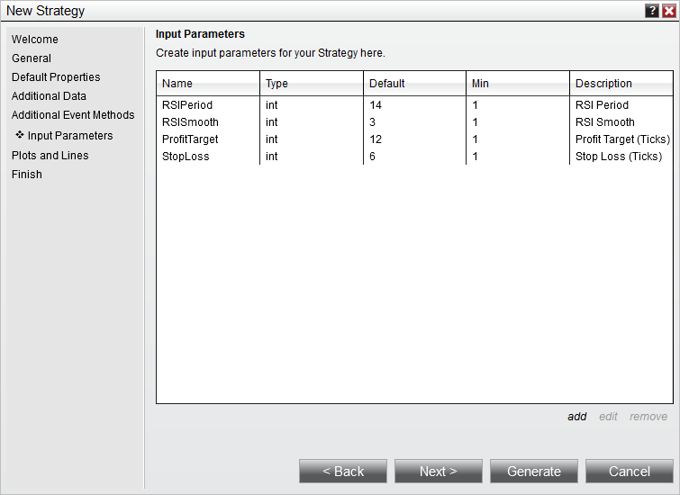

# Set Up

Our first tutorial covered using the [[[Strategy Builder](../strategies/strategy_builder.md) to create simple NinjaScript strategies or to build the framework needed for a more complex strategy.

This tutorial will cover another approach, using the NinjaScript [[[Editor](editor.md) and [[[New Strategy Wizard](ns_wizard.md).

1. Within the NinjaTrader Control Center window select the New NinjaScript  Editor... menu item

2. Click the "+" tab in the lower left, and select New Strategy to open a New Strategy Wizard

3. Enter the information as shown below

4. Press the "Next >" button until we are at the Inputs and Parameters page

## Defining Input Parameters

Below you will define your strategy's input parameters. These are any input parameters that can be changed by the user when running or backtesting a strategy. If your strategy does not require any parameters leave the "Name" fields blank.

5. Click the add button to create a User Input Parameter (See item 1 in the screenshot below)

6. Fill out the Input Parameters window and click OK to create the input parameter (See item 2 in the screenshot below)

7. Add the inputs as per the image below

8. Press the "Generate" button to generate the code in the NinjaScript Editor.

You are now ready to continue to the [[[Entering Strategy Logic](../strategies/entering_strategy_logic.md) page of this tutorial.
