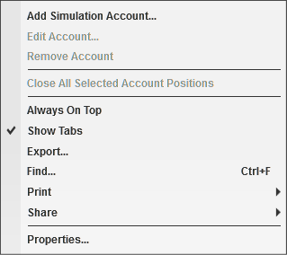
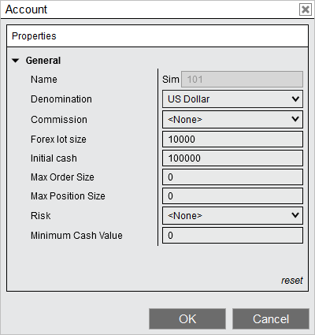
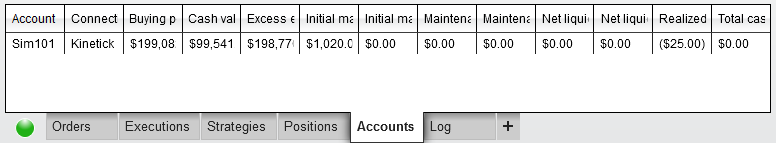
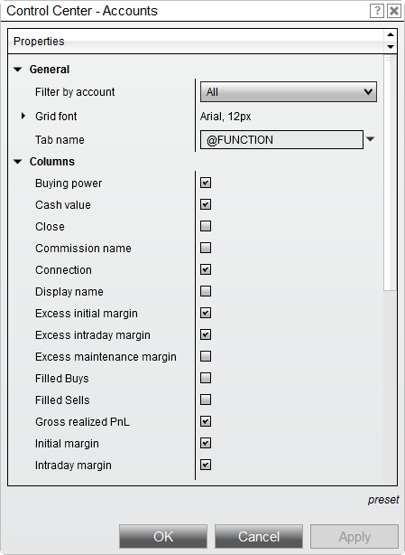

# Accounts Tab

The Accounts tab displays current account information in a [data grid](data_grids.md). The account values that are displayed is dependent on your connectivity provider. Not all connectivity providers transmit complete account data.

> playVideo

## Understanding the accounts tab

Understanding the Accounts Tab ControlCenter_AccountsGrid    Columns can be re-ordered and re-sized at will, and individual columns can be enabled or disabled via the Accounts grid by default:

---

---

Connection

The connection through which the account is accessed

Display Name

The account's Display Name

Buying Power

The account's buying power, taking margin into account

Cash Value

The cash value of the account

Excess Intraday Margin

Available (unused) intraday margin on the account

Excess Initial Margin

Available (unused) initial margin on the account

Intraday Margin

The margin enforced for positions held intraday

Initial Margin

The percentage of the purchase price that must be covered by the account's cash value

Maintenance Margin

The minimum amount of cash that must be maintained in the account

Excess Maintenance Margin

The cash value of the account above the Maintenance Margin value

Net Liquidation

The total worth of the account's assets (including margin)

Gross Realized PnL

Realized profit or loss before commissions have been subtracted

Realized PnL

Realized profit or loss after commissions have been subtracted

The following additional columns can be applied through the grid's Properties window:

---

---

Close

Contains a button which will allow you to close the position

Commission Name

The name of the Commission Template applied to the account

Daily loss limit

The percentage of the daily loss limit that has been reached

Daily profit trigger

The percentage of the daily profit trigger that has been reached

Filled Buys

The number of Buy orders filled in the current session

Filled Sells

The number of Sell orders filled in the current session

Look Ahead Maintenance Margin

Projected maintenance margin requirement as of the next period's margin change

Name

The name of the account. This can differ from the account's Display Name

▶️

▶️

▶️

Net Liquidation by Currency

Same as Net Liquidation, but for individual currencies

Position

The quantity held in all open positions on the account

Total Cash Balance

The total cash available in the account including any debits or credits

Total Commissions

The total commissions paid in the account for the session

Total PnL

The sum of Unrealized PnL + Realized PnL

Trailing max drawdown

The remaining value of the trailing max drawdown

Unrealized PnL

Total unrealized profit or loss for open positions on the account

Weekly loss limit

The percentage of the weekly loss limit that has been reached

Weekly PnL

Profit and loss for the week

Weekly profit trigger

The percentage of the weekly profit trigger that has been reached

Working Buys

The number of unfilled Buy orders currently resting on the account

Working Sells

The number of unfilled Sell orders currently resting on the account

Right Click Menu Right mouse clicking within the positions grid section opens the following menu:    ControlCenter_Accounts_ContextMenu

---

---

Add Simulation Account

Opens the Account window to configure a new simulation account

Edit Account

Opens the Account window to edit the selected account (See the Edit Account Menu section below)

Remove Account

Note: The Sim101 account cannot be removed)

Close All Selected Account Positions

Closes all selected positions on the selected account

Always on Top

Sets the Control Center window to always be on top of other windows

Show Tabs

Used to enable or disable tabs in the Control Center

Export

Exports the grid contents to "CSV" or "Excel" file format

Find...

Search for a term in the grid

Print

Select to print either the window or the order grid area.

Share

Select to share via your share connections.

Properties...

Configure the positions grid properties

Edit Account Menu Right mouse clicking within the positions grid section then selecting Edit Account opens the following menu:    EditAccount

---

---

Name

Displays the name of the account

Denomination

\*Sets what currency to display the account values. Must be set to the currency the account is in.

Commission

Sets what commissions template to apply

Forex lot size

Sets the default order quantity for forex

Initial cash

Sets the initial cash balance for the simulation account

Max order size

Sets a limit for order size

Max position size

Sets a limit for position size

Risk

Sets what risk template to apply

Minimum cash value

Sets the minimum cash value that must be available to place an order

---

Notes:  The Playback101 account cannot be edited, it inherits its settings from the Sim101.  Adjusting the denomination requires a reconnect.  \*Some providers will always display the denomination in US Dollars.  Not all properties display for all accounts.

Account Values Supported by Provider The account values that are displayed depend upon your connectivity provider. Some connectivity providers transmit partial account data, while others do not transmit anything. Below is a table of the various account values displayed by different connectivity providers.

---

---

---

---

---

---

---

---

---

---

---

Connectivity Provider

Buying Power

Cash Value

Excess  Intraday Margin

Excess Initial Margin

Intraday Margin

Initial Margin

Net Liquidation

Realized PnL

Unrealized PnL

Total PnL

NinjaTrader

Local Simulation Accounts (values are all NinjaTrader calculated since its a simulation account)

Continuum commissions)

\*

CQG commissions)

FOREX.com

FXCM

Interactive Brokers commissions)

Rithmic commissions)

TD Ameritrade commissions)

(NinjaTrader calculated)

\*With NinjaTrader Brokerage

> :  If a commissions template is applied, some values may include commissions, locally calculated.

## Understanding Currency Conversion

## NinjaTrader will attempt to convert currency for forex and futures trades.

> :  Due to the CME FX Futures being mostly limited to US cross rates conversion will only occur to US Dollar account denomination for futures trades.

## Accounts tab properties

> 

## Accounts Tab Properties

| Name / Option | Description |
| --- | --- |
| General |  |
| Filter by account | Filters accounts display by selected account |
| Grid font | Sets the font for the accounts grid |
| Tab name | Sets the tab name |
| Columns | Sets that columns are enabled or disabled in the accounts grid. |

▶️

## How to preset property defaults

Once you have your properties set to your preference, you can left mouse click on the "save" will save these settings as the default settings used every time you open a new window/tab.

▶️

▶️

If you change your settings and later wish to go back to the original factory settings, you can left mouse click on the preset text and select the option to restore to return to the original factory settings - please note though that you cannot save a custom default to restore to.

> Using Tabs page.

