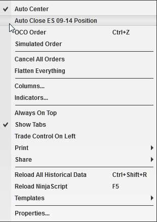

# Auto Close Position

## Automatically Closing Positions at a Specific Time

Auto Close Position is a strategy that will automatically close your position at an user defined time. A position will be closed using the NinjaTrader close algorithm. The user defined close time can be set via the "Auto  Close Position - Time" property located in the [[[Trading](../getting_started/options_trading.md) category of the [[[General Options](../getting_started/options.md) menu. You can enable or disable this strategy via any NinjaTrader order entry screen's right mouse click context menu.

