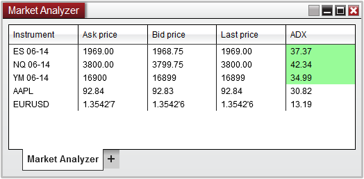
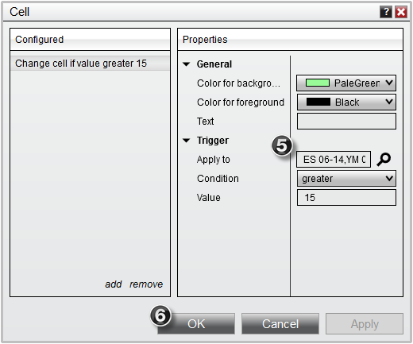
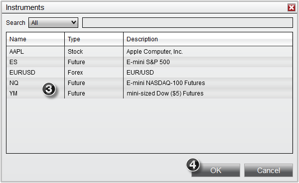
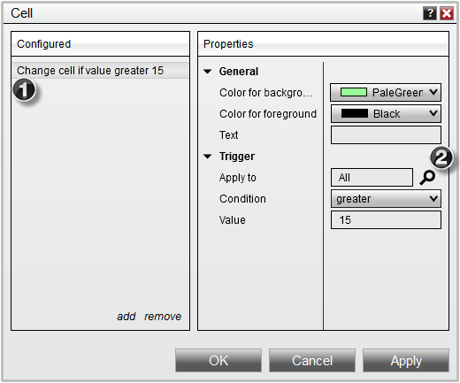
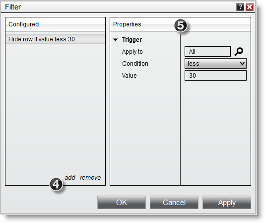
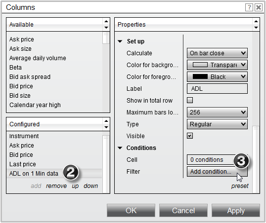
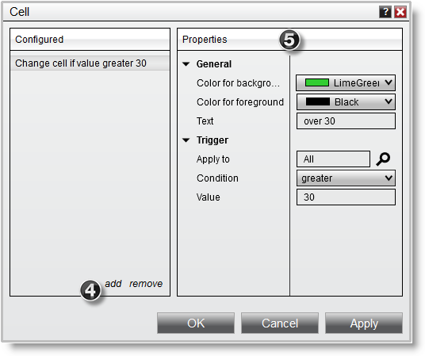
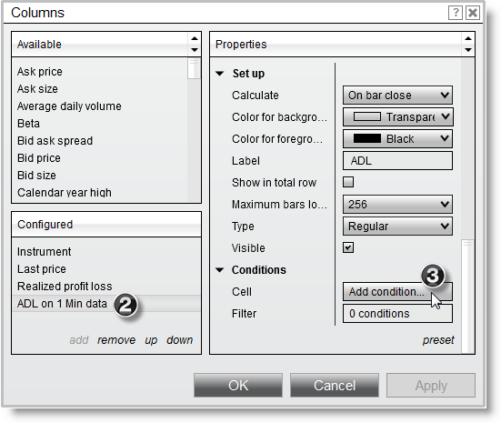
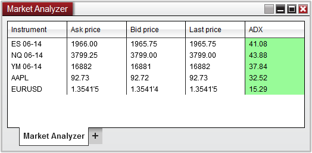

# Creating Cell and Filter Conditions

Market Analyzer columns can have cell and filter conditions applied to them for a more convenient display of information.

> Cell Conditions  Cell Conditions allow you to define the display behavior of a cell based on the cell's value, and are defined per column.  You can choose to alter both the color and text of a cell with Cell Conditions.   Creating Cell Conditions To create a Cell Condition:    1.[Open](working_with_columns.md) the Columns window  2.Select the column you would like to create a Cell Condition for in the applied column section.  3.Under the Conditions parameters section, move your mouse over the Cell field and then press the "Add condition..." button which will appear.  MarketAnalyzer_18    4.Press the Add button to add a new Cell Condition to the list of Configured conditions displayed in the left side of the Cell Conditions window  5.Set the Cell Condition properties in the right side of the Cell Conditions window    MarketAnalyzer_19    The example Cell Condition in the above image will:
- Trigger once the cell value is greater than 30
- Applies to "All" Instruments (please see the Understanding the apply to trigger section at the bottom of this page for more information)
- Display a lime green background with black text
- Display "over 30" as the text    You can remove a Cell Condition by pressing the Remove button.   Multiple Cell Conditions Cell Conditions are evaluated from top to bottom.    Assume you have the following conditions defined:    Change cell if value is greater than 30   Change cell if value is greater than 100    In this example, if the value of the cell was greater than 100, the first condition of "greater than 30" would change the cell's color since its first in the list of conditions to be evaluated. The "greater than 100" condition would never trigger in this example since "greater than 30" will always trigger the color change first. To ensure that both conditions trigger a color change so that you get the desired alerting behavior you want, you have to list the conditions in this order:    Change cell if value is greater than 100   Change cell if value is greater than 30    This will guarantee that a cell value over 100 will fall in the "greater than 100" condition and cell values between 30 and 100 will be triggered by the "greater than 30" condition.

## Understanding filter conditions

> Filter Conditions  Filter Conditions allow you to define conditions that filter out rows from the Market Analyzer grid display based on the cell's value and are defined per column.   Creating Filter Conditions To create a Filter Condition:    1.[Open](working_with_columns.md) the Columns window  2.Select the column you would like to create a Filter Condition for in the applied column section.  3.Under the Conditions parameters section, move your mouse over the Filter field and then press the "Add condition..." button which will appear.    MarketAnalyzer_20    4.Press the Add button to add a new Filter Condition to the list of Configured conditions displayed in the left side of the Filter Conditions window  5.Set the Filter Condition properties in the right side of the Filter Conditions window    MarketAnalyzer_21    The example Filter Condition in the above image will:
- Filter out the row from the Market Analyzer grid display when the cell value is less than 30
- Applies to "All" Instruments (please see the Understanding the apply to trigger section at the bottom of this page for more information)
- The row will be displayed in the Market Analyzer grid display when the cell value is greater than or equal to 30    You can remove a Filter Condition by pressing the Remove button.    To enable/disable filtering press down on your right mouse button in the Market Analyzer window and select the menu Row Filter. When enabled, the Market Analyzer will filter out rows from the grid display based on the Filter Conditions of the columns.

## Understanding the apply to trigger

| Name / Option | Description |
| --- | --- |
| Applying conditions to specific instruments When setting up Cell and Filter conditions, the default behavior is to apply these conditions to all instruments in the Market Analyzer.       MarketAnalyzer_27     However, you can optionally reconfigure these conditions to apply to instruments with specific names.  For example, if you had a Market Analyzer setup with several different instruments (as per the screen shot above), but only wanted your Cell conditions to work on only the Futures instruments, you can redefine your conditions to only include those instruments by:     1.Select your Configured condition  2.Press the Magnify glass icon next to the Apply to field    MarketAnalyzer_28    3.From the newly opened Instruments window, select the instruments you wish to apply the condition    |  | | --- | | Tip    Multi-select is supported in the Instrument window:
- To select a consecutive instruments, click the first instrument, press and hold down the Shift key, and then click the last instrument.
- To select non-consecutive instruments, press and hold down the Ctrl key, and then click each instrument that you want to select. |    4. Press OK on the Instruments window    MarketAnalyzer_29    5. Your Apply to field will now list the instrument names you selected earlier, indicating that conditions will only be triggered on instruments contained in this list.  6. Press OK Conditions window    MarketAnalyzer_30    Your Market Analyzer window will now only apply these conditions to the instruments which mach the name you configured     MarketAnalyzer_31 |

