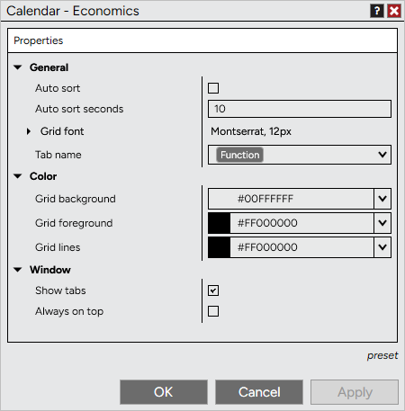

# Economics Properties



    Operations > Calendar > Economics Properties

Economics Properties

[Show/Hide Hidden Text]()

The Economics tab can be customized to your preferences in the Economics Properties window.

 

##         [How to access the Economics properties window]()

| To access the Economics Properties window, press down on your right mouse button inside the Economics tab and select the menu Properties... |
| --- |

##         [Available properties and definitions ]()

##

| General |  |
| --- | --- |
| Auto sort | Enables/Disables the automatic ranking and sorting of rows |
| Auto sort seconds | Sets the interval time in seconds between automatic resorting of rows |
| Grid font | Sets the font |
| Tab name | Sets the tab name |
| Color |  |
| Grid background | Sets the default color of the display grid background |
| Grid foreground | Sets the default color of the text in a cell |
| Window |  |
| Show tabs | Enables/Disables the tab control |
| Always on top | Enables/Disables if the window will be always on top of other windows. |

##         [How to preset property defaults]()

| Once you have your properties set to your preference, you can left mouse click on the "preset" text located in the bottom right of the properties dialog. Selecting the option "save" will save these settings as the default settings used every time you open a new window/tab.   If you change your settings and later wish to go back to the original settings, you can left mouse click on the "preset" text and select the option to "restore" to return to the original settings. |

| --- |
