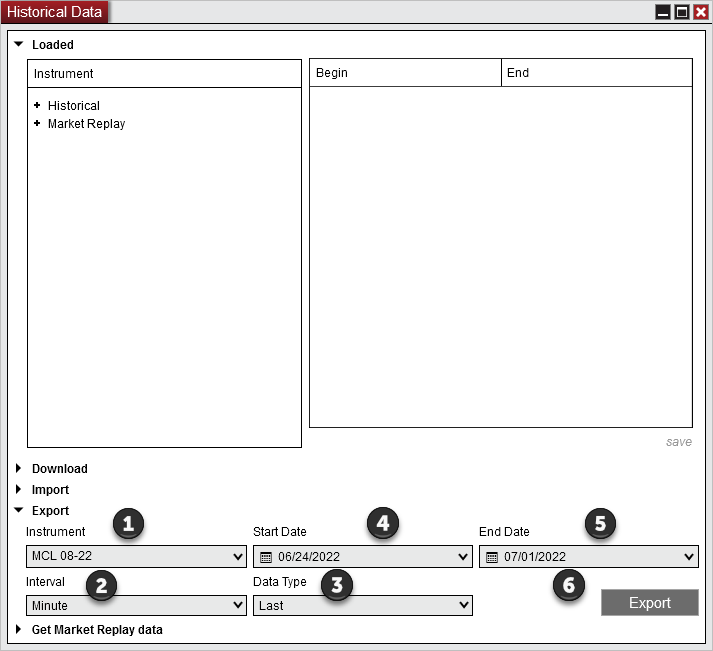

# Exporting

Historical data stored within NinjaTrader can be exported to a text ".txt" file. This is done within the Export section of the Historical Data Window window.

> How to Export Historical Data It is important to understand that the historical data you wish to export must currently be saved in NinjaTrader as provided by the data provider or collected live. Please see the "[Historical & Real-Time Data](data_by_provider.md)" section of the Help Guide for more information. If you do not have data, it can be downloaded from your data provider using the Download section of the Historical Data Window Load tab.    MarketDataArchives_ExportSteps    To export historical data to a text file:    1  2  3 Select the Data type to export. The data type(s) "Ask," "Bid," or "Last" are displayed if that type of data is available.  4 Select the desired Start date.  5 Select the desired End date.  6 Click "Export" and select an location and file name for the exported file.    The historical data is exported with End of Bar time stamps to the chosen folder as a text file in the same format specified in the "Understanding import file and data formats" section of the [Importing](importing.md) page. The exported data will be in the UTC time zone.

