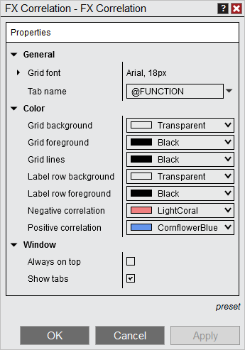

# FX Correlation Properties

The FX Correlation window can be customized through the FX Correlation Properties window.

> You can access the FX Correlation properties dialog window by clicking on your right mouse button and selecting the menu Properties.

The following properties are available for configuration within the FX Correlation Properties window:    FXCorrelation_Properties   Property Definitions

---

General

Grid Font

Sets the font options

Tab name

Sets the name of the tab, please see Using Tab Name variables for more information.

Color

Grid background

Sets the default color of the display grid background

Grid foreground

Sets the default color of the text in a cell

Grid lines

Sets the color of grid lines

Label row background

Sets the default color for the Label row background

Label row foreground

Sets the default color for the Label row foreground

Negative correlation

Sets the color for negative value correlations

Positive correlation

Sets the color for positive value correlations

Window

Always on top

Sets if the window will be always on top of other windows.

Show tabs

Sets if the window will allow for tab support

## How to preset property defaults

> Once you have your properties set to your preference, you can left mouse click on the "preset" text located in the bottom right of the properties dialog. Selecting the option "save" will save these settings as the default settings used every time you open a new window/tab.    If you change your settings and later wish to go back to the original settings, you can left mouse click on the "preset" text and select the option to "restore" to return to the original settings.

## Using Tab Name Variables

> Tab Name Variables A number of pre-defined variables can be used in the "Tab Name" field of the FX Correlation Properties window. For more information, see the "Tab Name Variables" section of the [Using Tabs](using_tabs.md) page.

