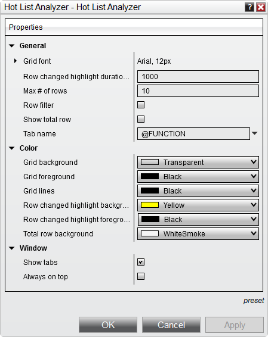

# Hot List Analyzer Properties

The Hot List Analyzer can be customized to your preferences in the Hot List Analyzer Properties window.

> To access the Hot List Analyzer Properties window, press down on your right mouse button inside the Hot List Analyzer window and select the menu Properties...

The following properties are available for configuration within the Hot List Analyzer Properties window    Hot_List_3   Property Definitions

---

General

Grid font

Sets the font

Row change highlight duration (ms)

Sets the duration (in seconds) the instrument cell will remain highlighted.  A value of zero will disable highlighting.

Max # of rows

Determines how many instrument rows can be added to the Hot List Analyzer

Row filter

Enables/Disables the automatic filtering of rows from the grid display based on the Filter Conditions of the columns.

Show total row

Enables/Disables the Total row in the Hot List Analyzer window display grid

Tab name

Sets the tab name

Color

Grid background

Sets the default color of the display grid background

Grid foreground

Sets the default color of the text in a cell

Grid lines

Sets the color of grid lines

Row changed highlight background

Sets the color for the row change highlight background

Row changed highlight foreground

Sets the color for the text in the row change highlight

Total row background

Sets the color of the Total row background

Window

Show tabs

Enables/Disables the tab control

Always on top

Enables/Disables if the window will be always on top of other windows.

## How to preset property defaults

> Once you have your properties set to your preference, you can left mouse click on the "preset" text located in the bottom right of the properties dialog. Selecting the option "save" will save these settings as the default settings used every time you open a new window/tab.    If you change your settings and later wish to go back to the original settings, you can left mouse click on the "preset" text and select the option to "restore" to return to the original settings.

