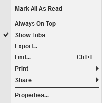
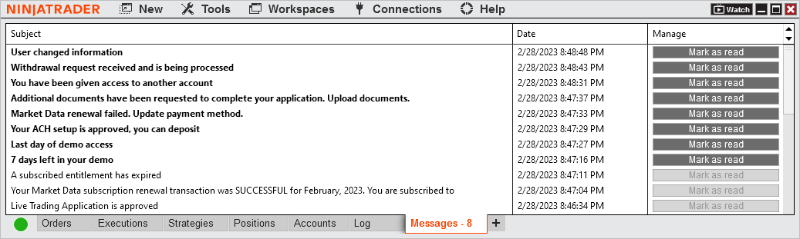

# Messages Tab

The Messages tab displays messages in relation to your account in a [data grid](data_grids.md).

Messages Display Unread messages will be displayed in bold and have the Mark as read button enabled. The Date and time the message was sent is included. The tab will display in a highlighted color if there are unread messages and indicate how many unread messages there are.    Messages   Right Click Menu Right mouse clicking within the log display section opens the following menu:    Messages2

---

Mark All As Read

Marks all unread messages as read

Always On Top

Sets if the window will be always on top of other windows

Show Tabs

Sets if the window should allow for tabs

Export

Exports the grid contents to "CSV" or "Excel" file format

Find...

Search for a term in the grid

Print

Select to print either the window or the log grid area.

Share

Select to share via your share connections.

Properties...

Configure the positions grid properties