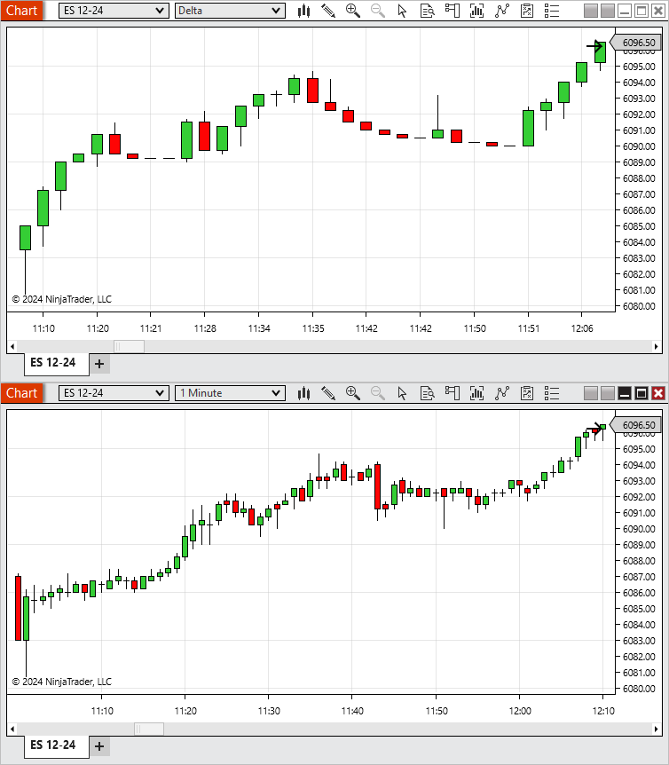
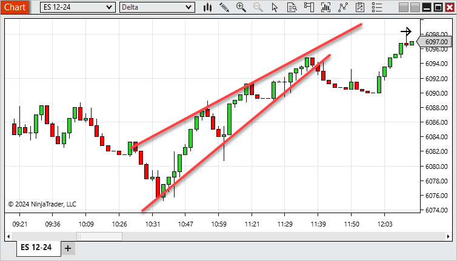
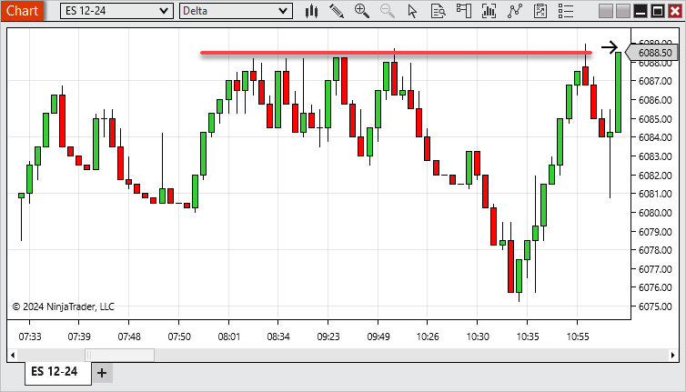

# Order Flow Delta Bars



    Operations > Charts > Order Flow + > Order Flow Delta Bars

Order Flow Delta Bars

[Show/Hide Hidden Text]()

## Description

A bar type that plots new bars based on when the cumulative delta surpasses the defined Trend delta or Trend reversal, providing a clear and noise-filtered visualization of significant shifts in market sentiment and order flow dynamics.

 

##         [Order Flow Delta Overview]()

##

##

##

##

##

##

##

##

##

##

##

##

> **Note:** Notes:
1. To plot historically Delta bars require historical bid ask stamped tick data. See the Data by Provider section for information on what providers offer historical bid/ask stamped tick data.
2. Volume bars could split a single tick into multiple bars for both historical and real-time data.

| Column 1 |
| --- |
|  |

##         [Order Flow Delta Parameters]()

##

| Trend delta | Defines how much the cumulative delta needs to surpass in it's current trend to build a new bar |
| --- | --- |
| Trend reversal | Defines how much the cumulative delta needs to reverse from it's current trend to build a new bar |

