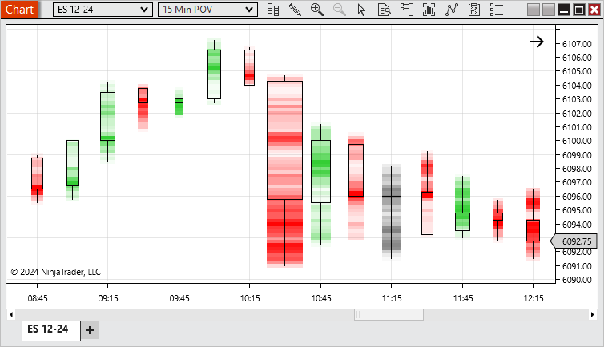
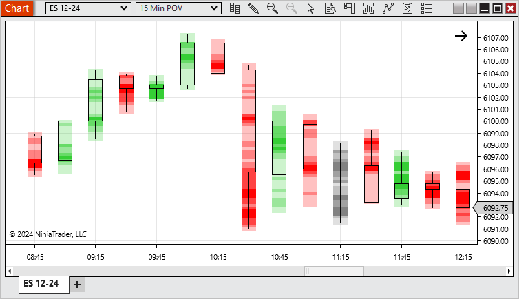

# Order Flow Price on Volume Bars



    Operations > Charts > Order Flow + > Order Flow Price On Volume Bars

Order Flow Price On Volume Bars

[Show/Hide Hidden Text]()

## Description

A bar type that plots new bars based on when the cumulative delta surpasses the defined Trend delta or Trend reversal, providing a clear and noise-filtered visualization of significant shifts in market sentiment and order flow dynamics.

 

##         [Order Flow Price On Volume Overview]()

##

##

##

##

##

##

##

##

##

> **Note:** Notes:
1. To plot historically Delta bars require historical bid ask stamped tick data. See the Data by Provider section for information on what providers offer historical bid/ask stamped tick data.
2. Volume bars could split a single tick into multiple bars for both historical and real-time data.

| Column 1 |
| --- |
|  |

##         [Order Flow Price On Volume Parameters]()

##

| POV Candlestick | This function the same as the Candlestick Chart style, but with the Price On Volume color distribution |
| --- | --- |
| POV Equivolume | This function the same as the Equivolume Chart style, but with the Price On Volume color distribution |

 

See [Chart Styles](../drawing_tools/chart_styles.md) for more information on Candlestick & Equivolume

| Base period type | Defines how much the cumulative delta needs to surpass in it's current trend to build a new bar. |
| --- | --- |
| Base period value | Defines how much the cumulative delta needs to reverse from it's current trend to build a new bar. |
| Ticks per level | Sets the level of aggregation for individual price levels, i.e. if price levels should be merged together, default 1 – so each price level delta result is seen individually inside the price bars |
| Chart style |  |
| Strength sensitivity | Sets how many levels of strength should be distributed within a bar |
