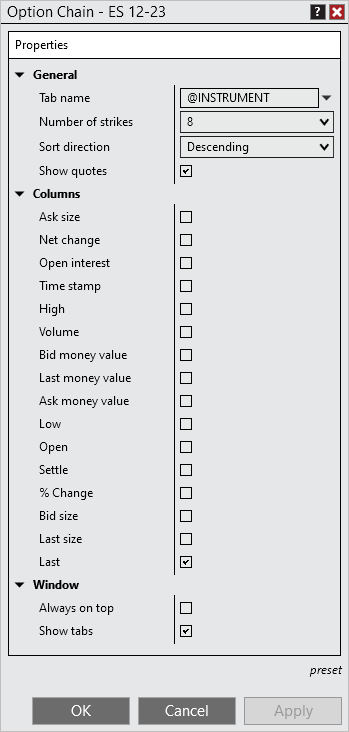

# Properties

The Options Chain window is highly efficient by design but can also be customized to your preferences through the Options Chain Properties menu.

> You can access the Option Chain properties dialog window by clicking on your right mouse button within the Option Chain window and selecting the menu Properties.

The following properties are available for configuration within the Option Chain properties window:    OptionChain10   Property Definitions

---

---

General

Tab name

Sets the tab name

Number of strikes

Sets the number of strikes to display

Sort direction

Sets if the strike prices are listed in descending or ascending order

Show quotes

Enables and disabled the quotes grid for the underlying security

Columns

Columns checkboxes

Enables/disabled what columns to display on the Option Chain

Window

Always on top

Sets if the window will be always on top of other windows

Show tabs

Sets if the window should allow for tabs

## How to set the default properties

> Once you have your properties set to your preference, you can left mouse click on the "preset" text located in the bottom right of the properties dialog. Selecting the option "save" will save these settings as the default settings used every time you open a new window/tab.    If you change your settings and later wish to go back to the original settings, you can left mouse click on the "preset" text and select the option to "restore" to return to the original settings.

## Using Tab Name Variables

> Tab Name Variables A number of pre-defined variables can be used in the "Tab Name" field of the Option Chain Properties window. For more information, see the "Tab Name Variables" section of the [Using Tabs](using_tabs.md) page.

