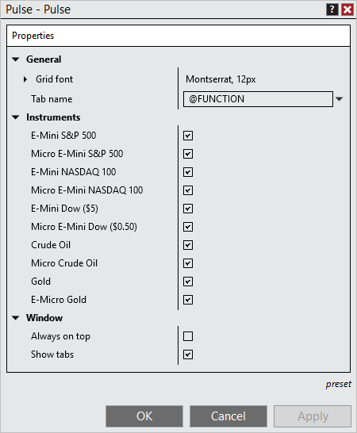

# Pulse Properties



    Operations > Pulse > Pulse Properties

Pulse Properties

[Show/Hide Hidden Text]()

The Pulse window can be customized through the Pulse Properties window.

 

##         [How to access the Pulse Properties window]()

| You can access thePulse properties dialog window by clicking on your right mouse button and selecting the menu Properties. |
| --- |

##         [Available properties and definitions ]()

##

| General |  |
| --- | --- |
| Grid font | Sets the font options |
| Tab name | Sets the name of the tab, please see Managing Tabs for more information. |
| Instruments |  |
| Instrument name | Enables/disabled displaying the Pulse gauge for the instrument |
| Window |  |
| Always on top | Sets if the window will be always on top of other windows. |
| Show Tabs | Sets if the window will allow for tab support |

##         [How to preset property defaults]()

| Once you have your properties set to your preference, you can left mouse click on the "preset" text located in the bottom right of the properties dialog. Selecting the option "save" will save these settings as the default settings used every time you open a new window/tab.   If you change your settings and later wish to go back to the original settings, you can left mouse click on the "preset" text and select the option to "restore" to return to the original settings. |
| --- |

##         [Using Tab Name Variables]()

##

| Tab Name Variables A number of pre-defined variables can be used in the "Tab Name" field of the Pulse Properties window. For more information, see the "Tab Name Variables" section of the Using Tabs page. |

| --- |
