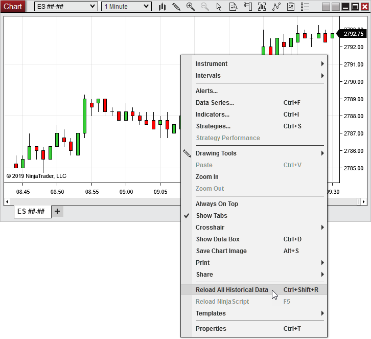

# Reload Historical Data

While you are connected to a market data provider that supports [historical data](data_by_provider.md), right mouse click within a chart to bring up the context menu and select the Reload All Historical Data menu item. Historical data for the base interval unit (minute bars for a 5 minute chart for example) will be reloaded for all charts of the same instrument. Reloading all historical data will overwrite all locally stored cache and repository data.

