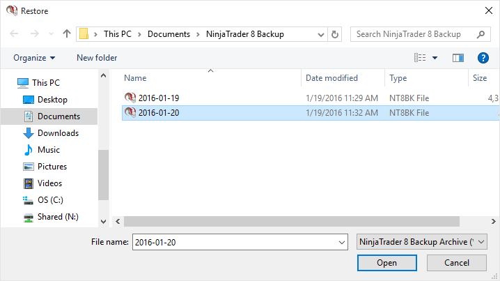
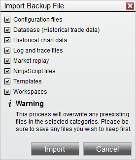
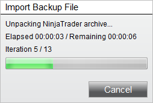

# Restoring a Backup Archive

Complete the following steps to restore a Backup Archive.

1.From within the Control Center window select the Tools menu. Then select the menu Import and the Backup File... menu item

2.Select the backup archive to restore from the "Restore" file dialog window

3.Press the "Open" button

4.Select the items you wish to restore

5.Press the "Import" button

You will now be presented with a status bar indicating the estimated time and progress of the import.

> **Note:** Restoring backups made from previous releases may have issues importing if there have been changes made to NinjaTrader's resource structure. Please contact [email protected](mailto:platformsupport@ninjatrader.com) if you are seeing issues importing.
