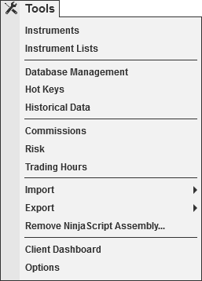

# Tools Menu

The following menus and items are available via the Tools menu of the NinjaTrader Control Center.

|  |  |
| --- | --- |
| [Instruments](../language_reference/instruments.md) | Opens the Instruments window |
| [Instrument Lists](instrument_lists.md) | Opens the Instrument Lists window |
| [Database Management](database.md) | Opens the Database Management window |
| [Hot Keys](hot_key_manager.md) | Opens the Hot Keys window |
| [Historical Data](historical_data_manager.md) | Opens the Historical Data window |
| [Commissions](understanding_commissions.md) | Opens the Commissions window |
| [Risk](understanding_risks.md) | Opens the Risk window |
| [Trading Hours](trading_hours.md) | Opens the Trading Hours window |
| [Vendor Licensing](../ninjascript/licensing_user_authentication.md) | Opens the Vendor Licensing window |
| Import | Opens the Import Sub Menu; [Backup File](restoring_a_backup_archive.md), [Historical Data](importing.md), [NinjaScript Add-On](../ninjascript/import.md), [Stock Symbol List](../language_reference/importing_a_list_of_stock_symb.md) |
| Export | Opens the Export Sub Menu; [Backup File](creating_a_backup_archive.md), [Historical Data](exporting.md), [NinjaScript Add-On](../ninjascript/export.md) |
| [Remove NinjaScript Assembly](../ninjascript/remove-ninjascript-assembly.md) | Opens the Remove NinjaScript assembly window |
| [Global Simulation Mode](global_simulation_mode.md) | Enables or Disables Global Simulation Mode (Note: Global simulation mode can only be enabled with a live NinjaTrader License) |
| Client Dashboard | Opens the web view of the Client Dashboard |
| [Options](../getting_started/options.md) | Opens the Options window |
