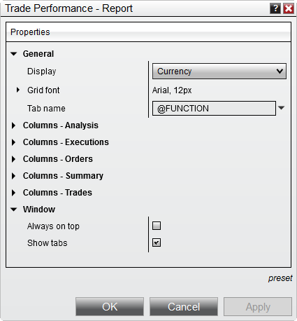

# Trade Performance Properties

Many of the Trade Performance visual display settings can be customized using the Trade Performance Properties window.

> You can access the Trade Performance properties dialog window by clicking on your right mouse button and selecting the menu Properties.

The following properties are available for configuration within the Trade Performance Properties window:    AccountPerformance_Properties   Property Definitions

---

General

Display

Sets the currency display

Grid font

Sets the font options

Tab name

Sets the name of the tab, please see Managing Tabs for more information.

Columns - Analysis

Columns - Executions

Columns - Journal

Columns - Orders

Columns - Summary

Columns - Trades

Window

Always on top

Sets if the window will be always on top of other windows.

## How to preset property defaults

> Once you have your properties set to your preference, you can left mouse click on the "preset" text located in the bottom right of the properties dialog. Selecting the option "save" will save these settings as the default settings used every time you open a new window/tab.    If you change your settings and later wish to go back to the original settings, you can left mouse click on the "preset" text and select the option to "restore" to return to the original settings.

