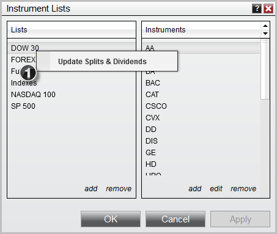

# Updating Splits and Dividends

You can quickly update all Splits and Dividends on an instrument list via the Instrument Lists window. Please follow the guide [Adding Splits and Dividends](../language_reference/adding_splits_and_dividends.md) for details on how to enable NinjaTrader to do updates on the selected instrument list.

## Updating Splits and Dividends

To trigger and update of all Split and Dividend data on all instruments on a specific instrument list:

## InstrumentLists_UpdateSplits

1.Right click on the Instrument List you want to trigger the mass update for and select Update Splits & Dividends.

NinjaTrader will now request historical splits and dividend information from your provider and populate the information in your local database.