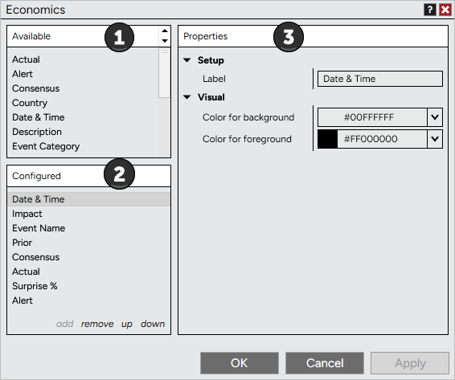
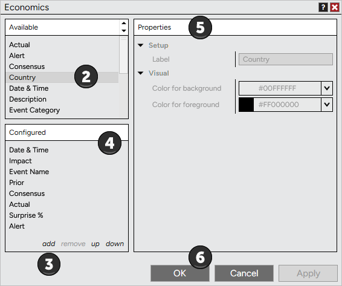
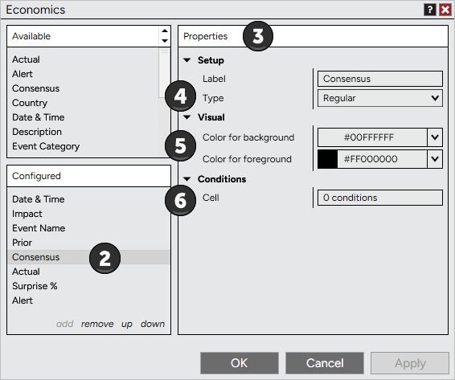
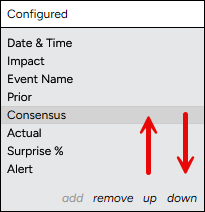
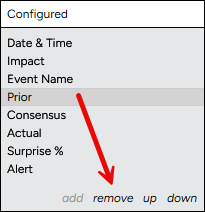

# Using Economics Columns



    Operations > Calendar > Using Economics Columns

Using Economics Columns

[Show/Hide Hidden Text]()

The Economics tab allows you to add a variety of columns. To add, remove, and customize columns in your Economics tab please review the information below.

 

##         [Understanding the Columns window]()

##

##

| The Columns window is used to add, remove, and edit columns within the Economics tab.   Accessing the Columns Window To access the Columns window press down on your right mouse button in the Economics tab and select the menu item Columns...   Sections of the Columns Window The image below displays the four sections of the Columns window.   1.List of available columns2.Current columns applied to the Economics tab3.Selected column's parameters     |
| --- |

##         [How to add columns]()

##

| A variety of columns can be added to your Economics tab.   Adding columns to the Economics tab To add a column to the Economics tab:   1.Open the Columns window (see the "Understanding the Columns window" section above)    2.Select the column you want to add from the list of available columns3.Press the Add button or simply double click on the column you want to add4.The column will now be visible in the list of applied columns5.The column's parameters will be editable on the right side of the Columns window when the column is selected from the applied columns list (see the "How to customize columns" section below)6.Press the OK button to apply the column(s) to your Economics tab, and exit the Columns window     |
| --- |

##         [How to customize columns]()

##

##

##

| Once you have added columns to your Economics tab (see the "How to add columns" section above) you can customize the column by editing the column's parameters.   Editing a Column's Parameters You can customize any column from the Columns window.   1.Open the Columns window (see the "Understanding the Columns window" section above)  2.Highlight the column you would like to edit in the list of Configured columns (as shown by the image below).3.Once highlighted this column's parameters will be editable on the right hand side4.You can choose to display the column Type as Regular or as a BarGraph5.You can configure the color settings6.You can set Cell conditions for any column from the Conditions parameters section         Changing the Order and Width of Columns To order columns in the Economics tab you can use "up" or "down" in the Configured columns section.          •Left mouse click "up" to move the selected applied column left in the Economics tab•Left mouse click "down" to move the selected applied column right in the Economics tab  Please see the Data Grids section of the user help guide for information on sizing and ordering columns. |
| --- |

##         [How to remove columns]()

##

| Columns can be removed from the Columns window or from the Economics tab directly.   Removing Columns from the Economics Tab There are two ways to remove a column:   1.From the Economics tab left mouse click on the column header and hold down the left mouse button to drag the column outside the Calendar window, once the cursor changes to a black X release the left mouse button to remove the column.2.Open the Columns window (see the "Understanding the Columns window" section above).  Highlight the column you would like to remove in the list of Configured columns (as shown in the image below) then press the Remove button.     |
| --- |