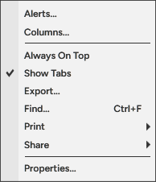
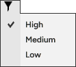
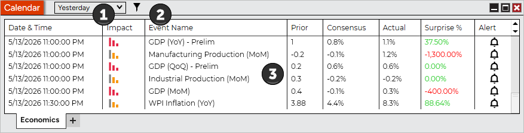
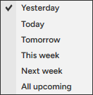

# Using the Economics Tab



    Operations > Calendar > Using the Economics Tab

Using the Economics Tab

[Show/Hide Hidden Text]()

##         [Understanding the layout of the Economics tab]()

##

##

##

##

##

##

##

| Alerts... | Right clicking on an event and selecting Alert... will bring up the configuration window to set up an alert of the event |

| --- | --- |
| Columns... | Opens the Columns window to configure the desired columns |
| Always On Top | Sets if the window should be always on top of other windows |
| Show Tabs | Sets if the window will allow for tab support |
| Export... | Exports the Economics contents to "CSV" or "Excel" file format |
| Find... | Search for a term in the Economics calendar |
| Print | Displays Print options |
| Share | Displays Share options |

| Properties... | Sets the Economics Properties |

##         [Using Tabs]()

| The Calendar window is a tabbed interface, this gives you the ability to have multiple Economics tabs configured in the same window. Please see the Using Tabs section of the help guide for more information. |
| --- |

