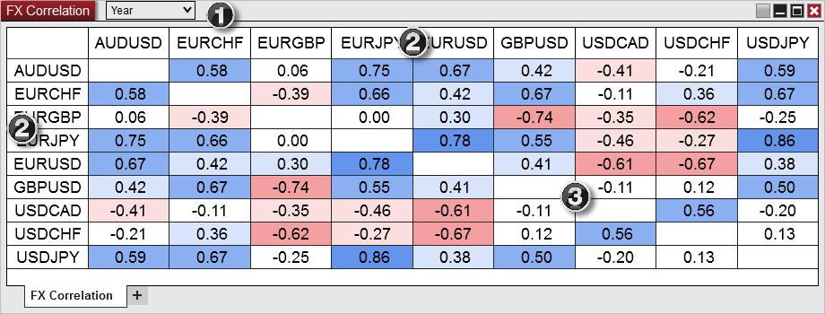
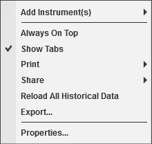

# Using the FX Correlation Window

> There are multiple ways to select a Forex Instrument in the FX Correlation Chart window.
- Right clicking on the FX Correlation window and selecting the menu Add Instrument(s).
- With the FX Correltion window selected begin typing the instrument symbol directly on the keyboard. Typing will trigger the Overlay Instrument Selector.    For more Information on instrument selection and management please see [Instruments](../language_reference/instruments.md) section of the Help Guide.

FXCorrelation_Window   1 Range  The Range drop down menu indicates over how long of a period to calculate the correlation for the instruments. It is based of of minute data so selecting Year would be 1 minute data over the past year.   2 Correlation instruments  The correlation instruments are the instruments that will be compared against each other.      3 Correlation values  Correlation values closer to 1 indicate that the instruments move in the same direction. Values closer to -1 indicate that the instruments move in the opposite direction. Value closer to 0 indicate no correlation.   Right Click Menu Right mouse click on the FX Correlation window to access the right click menu.  FXCorrelation_ContextMenu

---

Add Instruments

Selects the Forex instrument to add

Always On Top

Sets if the window should be always on top of other windows

Show Tabs

Sets if the window will allow for tab support

Print

Displays Print options

Share

Displays Share options

Reload All Historical Data

Reloads the historical bar data used for Indicator calculations

Export...

Exports the FX Correlaion contents to "CSV" or "Excel" file format

Properties...

Sets the [FX Correlation Properties](fx-correlation-properties.md)

## Using Tabs

> The FX Correlation Chart window is a tabbed interface, this gives you the ability to have multiple FX Correlation Chart tabs configured in the same window. Please see the [Using Tabs](using_tabs.md) section of the help guide for more information.