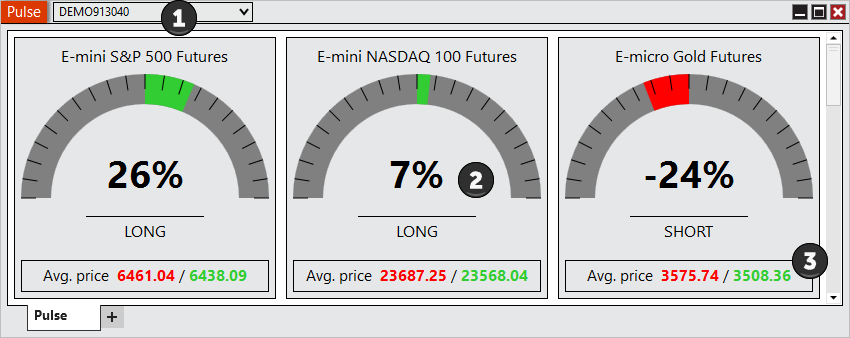
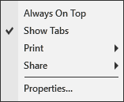

# Using the Pulse Window



    Operations > Pulse > Using the Pulse Window

Using the Pulse Window

[Show/Hide Hidden Text]()

##         [Enabling and disabling Instruments]()

| Instruments can be enabled and disabled within the Properties section of the Pulse window.   For more Information on instrument selection and management please see Pulse Properties section of the Help Guide. |
| --- |

##         [Understanding the layout of the Pulse window]()

##

##

##

##

##

##

##

| Always On Top | Sets if the window should be always on top of other windows |
| --- | --- |

| Show Tabs | Sets if the window will allow for tab support |
| Print | Displays Print options |
| Share | Displays Share options |
| Properties... | Sets the Pulse Properties |

##         [Using Tabs]()

| The Pulse window is a tabbed interface, this gives you the ability to have multiple Pulse tabs configured in the same window. Please see the Using Tabs section of the help guide for more information. |

| --- |

