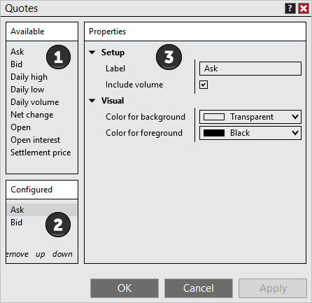
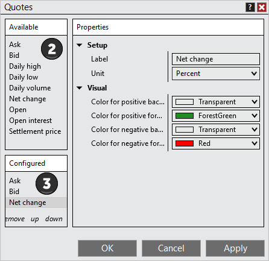

# Using Time & Sales Quotes



    Operations > Time & Sales > Using Time & Sales Quotes

Using Time & Sales Quotes

[Show/Hide Hidden Text]()

The NinjaTrader Time & Sales has the ability to add additional quotes for further analysis for real-time market prices.

 

 

##         [Understanding the Quotes window]()

##

##

| The Quotes window is used to add, remove and edit quotes within a Time & Sales    Accessing the Quotes Window Right mouse click on the Time & Sales window and select the menu Quotes    Sections of the Quotes Window The image below displays the three sections of the Quotes window: 1.List of Available quotes2.Current quotes Configured on the Time & Sales3.Selected columns Properties     |
| --- |

##         [How to add quotes]()

##

| Adding a Quote To add an Quote to a Time & Sales: 1. Open the Quotes window (see the "Understanding the Quotes window" section above) 2. Left mouse click on the Available quote you want to add and press the Add button or simply double click on it 3. The quote will now be visible in the list of Configured quotes 4. The quote's parameters will now be editable on the right side of the quotes window      |
| --- |

##         [How to remove quotes]()

##

| Removing a Quote To remove a quote from your NinjaTrader Time & Sales:   •Open the Quotes window (see the "Understanding the Quotes window" section above), select a quote from the Configured columns list, press the Remove button, and then press the OK button to exit the Quotes window. |
| --- |