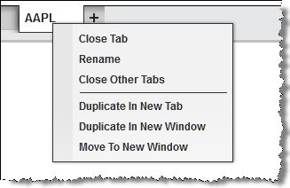
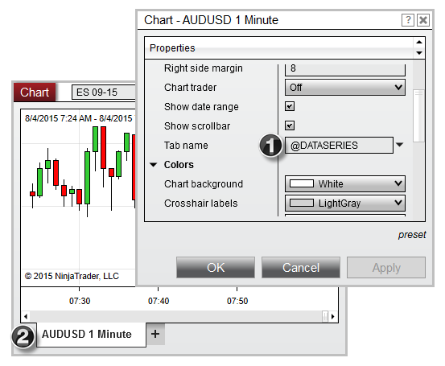
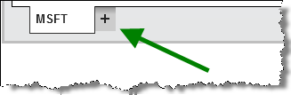
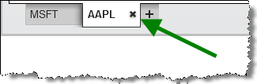
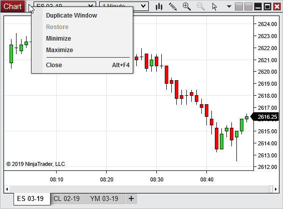

# Using Tabs

Various windows in NinjaTrader are now a tabbed interface, this gives you the ability to have multiple tabs in the same window.

| Name / Option | Description |
| --- | --- |
| Adding Tabs Pressing the + tab will create a new Time & Sales tab in this window.    Tabs_Add    |  

> **Note:** With the Time & Sales window selected you may also start typing "++" followed by the instrument symbol into the Overlay Instrument Selector to quickly create a new tab with that instrument preselected. Example: "++MSFT"

 |

| Name / Option | Description |
| --- | --- |
| Removing Tabs Moving your mouse over the tab handle and selecting the x icon to remove that specific tab.    Tabs_RemoveIcon    |  

> **Note:** You cannot remove the last remaining tab as you must have at least one tab per window.

 |

## Reordering tabs

> Reordering Tabs Click and hold to drag the tab into the desired position in the tab area.

## Tabs actions

Right Click Menu Right mouse click on the tab to access the right click menu to perform a tab action.  Tabs_ContextMenu

---

Close Tab

Removed the selected tab

Rename

Opens the properties window with the tab name property selected for direct editing

Close Other Tabs

Removed all tabs except for the selected tab

Duplicate In New Tab

Duplicates the selected tab into a new tab in the same window

Duplicate In New Window

Duplicates the selected tab into a new tab in a new window

Move To New Window

Moves the selected tab into a new window

## Duplicating a window and it's tabs

> Duplicate Window Right mouse click on the title bar of a window and selecting Duplicate Window will duplicate the window, including it's tabs.  DuplicateWindow

## Tab Name Variables

Using Tab Name Variables Tabs throughout NinjaTrader allow for the use of pre-defined variables which will dynamically populate tab names with relevant labels, such as the instrument name, period, or account selected in the tab. To use one of the variables listed in the table below, first open the window's Properties dialogue, then enter your chosen variable in the "Tab Name" field.    TabVariables1  1) The variable "@DATASERIES" has been entered in the "Tab Name" field of the Chart Properties window.  2) The "@DATASERIES" variable populates the instrument full name and period in the selected tab.

---

- These variables are case sensitive, meaning that "@instrument" is not the same as "@INSTRUMENT."

- More than one variable can be used together in a single tab name. For example, using "@FUNCTION @ACCOUNT" would list the tab's function and selected account together. |    |  |  |  | | --- | --- | --- | | Variable | Value | Applicable To | | @INSTRUMENT | Displays the name of the primary instrument displayed in the tab | Level II, Time & Sales, Basic Entry, FX Board, FX Pro, SuperDOM, Order Ticket, Charts | | @INSTRUMENT\_FULL | Displays the full name of the primary instrument displayed in the tab (adds the expiry for futures contracts) | Level II, Time & Sales, Basic Entry, FX Board, FX Pro, SuperDOM, Order Ticket, Charts | | @INSTRUMENT\_ALL | Displays the names of all instruments displayed in the tab | FX Board, Charts | | @INSTRUMENT\_FULL\_ALL | Displays the full name of all the instruments displayed in the tab (adds the expiry for futures contracts) | FX Board, Charts | | @PERIOD | Displays the period configured on the primary instrument in the tab | Charts | | @PERIOD\_ALL | Displays the periods configured for all instruments in the tab | Charts | | @ACCOUNT | Displays the account selected in the tab | Control Center (Account, Executions, Orders, Positions, Strategies Grids), Basic Entry, FX Board, FX Pro, SuperDOM, Order Ticket, Charts | | @FUNCTION | Displays the function of the tab (examples: "Chart" or "Log") | All Tabs | | @ATM | Displays the selected [ATM Strategy](advanced_trade_management_atm.md) in the tab | Charts | | @DATASERIES | Equivalent to "@INSTRUMENT\_FULL @PERIOD" for the primary instrument in the tab | Charts | | @DATASERIES\_ALL | Equivalent to "@INSTRUMENT\_FULL @PERIOD" for all instruments in the tab | Charts | |

## Switching tabs

> Switching Tabs You can switch between tabs by clicking on the desired tab or by pressing CTRL+Tab on your keyboard.

