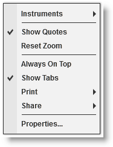
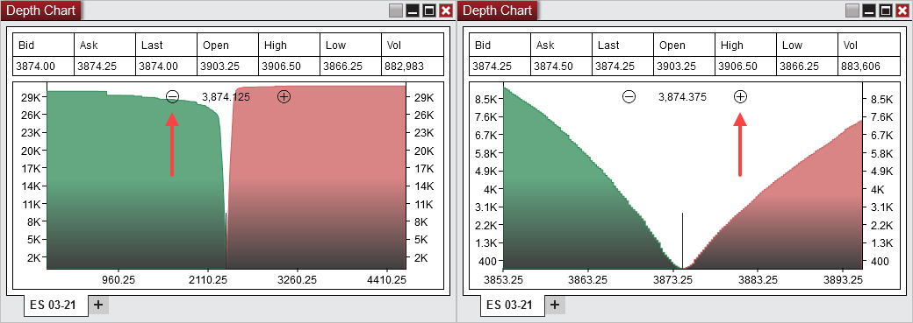
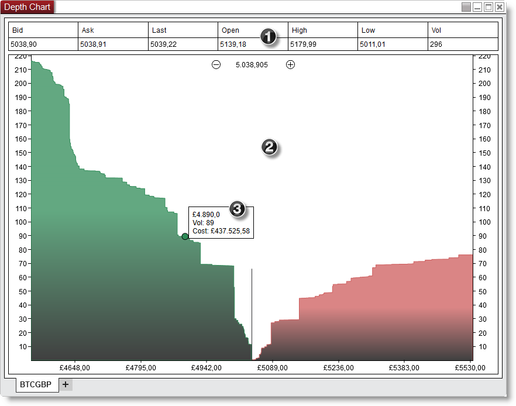

# Using the Depth Chart window

> There are multiple ways to select an Instrument in the Depth Chart window.
- Right clicking on the Depth Chart window and selecting the menu Instruments.
- With the Depth Chart window selected begin typing the instrument symbol directly on the keyboard. Typing will trigger the Overlay Instrument Selector.    For more Information on instrument selection and management please see [Instruments](../language_reference/instruments.md) section of the Help Guide.

DepthChart_Window   1 Quotes  The Quotes section displays various market data items.

---

---

Bid

The current bid price

Ask

The current ask price

Last

The current last traded price

Open

The current sessions open price

High

The current sessions high price

Low

The current sessions low price

Vol

The current sessions total volume.

You can disable the Quotes section by clicking on your right mouse button and deselecting the menu item Show Quotes.   2 Graph  The Graph displays the cumulative buy and sell orders through the full available book, so the vertical Y-axis value at any point is the result of summing all bids (asks) from the best bid (ask) to the price value on the horizontal X axis.    DepthChartZoom    You can use the +/- zoom buttons on the chart to set the zoom level (right click on the chart > Reset zoom to reset the level to default).    3 Tooltip  The tooltip displays:    - the selected Depth chart x-axis value  - the associated cumulative volume up to that value  - the currency cost of the cumulative volume   Right Click Menu Right mouse click on the Depth Chart window to access the right click menu.  DepthChart_ContextMenu

---

---

Instruments

Selects the instrument

Show Quotes

Sets if the quotes section is displayed

Reset Zoom

Resets the zoom level to default

Always On Top

Sets if the window should be always on top of other windows

Show Tabs

Sets if the window will allow for tab support

Print

Displays Print options

Share

Displays Share options

Properties...

Sets the [Depth Chart Properties](depth_chart_properties.md)

## Using Tabs

> The Depth Chart window is a tabbed interface, this gives you the ability to have multiple Depth Chart tabs configured in the same window. Please see the [Using Tabs](using_tabs.md) section of the help guide for more information.

