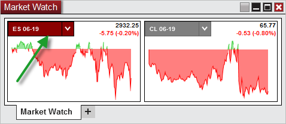

# Working with Instrument Tiles

The Market Watch can be setup for use with an unlimited number of instrument tiles which are used to display a net change chart, last price, and net change in points & percent.

> Adding an Individual Instrument You can add as many individual instrument tiles to your Market Watch window as you would like.
- Press down on your right mouse button in the Market Watch window and select the menu item Add Instrument(s).  Through the Instrument Selector menu, you can navigate through various instrument lists to locate the instrument you desire, and left click on the instrument to add the individual instrument to the Market Watch.  Adding a List of Instruments You can also rapidly add an entire list of predefined instruments to the Market Watch window.
- Press down on your right mouse button in the Market Watch window and select the menu item Add Instrument List.  Then select the instrument list you would like to add to the Market Watch.    Please see the [Instrument Lists](instrument_lists.md) section of the user help guide for additional information on creating, editing, and deleting instrument lists.   Changing Instruments Once an instrument tile has been added to the Market Watch display, you can quickly change the instrument by using the Instrument Selector.    MarketWatch1   Arranging Tiles You can customize the arrangement in which each instrument tile is displayed by left clicking and dragging the instrument tile to the desired location.   Removing Instruments To remove an instrument tile, simply right click on the desired tile and select Remove Tile.

> Creating an Instrument List If you have a Market Watch setup with a number of different instruments you would like to save for later, you can quickly add the entire display of instruments into an Instrument List for quick access.
- Press down on your right mouse button in the Market Watch window and select the menu item Create Instrument List, then give the Instrument List a unique name and press OK.    You will now be able to access this list from other features of NinjaTrader using the [Instrument Selector](../addons/instrumentselector.md).  You can further edit this list by using the [Instrument Lists](instrument_lists.md) window

