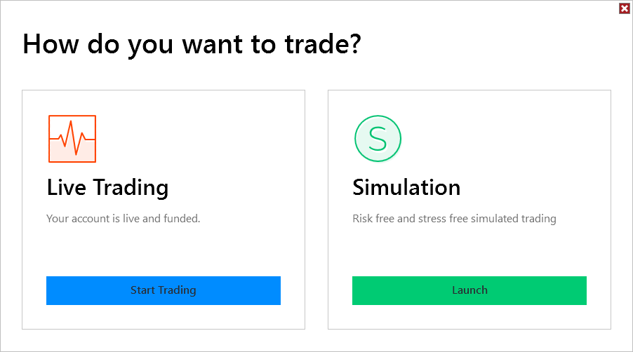
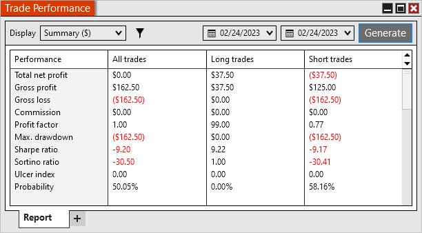
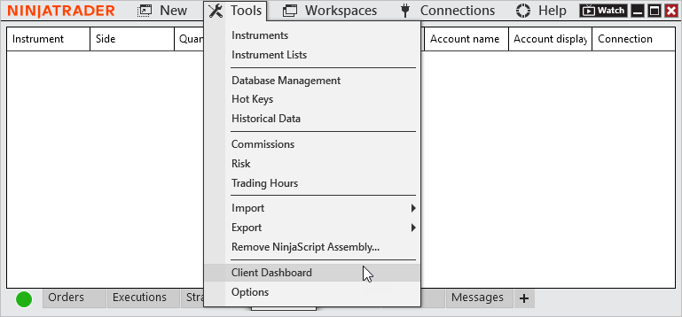
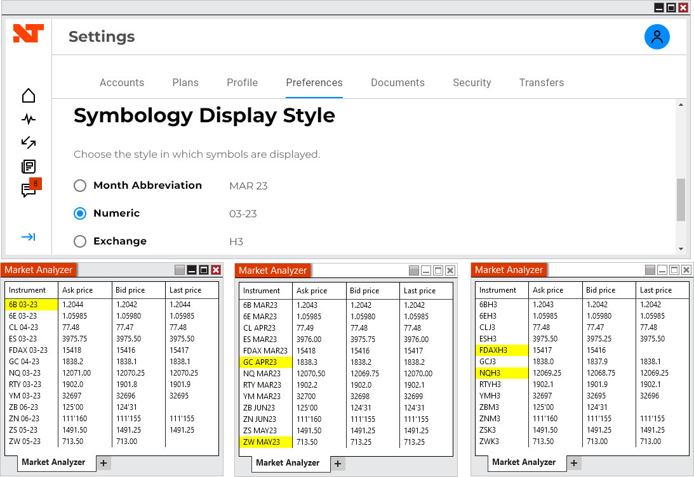
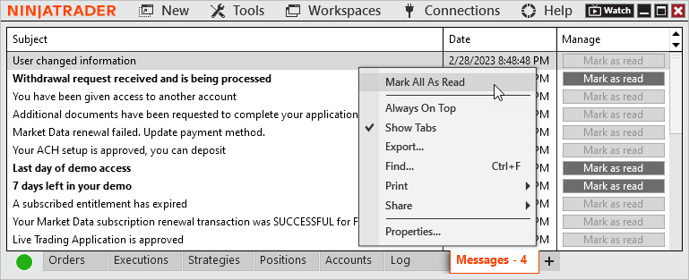
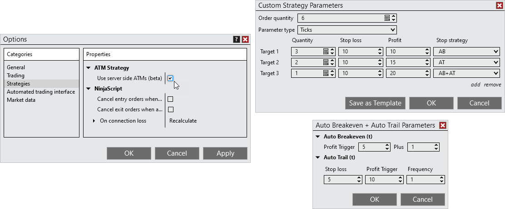
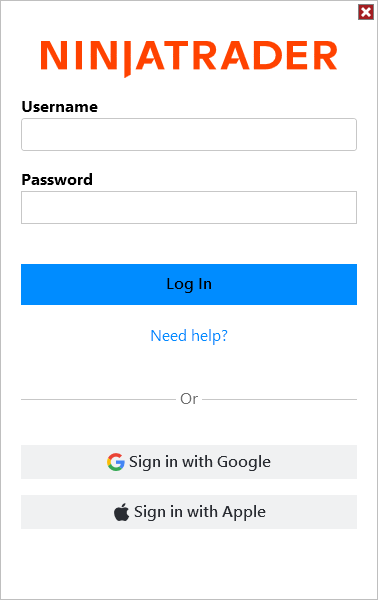
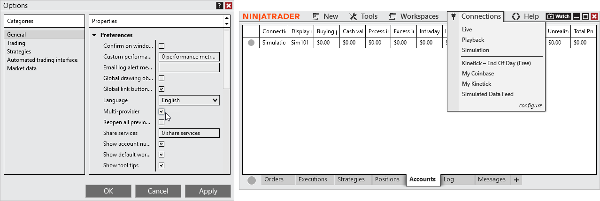

# Release Notes - NinjaTrader 8.1.1



    Release Notes > 8.1.1

8.1.1

See additional patch notes at the bottom

 

8.1.1.0 Release Date

March 4, 2023

 

> **Warning:** The log in credentials are only to provide access to your account, entitlements, and server side ATM templates. Any multi-provider connections, NinjaScripts, workspaces, etc saved to your local computer will be available to any log in to your local computer.

 

> **Warning:** Multi-provider connections are available to any user that logs in to your local computer. If other NinjaTrader users are connecting from your computer, it is recommended to configure your connections to Ask password on connect.

 

> **Warning:** When an entry order is submitted with a server side ATM the stop loss and target will display as Suspended, indicating they will not become active until the entry is filled. The orders can be modified before the entry is filled. Any scripts that check order state should be tested to ensure the new order state doesn't result in unintended results.

 

| Features |
| --- |
|  |
|  |
| Trading Mode window After logging in, you will be presented with a Trading Mode screen. The status of your live or simulation account will be display here and you can select how you would like to continue. You can now connect to Live and only have your live account available, preventing trading to the simulation account in error. The Trading Mode screen will not display when Multi-provider mode is enabled.      |
|  |
|  |
|  |
|  |
| Server side Trade Performance reports Trade Performance reports for the NinjaTrader connection are pulled from the server. NinjaTrader will no longer require to be connected as orders are filled to give accurate reports.      |
| Client Dashboard access Under Tools there is a link to the Client Dashboard. The Client Dashboard can be used to change your plan, add plan power-ups, perform transfers, view your statements, etc.      |
| Customizable contract month display format NinjaTrader can now display contract months in a format of your choosing. The Symbology Display Style can be selected within the Client Dashboard and will be applied to the Desktop, Web, and Mobile platforms.      |
| Messages tab The Messages tab will display important messages to your account. An indication of how many unread messages there are will be displayed within the tab.      |

 

| Issue # | Status | Category | Comments |
| --- | --- | --- | --- |
| 15450 | Done | Alerts | Alerts window did not allow numeric value to be compared with numeric value |
| 15387 | Fixed | Alerts, Strategy Builder | Disable BarsAgo & Offset for CrossAbove / Below in Strategy Builder and Alerts as only the series is ever compared |
| 15555 | Fixed | Order Flow + | Volumetric Bars buy imbalance boxes could appear outside candle box |
| 14760 | Changed | Continuum/CQG | Web API now uses oAuth based authentication |
| 15349 | Fixed | Interactive Brokers, Chart | Multiple Change Order requests on paper account caused chart window to freeze |
| 15309 | Fixed | NinjaScript Editor, Strategy | Renaming strategy that changes parameter names caused compile errors |
| 15416 | Fixed | NinjaScript Editor | Resolved a scenario where clicking on a compile error resulted in an error |
| 15440 | Fixed | NinjaScript Editor, Workspaces | Tabs could scroll unexpectedly when switching between them from a saved workspace |
| 15537 | Fixed | ShareAdapter | iCloud share service could not send messages |
| 15418 | Fixed | Strategy Analyzer | Backtest type reverted when selecting a strategy |
| 15457 | Fixed | Workspaces | Closing default workspace on new install could prevent proper creation of new savable workspace |
| 15561 | Fixed | Workspaces | Warning of closing default workspaces did not function as expected |

 

 

8.1.1.1 Release Date

March 8, 2023

 

| Issues # | Status | Category | Comments |
| --- | --- | --- | --- |
| 617 | Fixed | Charts | Setting Symbology Display Style to Exchange resulted in daily charts being slow to load |
| 761 | Fixed | Data | Historical data was saving based on Symbology Display Style |
| 390 | Fixed | Log In | Google and Apple log ins could fail |
| 366 | Changed | Log In | Log In window now saves username by default |
| 399 | Fixed | Log In | Log in error was not removed when attempting to log in again |
| 626 | Changed | Log In | Changed "Need help?" To "Forgot Username? | Forgot Password?" on Log In window |

| 650 | Changed | Log In | Optimized the log in experience and added a loading indicator |
| 389 | Fixed | NinjaScript | NinjaScript Add-Ons would fail to load if it utilized NinjaTrader.Cbi.License.MachineId |
| 401 | Fixed | NinjaScript | NinjaScript Add-Ons would fail to load if it utilized Newtonsoft.Json |

 

8.1.1.2 Release Date

March 22, 2023

 

| Issues # | Status | Category | Comments |
| --- | --- | --- | --- |
| 1426 | Fixed | ATMs | Deleting an ATM template set the ATM dropdown to None on all windows |
| 153 | Added | Log In | A captcha was added to allow log in after too many failed log ins from IP address |
| 409 | Fixed | NinjaTrader Connection | Resolved a scenario where users with a live account couldn't access a simulation account |
| 1391 | Fixed | NinjaTrader Connection | Resolved a scenario where Account Type was locked to Simulation |
| 1444 | Fixed | NinjaTrader Connection | After many connections drops the application could crash |
| 1217 | Fixed | NinjaTrader Connection | Configured connection name could change |
| 1406 | Fixed | NinjaTrader Connection, Orders | Resolved a scenario where position and order updates received an error that they were for an unknown symbol |
| 1641 | Fixed | NinjaTrader Continuum, SuperDOM | Resolved a scenario where some accounts that should be available in the SuperDOM were disabled |

 

 

8.1.1.3 Release Date

March 28, 2023

 

| Issues # | Status | Category | Comments |
| --- | --- | --- | --- |
| 1941 | Fixed | Logs | Security fix for local tracing |
| 1846 | Fixed | NinjaTrader Connection | Last trade events could be marked with incorrect bid/ask prices |

 

8.1.1.4 Release Date

April 27, 2023

 

| Issues # | Status | Category | Comments |
| --- | --- | --- | --- |
| 2073 | Changed | Continuum, CQG | Updated a CQG Server Certificate. All users connecting via Continuum or CQG are required to update to this version on or before June 23th, 2023. |
| 2252 | Fixed | NinjaTrader Connection, Multi-provider | In some scenarios account name didn't display as expected |
| 1355 | Fixed | Trade Performance | Resolved multiple scenarios that could cause no results to be returned |

 

8.1.1.5 Release Date

May 1, 2023

 

| Issues # | Status | Category | Comments |
| --- | --- | --- | --- |
| 3319 | Fixed | NinjaTrader Connection | Resolved a scenario where stop limit orders would get an error |

 

8.1.1.6 Release Date

May 16, 2023

 

| Issues # | Status | Category | Comments |
| --- | --- | --- | --- |
| 3484 | Fixed | ATMs | Resolved a scenario that applied a previously selected ATM to a stop limit order |
| 3299 | Fixed | Trade Performance | Resolved additional scenarios that could cause no results to be returned |

 

8.1.1.7 Release Date

June 6, 2023

 

| Issues # | Status | Category | Comments |
| --- | --- | --- | --- |
| 4600 | Fixed | ATMs, Chart Trader | ATM strategies attached to stop limit orders did not deploy on Chart Trader |
| 2262 | Fixed | Connections | Resolved a scenario where a connection would not save |
| 3729 | Fixed | Control Center | Watch button didn't show when live at times and could error when selecting |

| 4113 | Fixed | NinjaTrader Connection | Preemptive property updates to prevent connection issues |
| 4605 | Fixed | Trade Performance | Multiple fixes to reports, report values, and errors |
