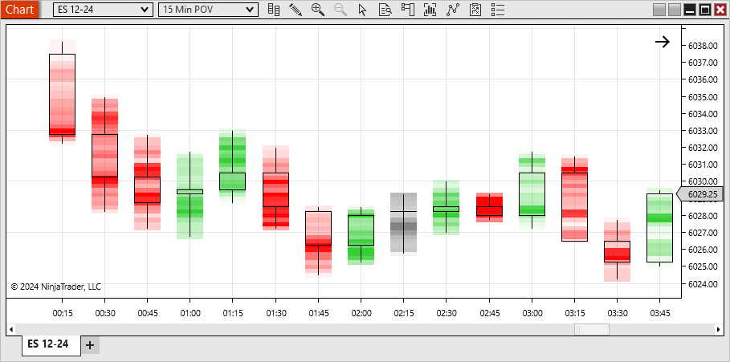
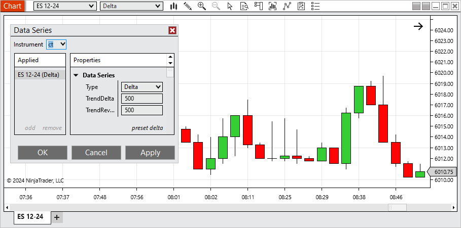
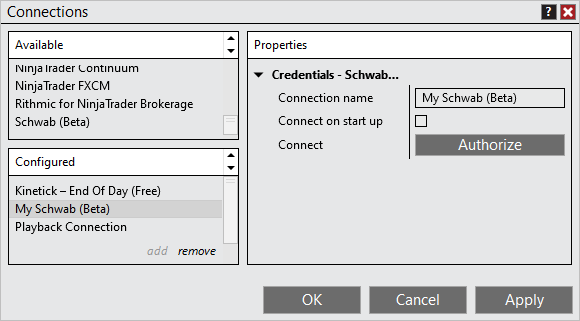
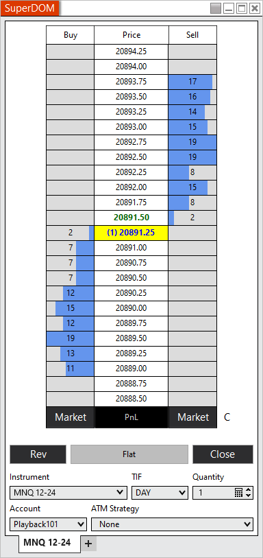
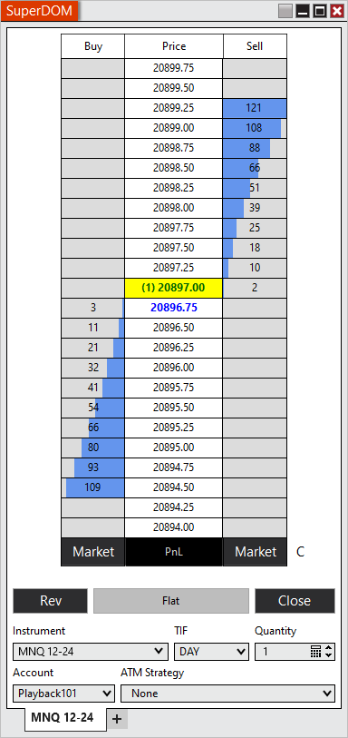
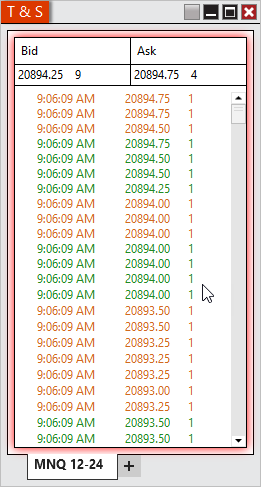
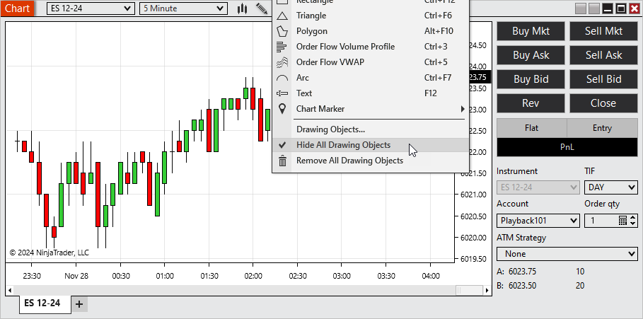
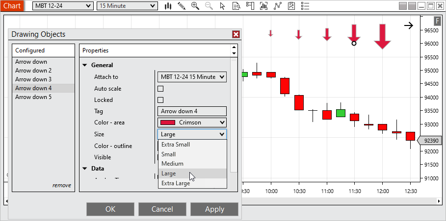
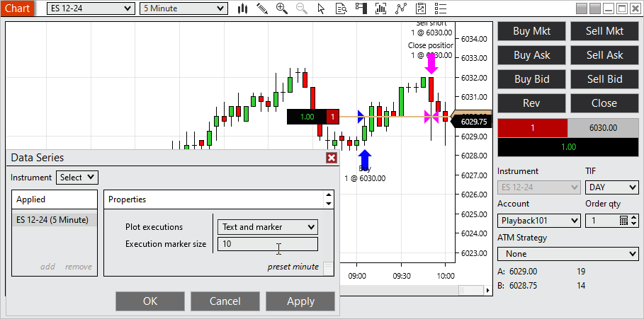
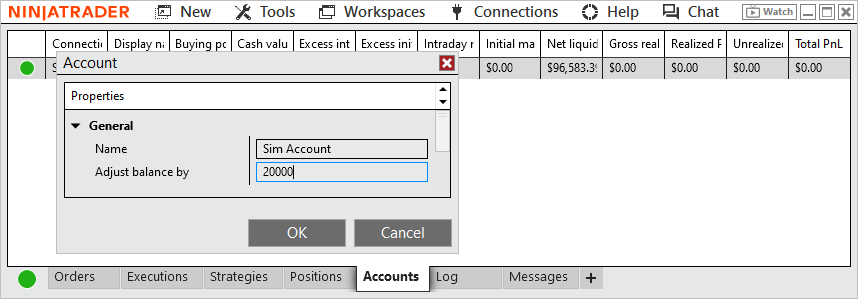

# Release Notes - NinjaTrader 8.1.4



    Release Notes > 8.1.4

8.1.4

See additional patch notes at the bottom

 

8.1.4.0 Release Date

December 17, 2024

 

| Features |
| --- |
| Order Flow + Price On Volume (POV) chart type Feature #14958          With the Price On Volume chart you can easily see the volume distribution per bar in a compact format. The areas in the bar that are most opaque have the highest volume and the areas that are more transparent have the least volume. The display with a hollow candlestick so you can still identify open, high, low and close. They also are colored to indicate up, down or doji bars. Additionally, they have a Chart Style available called POV Equivolume that will make the bars in view with the highest volume wider to further see the volume distribution on the chart. This tool is only available with the Order Flow + add-on, available within the Plans section of the Client Dashboard. |
| Order Flow + Delta chart type Feature #7065          The Delta charts build new bars based on when the cumulative delta surpasses the defined Trend Delta or Trend Reversal. In the example here, a new bar would form when the cumulative delta has increased by over 500 or decreased by over 500 since the start of the bar. This tool is only available with the Order Flow + add-on, available within the Plans section of the Client Dashboard. |
| Schwab Connection (beta) Feature #47          Schwab is now available in beta as a brokerage connection. To connect to Schwab Multi-provider must be enabled within the Control Center under Tools> Options> General. Trading to Schwab requires the Multiple Broker add-on, available within the Plans section of the Client Dashboard. |
| Depth histogram on SuperDOM Feature #15887          The Depth Histogram makes it easy to see where the largest market depth values are on the SuperDOM. Optionally this can be disabled within the SuperDOM's Properties. |
| Market depth aggregation on the SuperDOM  Feature #15876          Market Depth Aggregation shows what total volume would need to occur for the price to break through each price level. This can be enabled within the SuperDOM's Properties. |
| Add ability to freeze T & S on hover Feature #15145          The T & S window can have many trades quickly load then scroll out of view, making it difficult to examine areas of interest. Within the setting we now have added the option to freeze the T & S window on hover, allowing you to review then jump back to the current data. |
| Add the ability to hide/show all drawing objects on a chart with a button or a hot key Feature #15876          You can now quickly Hide All Drawing Objects within the Drawing Tools' menu. When disabling this option, drawing tools will return to their previous state. Drawing Tools that had their visibility disabled will not be affected. |
| Add ability to adjust the size of Drawing Tool Chart Markers Feature #17863          Chart markers now have a setting to adjust their sizes 5 different settings to best fit your preference. |
| Add ability to adjust the size of Execution Markers Feature #17864          Within the Data Series you can now adjust the size of execution markers to your preference. |
| Manage additional account settings withing platform Feature #210          Nickname/Display Name can now be set within the platform by right clicking on the account within the Accounts tab of the Control Center and selecting Edit Account. Additionally, for simulation accounts you can make adjustments to the  accounts balance from here. |
| C# 9 support Feature #16675   The NInjaScript Editor has been updated to support C# 9 |

 

| Issue # | Status | Category | Summary |
| --- | --- | --- | --- |
| 12879 | Fixed | Alerts | Resolved a scenario where pop up dialogs wouldn't populate multiple times for the same alert |
| 16986 | Fixed | ATM | Auto Trail used original entry price when scaling in |
| 20091 | Fixed | ATM, Orders | Modifying a stop/target then disconnecting/reconnecting multiple times could result in the order price no longer updating |
| 16158 | Fixed | Chart | Closing chart windows from the Task Manager while they were loading could result in an error |
| 18332 | Fixed | Chart | In the Data Box, the Bar Index could stop updating at times when adjusting the chart scale |
| 20136 | Fixed | Coinbase | Connection attempt resulted in an error |
| 16874 | Fixed | Connections | Ask password on connect couldn't be modified after a connect/disconnect |
| 19361 | Fixed | Connections | In some scenarios the prior day's daily bar was not updating after connecting |
| 19369 | Fixed | Connections | No error was shown when trying to connect after username and password was removed |
| 21987 | Fixed | Continuum/CQG | Web API connections could hang when holding a position overnight |
| 11058 | Fixed | Control Center | Accounts tab incorrectly showed the option to add a simulation account when multi-provider mode was disabled |
| 16517 | Fixed | Control Center | Account Data "Filter By Account" stops working in saved workspace after restarting |
| 16890 | Fixed | Control Center | Preferred Connections were not sorted correctly |
| 18568 | Fixed | Control Center | Feature to indicate an update is available wasn't notifying all expected users |
| 19682 | Changed | Control Center | Updated contact support utility |
| 20093 | Fixed | Control Center | Positions tab could report incorrect side when placing an order reversing your side |
| 21127 | Fixed | Control Center | Updated email to contact support |
| 16188 | Changed | Control Center, Chat | Chat and Client Dashboard is authenticated to the user initially used to log in with. |
| 14468 | Changed | cTrader | Point Values for instruments are no longer set/forced on connect |
| 15747 | Fixed | Forex.com | Connections using NInjaTrader historical data servers couldn't connect |
| 16518 | Fixed | Forex.com | Removed unnecessary logging to trace files |
| 16705 | Fixed | FX Board, Market Watch | Instrument Link not working as expected |
| 19872 | Changed | FX Board, Market Watch | Improved sorting of tiles and hover affect |
| 20290 | Fixed | Instruments | Some instruments didn't keep modified instrument mappings |
| 20913 | Fixed | Instruments | Futures Instruments saved in Recent list did not roll if saved in different symbology mode |
| 18850 | Fixed | Market Watch | Resolved a scenario where adding specific instruments with multi-provider resulted in an error |
| 19493 | Changed | Menus | Improved use of the keyboard to select items in menus |
| 15862 | Changed | News | An applied instrument filter can now be removed |
| 18469 | Changed | NinjaScript | If an Add-on used a .zip file (which is the ML.net trained model) and this .zip file was dropped in the export zip file, this file was not imported on the importing machine |
| 19249 | Fixed | NinjaScript | Duplicate bar updates could occur when loading a separate chart with the same data series and OFCD |
| 20203 | Fixed | NinjaScript | When attempting to export a script it could only be exported if there were 5 or less assemblies imported |
| 12869 | Fixed | NinjaTrader Connection | Resolved a scenario in which a dropped connection didn't reconnect |
| 15472 | Fixed | NinjaTrader Connection | Live and/or Simulation could be unavailable after creating an addition NinjaTrader connection |
| 15968 | Fixed | NinjaTrader Connection | When multi-provider was enabled you couldn't create and save a NinjaTrader simulation connection with Ask password on connect enabled |
| 16364 | Fixed | NinjaTrader Connection | Simulation/Live menu options could disappear after creating a new NinjaTrader connection |
| 21454 | Fixed | NinjaTrader Connection | Additional checks added to prevent attempting to connect while a disconnect is occurring |
| 16650 | Fixed | Order Flow + | VWAP drawing tool showed an unnecessary property |
| 16651 | Fixed | Order Flow + | VWAP Drawing Tool did not have a Data property |
| 18182 | Fixed | Order Flow + | Improved Cumulative Delta calculations for when multiple ticks occur at the same time |
| 19264 | Fixed | Order Flow + | Charts with split trading hours templates split VWAP unexpectedly |
| 14091 | Fixed | Orders | When rate limit was reached, no message indicated that as the cause of orders stuck in initiated |
| 14769 | Fixed | Orders | Resolved an error that could result from a null value |
| 15246 | Fixed | Orders | Order updates being received different than normal could result in an order showing as filled then incorrectly show as working |
| 16253 | Fixed | Orders | Clicking Close with a position and limit order could get an error if done after a dropped connection re-established |
| 16780 | Fixed | Orders | Modifying profit target or stop loss in TradingView modified entry order in NinjaTrader |
| 5920 | Changed | Regionalization | Translation pass |
| 20575 | Fixed | Regionalization, Drawing Tools | Text draw tool has been updated to better work with different languages |
| 14159 | Changed | Regionalization, Chat | Chat now opens with same language as platform |
| 14157 | Changed | Regionalization, Control Center | Client Dashboard now opens with same language as platform |
| 16685 | Fixed | Rithmic | Removed invalid Systems from the connection properties |
| 19950 | Changed | Rithmic | Updated Rithmic API to 13.4.0.0 |
| 15062 | Fixed | Server Side ATM | Quantity selector incorrectly showed in parameters |
| 17378 | Fixed | Strategies | Instrument Selector did not default to last Instrument type |
| 14901 | Fixed | Strategy | Resolved a scenario where a strategy could get applied to the Sim101 account with multi-provider disabled |
| 15203 | Fixed | Strategy | EntriesPerDirection were not respected after scaling out of a position with High Order Fill Resolution |
| 18727 | Fixed | Strategy | OnStateChange called more times than expected when default templates for strategies existed |
| 19306 | Fixed | Strategy | Resolved a scenario where template didn't load saved parameters |
| 15948 | Fixed | Strategy Analyzer | Order quantities could be incorrect when running a Multi-Objective Optimization |
| 15967 | Fixed | Strategy Analyzer | Optimizer skipped some iterations unexpectedly |
| 11651 | Fixed | Strategy Analyzer | Different behavior occurred when opening log results by double-clicking vs opening in new window/tab |
| 13311 | Fixed | Strategy Analyzer | The results in the lower summary grid did not match the selected row in the upper list of optimizations when using Time input properties after a restart |
| 13801 | Changed | Strategy Analyzer | Improved an error to indicate if there is insufficient data available for secondary series |
| 14183 | Fixed | Strategy Analyzer | Opening a chart from a trade displayed  with the time period of the secondary  data series |
| 14466 | Changes | Strategy Analyzer | Commissions templates are now selected/applied in Settings |
| 15421 | Fixed | Strategy Analyzer | Error occurred when optimizing a strategy with a public property that was missing the order attribute |
| 19226 | Fixed | Strategy Analyzer | Resolved a scenario where memory usage was not clearing |
| 19258 | Fixed | Strategy Analyzer | Using a public TimeSpan property in strategy caused log results to display 0 |
| 19626 | Fixed | Strategy Analyzer | Keep # of best results parameter was not working for AI Generate optimizer |
| 20786 | Fixed | Strategy Analyzer | Public brush prevented strategy logs from saving |
| 15940 | Fixed | Strategy Builder | User input could get stuck so it couldn't be edited or removed |
| 14000 | Fixed | Trade Performance | An error could occur when disconnecting while downloading Trade Performance results |
| 20315 | Fixed | Trade Performance | Resolved a scenario where orders date showed 1/1/0001 |
| 16315 | Fixed | TradeStation | Orders from continuous contracts no longer requires a restart on the rollover date |
| 17035 | Changed | Windows | Add middle mouse clicking to close tabs |
| 17470 | Fixed | Windows | Not all headers were properly styled |

 

8.1.4.1 Release Date

December 20, 2024

| Issue # | Status | Category | Summary |
| --- | --- | --- | --- |
| 24005 | Fixed | Control Center, Orders | Trading from Web Trader could result in incorrect Time and market orders not showing on Orders tab |

 

8.1.4.2 Release Date

March 13, 2025

| Issue # | Status | Category | Summary |
| --- | --- | --- | --- |
| 23935 | Changed | Schwab | Refined Schwab integration to improve order submission and trading platform compatibility |
| 22783 | Changed | Order Flow + | Added a direct link to the Plans section of the Client Dashboard in Order Flow + pop-up for easier access to upgrade options |