# Release Notes - NinjaTrader 8.1.5



    Release Notes > 8.1.5

8.1.5

See additional patch notes at the bottom

 

8.1.5.0 Release Date

May 28, 2025

 

| Features |
| --- |
| Fair Value Gap indicator Feature #26714     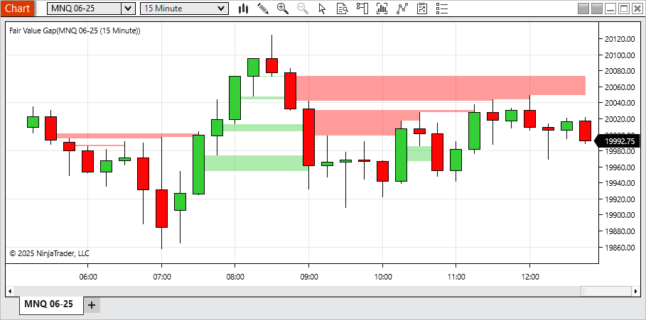     A new Fair Value Gap indicator has been introduced to help identify gaps between price movements over three-bar sequences. When a gap is detected between the first and third bars, a visual highlight is drawn. This highlight can extend until it is filled, partially filled, or after a user-defined number of bars. Gaps moving upward are displayed in green, while downward gaps appear in red. Users can filter out smaller gaps and limit the number of plotted highlights. This tool may be useful for identifying areas of fast price movement or potential interest for further review. |
| Marker for drawing tools when placing or modifying Feature #24356     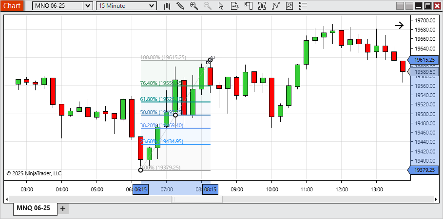     To improve precision when placing or modifying drawing tools, markers are now shown at key data points during interaction. This allows for more accurate object placement. This feature is enabled by default and can be turned off in the chart settings. |
| Chart snap mode enhancements Feature #24386     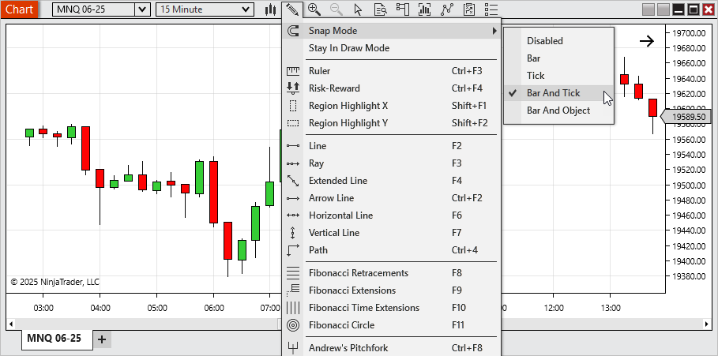     A new default Snap Mode, Bar And Tick, has been added for more intuitive drawing object placement aligned with bar times and tick prices. Additionally: •Bar And Price has been renamed to Bar And Object to better reflect that snapping occurs to the price level of any chart object.•Price mode has been renamed to Tick for consistency and clarity. |
| Ichimoku Cloud indicator Feature #24849     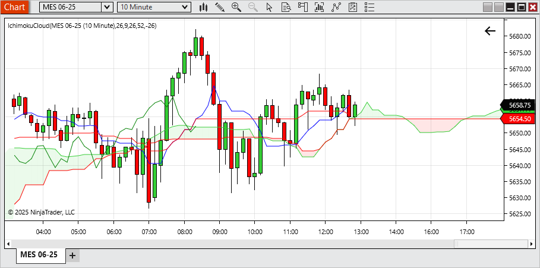     The Ichimoku Cloud is now available as a built-in indicator. It calculates support/resistance levels and trend direction based on five lines: Conversion (Tenkan),Base ( Kijun), Leading (Senkou) Span A, Leading (Senkou) Span B, and Lagging (Chikou). The cloud formed between the Leading (Senkou) Spans can help users visualize potential trend strength and market equilibrium. This indicator is configurable and designed to fit various analytical styles. |
| Indicator search and description Feature #27279     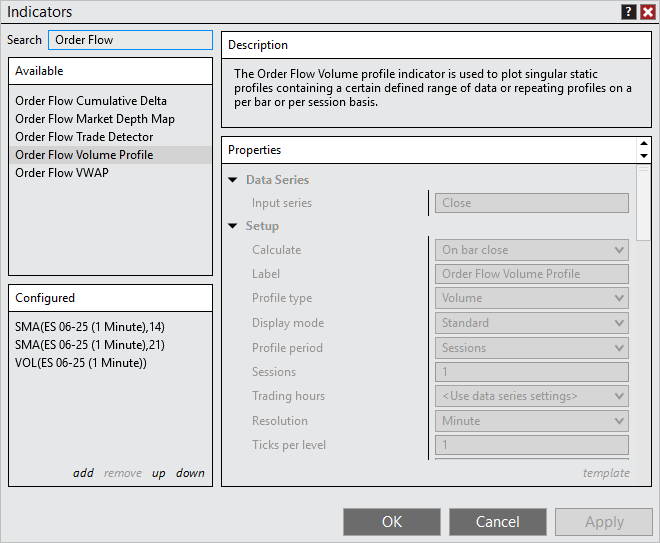     The Indicators window now includes a search function, allowing users to quickly locate indicators by searching both their names and descriptions. A new Descriptions panel has also been added, making it easy to view the purpose and functionality of each indicator. This helps clarify why a specific indicator may have appeared in your search results and provides more context for choosing the right tool. |
| Price markers for horizontal lines Feature #24850     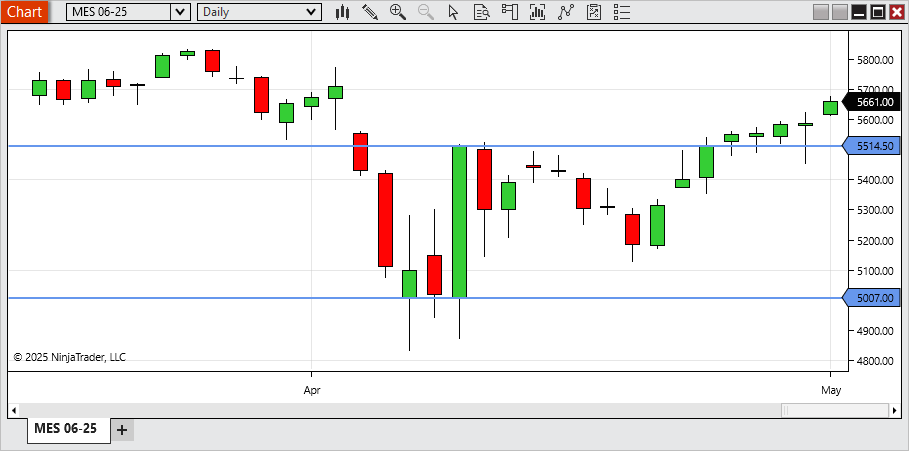     A new setting in horizontal line drawing objects allows users to display a price marker, making it easy to view the exact price level of the line directly on the chart. |
| Time Highlighter Feature #24499     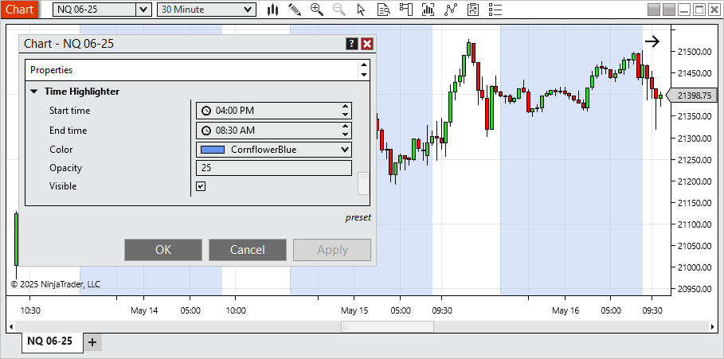     A new Time Highlighter setting is now available within the chart’s properties, allowing you to visually highlight specific times of day on your chart. Use it to mark ETH hours or any custom time ranges you want to draw attention to during your trading sessions. |
| Invert chart panel's scale Feature #24498     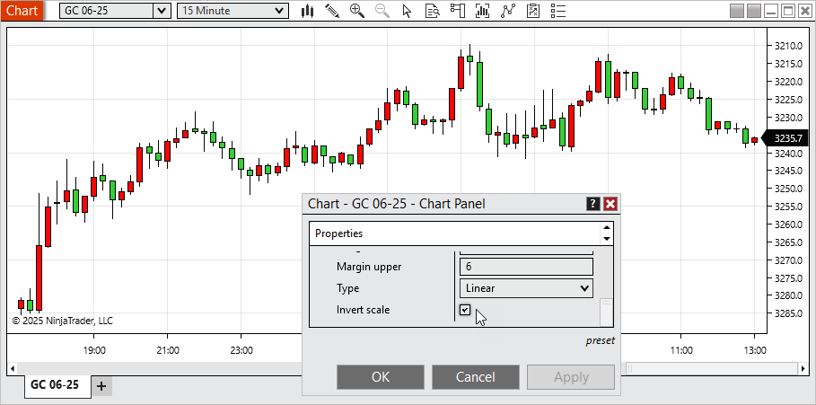     Users can now invert the vertical axis of any chart panel. This feature is useful for traders who prefer an alternate visual layout or who use mirrored price patterns for comparative analysis. |
| Ignore errors and no alert on strategy Feature #22487     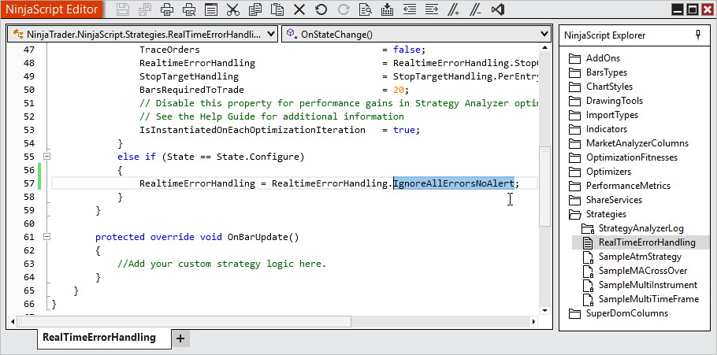     New handling allows a strategy to continue running even if errors occur and alerts for those errors will also be suppressed. Users are responsible for monitoring the Logs tab for error messages and managing them as needed. |
| Quantity modification Hot Keys Feature #25072     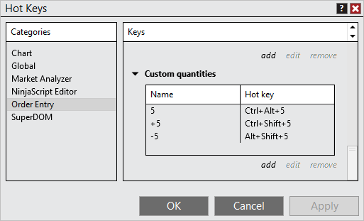     Custom Quantity Hot Keys allow users to quickly adjust order quantities using the keyboard. You can: •Set quantity to a fixed value.•Increase quantity by a specified amount.•Decrease quantity by a specified amount. |
| Reduce quantity input with Number Pad Feature #25110     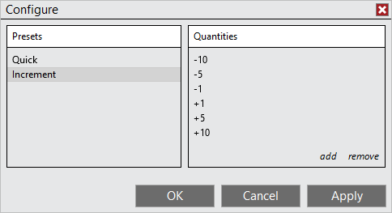     Order entry quantity adjustments using the Number Pad can now accept negative increment values, making it easier to reduce order size directly from the Number Pad. |
| Location settings for Bar Timer and Counter indicators Feature #26077     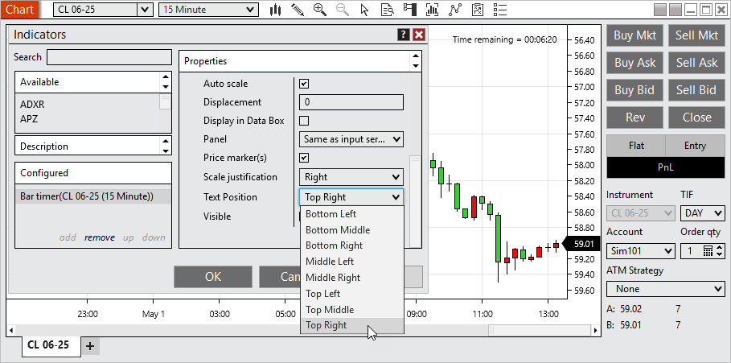     The Bar Timer and Bar Counter indicators can now be placed in any of eight configurable positions on the chart, offering greater flexibility for workspace layout and readability. |
| From and To time inputs for Trade Performance Feature #26023     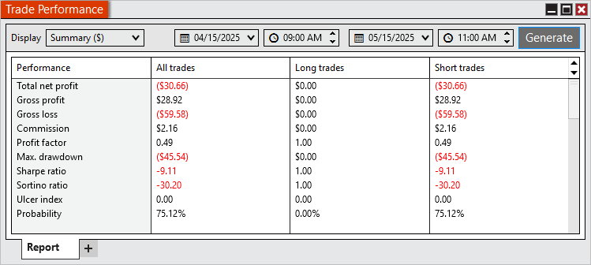     You can now define specific From and To time inputs when reviewing Trade Performance, allowing for refined analysis within a particular time range of the trading day. |
| Schwab in production Feature #25475     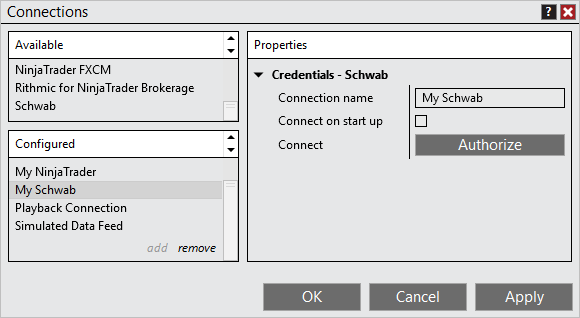     The Schwab brokerage connection has transitioned from Beta to Production status. To enable this connection: •Multi Provider mode must be enabled via Tools > Settings•Configure the Schwab connection under Control Center > Connections > ConfigureNote: Trading requires the Multiple Broker Add-on, available in the Client Dashboard > Plan |
| Hot Lists with Schwab Feature #21286     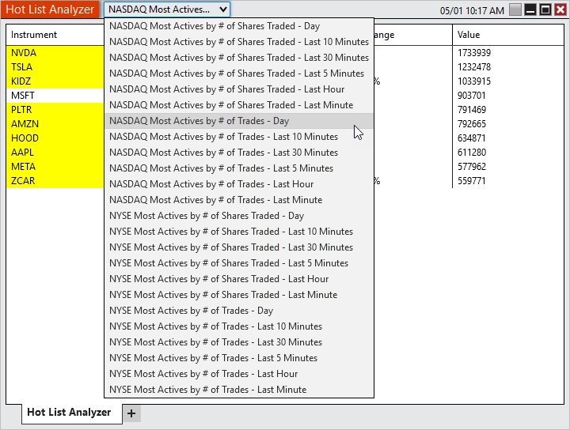     While connected to Schwab, users can now access Hot Lists showing the most active NASDAQ and NYSE instruments based on trade volume or number of trades over defined timeframes. |
| Workspace column in Strategies tab Feature #26020     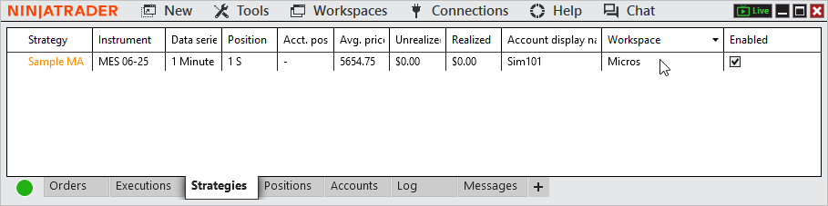     A new optional Workspaces column in the Strategies tab allows users to quickly identify which workspace each strategy instance is running in, streamlining multi-workspace management. |

 

| Issue # | Status | Category | Summary |
| --- | --- | --- | --- |
| 22862 | Fixed | ATM | Resolved unexpected behavior with available saved ATMs when saving an existing ATM with a new name |
| 21859 | Fixed | Basic Entry | Resolved an issue where pasting a value into price and clicking buy/sell submitted to last value instead |
| 27275 | Changed | Chart | Instrument selector now shows the drop-down as a button to better differentiate the typing input vs drop-down |
| 25791 | Fixed | Chart | Resolved an error that could occur when resizing a window |
| 21602 | Fixed | Chart | Adding Volumetic to Interval selector could show incorrect applied value |
| 24981 | Fixed | Chart | Using text drawing tool in a non primary chart panel didn't properly display the input |
| 23315 | Fixed | Chart | Drawing tool tile couldn't be dragged to a new chart |
| 27410 | Changed | Chart | Added an additional chart background image |
| 27394 | Fixed | Coinbase | Resolved an unexpected connection loss and error that could occur |
| 26066 | Fixed | Coinbase | Infrequent bid/ask updates were occurring |
| 27077 | Changed | Control Center | Implemented a new message support flow to prevent limit errors |
| 23466 | Changed | Control Center | Error messages now support HTML links |
| 22834 | Changed | Control Center | Client Dashboard is now based on your log in and can be accessed without being connected to an account |
| 26570 | Changed | Control Center | Enhanced detection of live stream occurring |
| 27271 | Changed | Control Center | Changed Options to Settings to reduce confusion with options instruments |
| 26563 | Fixed | Control Center | Messages tab was not showing some message types |
| 27285 | Fixed | Control Center | Disabling Show Tabs then restarting display setting as enabled when still disabled |
| 22174 | Fixed | Control Center | Some errors didn’t have the current support email address |
| 22397 | Fixed | Control Center | Link to fund account was broken |
| 24795 | Fixed | Control Center | Trailing Max Drawdown was not calculating as expected in some scenarios |
| 26255 | Fixed | Control Center | Selecting no in close window confirmation for Client Dashboard resulted in a blank window |
| 25923 | Fixed | Control Center | Error removed from log when level 2 data is not available |
| 25967 | Changed | Control Center | Warning is displayed when system resumes from a suspended state |
| 26214 | Fixed | Control Center | Commission, Risk, and Trading hour templates could have blank names |
| 24193 | Changed | Control Center | Warning is displayed when Documents folder is on OneDrive |
| 23984 | Fixed | Historical Data Window | Was unable to export data that was saved with a different symbology display style |
| 22237 | Fixed | Hot Keys | Removed default hot key for OCO which conflicted with default Windows hot keys |
| 22178 | Fixed | Interactive Brokers | A connection issue could prevent order updates and didn't trigger a connection loss |
| 21643 | Fixed | Interactive Brokers | The instrument ADD incorrectly displayed |
| 26454 | Changed | Interactive Brokers | Now requires Trader Workstation |
| 27055 | Changed | Licensing | Additional 3rd party licensing option made available |
| 25468 | Fixed | Market Analyzer | Error could occur when using some columns with saved workspaces and adding additional instruments |
| 23428 | Changed | Market Analyzer | Attempting to add an instrument already in the list will now scroll to and highlight that instrument |
| 23780 | Fixed | NinjaScript | Comments after public properties marked NinjaScriptProperty prevented proper constructor generation |
| 25757 | Changed | NinjaScript Editor | Find and Replace window now used for both related hot keys |
| 24662 | Fixed | NinjaTrader Connection | Connecting to a different NinjaTrader connection than used for log in could result in token errors |
| 24033 | Fixed | NinjaTrader Connection, Options Chain | Some instruments were not receiving data |
| 21338 | Fixed | NinjaTrader Connection, Orders | Modifying an existing Arena order after reconnecting could get stuck in pending change |
| 26819 | Fixed | NinjaTrader Connection, Orders | Addressed an issue resulting in missing order updates |
| 25035 | Fixed | NinjaTrader Connection, Orders | Improved error handling for when connection provider is unavailable |
| 21769 | Fixed | NinjaTrader Connection, Strategy | MIT orders using same signal name were duplicated instead of updated |
| 27107 | Fixed | NinjaTrader Continuum, CQG | WebAPI connections stopped receiving data with European time zone settings during daylight saving change |
| 20577 | Changed | NinjaTrader Continuum, CQG | Introduced OAuth to connection settings |
| 27200 | Fixed | Option Chain | Crash occurred when attempting to send an option order with the wrong symbol for broker |
| 22076 | Fixed | Order Flow + | With Market Depth Map applied the send to back z-order functionality froze the platform |
| 23239 | Fixed | Order Flow + | VWAP drawing tool had an error when placed on something other than a data series |
| 23387 | Fixed | Order Flow + | Delta charts did not show selected values on chart toolbar |
| 25995 | Fixed | Order Flow + | Price On Volume chart styles now only show for the related chart type |
| 22874 | Fixed | Order Flow +, Drawing tools | VWAP drawing tool slope color was incorrect when drawn into the future |
| 22239 | Changed | Orders, Control Center | Last order button keyboard focus can now be set within Settings > Trading and is disabled by default |
| 23700 | Changed | Regionalization | Implemented additional translations |
| 21229 | Fixed | Rithmic | Improved compatibility checks for connections |
| 21309 | Fixed | Schwab | Commissions were not populating |
| 22984 | Fixed | Schwab | Did not reconnect after disabling firewall |
| 23197 | Fixed | Schwab | OCO was missing on reconnect with new database |
| 24794 | Fixed | Schwab | Date range validation could have an error on requesting bar series for historical data |
| 25036 | Fixed | Schwab | Connection could be prevented when receiving positions with no instrument data |
| 26017 | Fixed | Schwab | Having unverified credentials prevented the connections dialog from saving changes to other connections |
| 27003 | Fixed | Schwab | Connection did not allow re-authentication when machine ID changed |
| 26684 | Fixed | Schwab | Expected error was not showing when connection needed to be re-authorized |
| 22985 | Fixed | Schwab | Disconnection message could show more times than necessary |
| 24671 | Fixed | Schwab, Level II | Closing or changing instruments caused market data to stop processing correctly |
| 25674 | Fixed | Schwab, NinjaScript | OnExecutionUpdate() gave the cumulative quantity total filled rather than the quantity pertaining only to that execution |
| 21344 | Fixed | Schwab, Orders | Submitting 1 OCO then unchecking OCO resulted in order canceling and showing stuck in cancel pending |
| 25138 | Changed | Schwab, Orders | MIT order are now locally simulated to prevent errors when using with OCO |
| 26777 | Fixed | Schwab, Orders | Flatten or Reverse Orders can't be replaced error occurred when placing an order that would reverse your position |
| 24357 | Fixed | Schwab, Positions | Position was not showing for Close Ended Funds/ ETF's |
| 21405 | Fixed | Schwab, Strategies | Sell orders could be sent as short sales resulting in a rejection |
| 24452 | Changed | Share Service | Updated Outlook email share service |
| 24047 | Fixed | Strategy Analyzer | Trading hours selector reverted to use instrument setting after a backtest completed |
| 24879 | Fixed | Strategy Analyzer | Data Series reset back to 1 minute after first test completed |
| 24911 | Fixed | Strategy Analyzer | Compiling could change time interval selection |
| 26842 | Fixed | SuperDOM | Repeating errors could occur when stacking buy limit orders |
| 22592 | Fixed | SuperDOM | Pulling/Stacking column intermittently not working as expected |
| 23128 | Changed | SuperDOM | Implemented data performance enhancements |
| 23592 | Changed | TD Ameritrade | Decommission TD Ameritrade |
| 20562 | Fixed | Trade Performance | Resoled a scenario where simulation accounts didn't return performance results |
| 26871 | Fixed | Trade Performance | Error could occur when adding a journal entry |

 

8.1.5.1 Release Date

June 10, 2025

 

| Issue # | Status | Category | Summary |
| --- | --- | --- | --- |
| 29107 | Fixed | Indicators | Ichimoku Cloud's lagging line had incorrect displacement |
| 28931 | Fixed | Market Analyzer, Hot List Analyzer | Adding an instrument already added displayed an error if a mini chart was applied |
| 29205 | Fixed | NinjaScript Editor | Intelliprompt was not displaying all drawing tools in the Drawing class |
| 29019 | Fixed | Regionalization | New or changed text that hasn't been translated yet displayed as blank rather than in English |
| 29045 | Changed | Rithmic | NG was unable to receive real-time data |

 

8.1.5.2 Release Date

July 2, 2025

 

| Issue # | Status | Category | Summary |
| --- | --- | --- | --- |
| 29420 | Fixed | Chart | Some custom chart intervals showed as @VALUE |
| 29660 | Fixed | Chart, Order Flow + | Error occurred when moving objects on the z axis of a Volumetric chart |
| 29696 | Fixed | CQG WebAPI, Orders | Resolved a scenario where position updates did not come in as expected |
| 29925 | Fixed | cTrader | Demo check-box was missing |
| 29549 | Fixed | Drawing Objects | Locked lines could move when clicked on |
| 29269 | Fixed | Interactive Brokers, Orders | Trades to NG 07-25 showed as NG 12-99 |
| 29872 | Fixed | Orders | Stop limit order marker showed at zero when triggered but not filled |
| 29895 | Fixed | Orders | Stop limit orders couldn't have offset set to zero unless preconfigured in Properties |
| 29459 | Fixed | Rithmic, Orders | Orders could not be submitted to NG |
| 29631 | Fixed | SuperDOM | Quantity field was automatically selected when launching the platform |
| 29451 | Fixed | Vendor Licensing | Trial for new products couldn't be set to 0 |
| 29248 | Fixed | Vendor Licensing, NinjaScript | NinjaScript objects calling VendorLicense() could lock up platform |