# Release Notes - NinjaTrader 8.1.6



    Release Notes > 8.1.6

8.1.6

See additional patch notes at the bottom

 

8.1.6.0 Release Date

September 25, 2025

 

| Features |
| --- |
| Pulse Feature # 18488     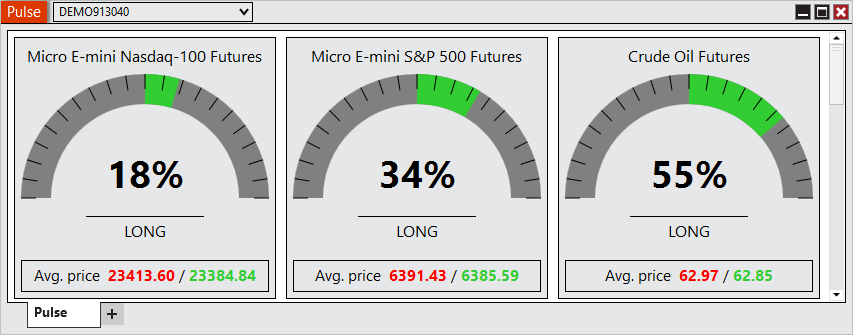     Gain a clearer picture of market sentiment with the new Pulse window. Pulse delivers real-time insights by comparing long and short positions and highlighting average entry prices across popular Futures markets, helping you instantly see the balance of participation at a glance. A basic overview of its calculations is (Sum of Net Long Positions - Sum of Net Short Positions)/Sum of All Net Positions. You can access Pulse from the New menu in the Control Center. |
| Order Entry mouse Hot Keys Feature # 29312     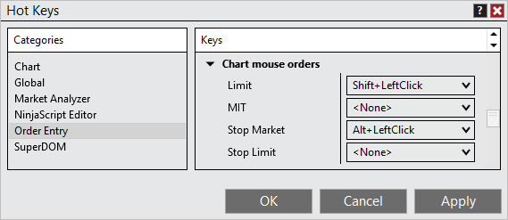     Trade faster with mouse-based hot keys on charts. By combining a keyboard modifier with a mouse click, you can send orders instantly. Designed for speed and familiarity, this feature keeps your workflow smooth and efficient. |
| Show Indicators toggle Feature # 27716     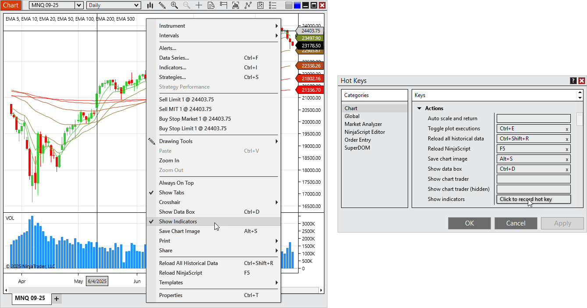     Need a clean chart view in a hurry? The new Show Indicators toggle makes it simple to temporarily clear your charts with a single action, then restore your full setup instantly. Available from the chart’s right-click menu or optionally configurable as a Hot Key. |
| Configurable PnL and Position colors Feature # 28264     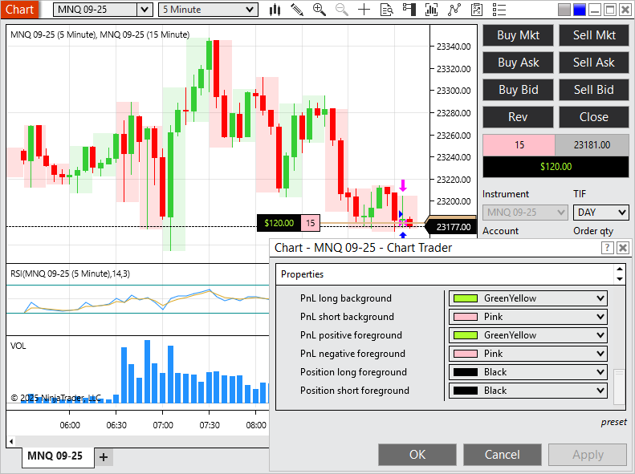     Personalize your platform with custom PnL and Position colors. Whether for accessibility or preference, this enhancement makes critical values easier to see the way you want. |
| Streamlined template loading Feature # 29784     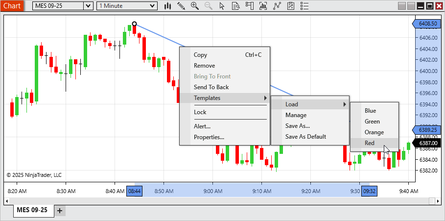     Switch Templates faster than ever. The new streamlined Template menus let you apply Chart, Market Analyzer, SuperDOM, or Drawing Tool Templates from the right click menu, no extra windows required. Managing Templates is still just as easy with dedicated “Manage” options. |
| Multiple Time Highlighters Feature # 30422     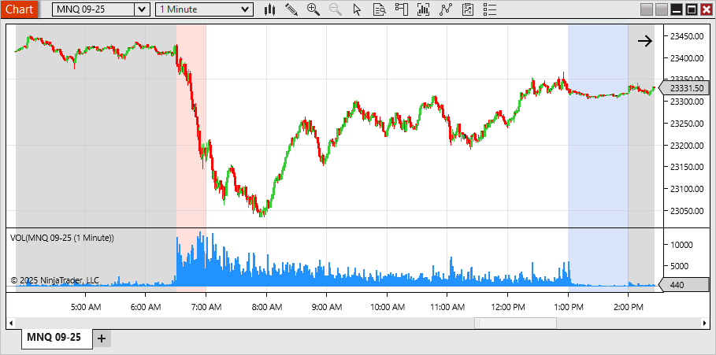     Mark the moments that matter most. With support for multiple Time Highlighters per chart, you can now visually track several key times in your trading session. Such as opens, extended trading hours, or custom time windows all in one view. |
| NinjaScript access for Volume Profile Feature # 28844          Developers now have direct programmatic access to Volume Profile values in NinjaScript. Use essential outputs like POC, Value Area High, and Value Area Low to unlock deeper customization and build next-generation strategies. |
| Guidance for when a user has no accounts Feature # 6135     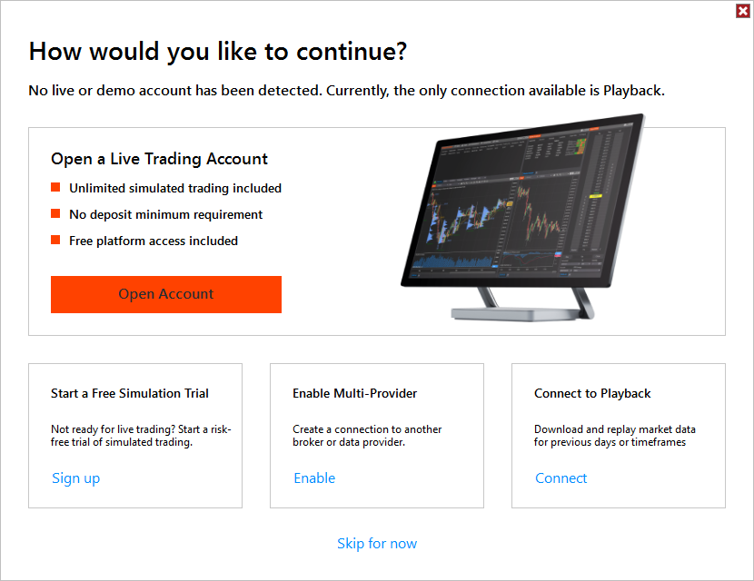     Getting started is now easier with a new “How would you like to continue?” window. First-time users without an account can quickly choose to open a live account, start a free trial, enable multi-provider mode, connect to Playback, or skip for now ensuring a smoother first experience.. |
| Trade Detector Alerts Feature # 26022     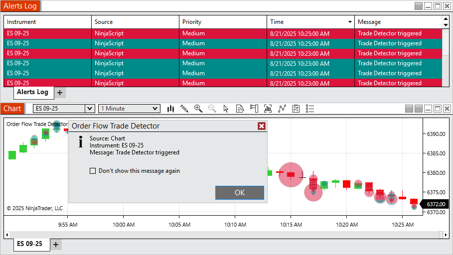     Stay on top of activity with Trade Detector alerts. When enabled, you’ll see a pop-up whenever a new marker is triggered, with alerts also logged for easy review. |
| Import and Export of Workspaces Feature # 26751     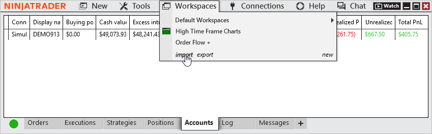     Take your workspace with you. The new workspace import and export tools make it easy to back up, share, or move your custom layouts directly from the Control Center. No file digging required. |
| Configurable Quotes in T&S Feature # 30707     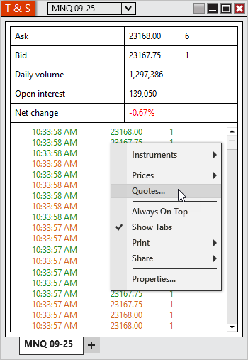     Make Time & Sales your own with configurable quotes. Choose which values (exampole Bid, Ask, Daily High/Low, Net Change) appear at the top of the window and personalize their labels, order, and colors for a tailored display. |
| Wicks and outlines optionally match candle's body Feature # 29753     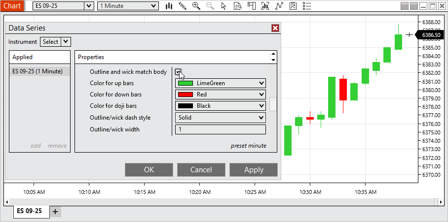     Give your charts a fresh, modern look with the new option for candlestick outlines and wicks to match the candle body color. Cleaner visuals make charts easier to interpret at a glance. This option is enabled by default for new charts, while existing workspaces and templates remain unchanged. To restore the old style as your default, simply uncheck Outline and wick match body, right-click on Chart Style, and select Set preset. |
| Charts can display in 12 hour or 24 hour formatting Feature # 29756     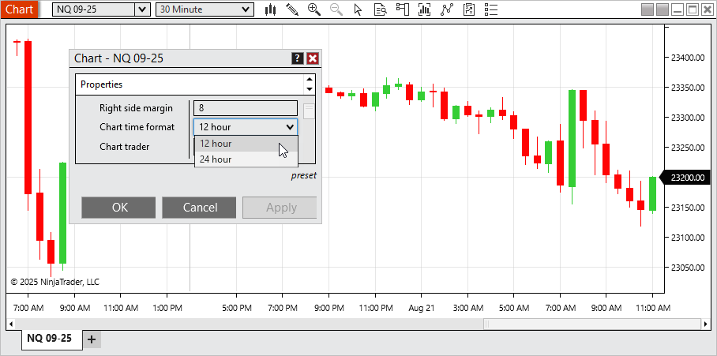     View chart times in the format that works best for you with the new ability to switch between 12-hour (AM/PM) and 24-hour display. By default, new charts now use 12-hour format, while your saved workspaces and templates remain unaffected. To set 24-hour as your default, open Chart Properties, select Chart time format > 24 hour, then use Preset > Save. |
| Additional Time Frame settings load based on calendar values Feature # 28877     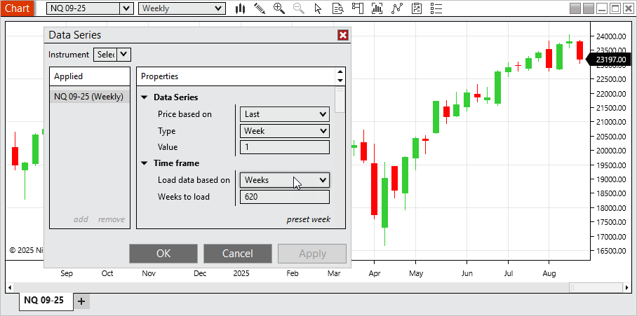     Analyze higher timeframes more naturally with calendar-based data loading. Charts can now load by calendar weeks, months, or years. This aligning perfectly with standard market periods. |
| Indicator descriptions support line breaks and hyperlinks Feature # 31035     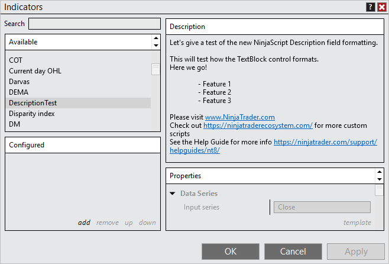     Indicator descriptions are now more readable and interactive. Descriptions support line breaks for better formatting and clickable links for quick access to vendor documentation or websites, all rendered through an updated TextBlock control for a cleaner, modern presentation. |
| NinjaScript Editor support C#13 Feature # 30437   Develop with the latest language features using the updated NinjaScript Editor with C# 13 support. Build more powerful and flexible custom scripts with modern C# capabilities. |

 

| Issue # | Status | Category | Summary |
| --- | --- | --- | --- |
| 27977 | Fixed | Chart | Attempting to print in landscape mode printed in portrait mode |
| 29292 | Fixed | Chart | Zoom was not working as expected in some scenarios |
| 29724 | Fixed | Control Center | Duplicating the Strategies tab caused Realized PnL to reset to 0 |
| 30484 | Changed | Control Center | Updated export NinjaScript add on protected compiled assembly link and made link clickable |
| 28305 | Changed | Instruments | Added the instrument selector to the title bar of windows with no instrument selector |
| 27902 | Changed | Instruments | Instrument input now displays if the selected instrument has delayed data |
| 29266 | Fixed | IQ Feed | Remove Hot Lists since provider doesn't support them |
| 28204 | Fixed | IQFeed, Option Chain | Symbol limit was reached unexpectedly |
| 26543 | Changed | Licensing | Agile.NET support was upgraded to 7.0.0.24 (updated to 7.0.0.30) |
| 29919 | Fixed | Licensing | 3rd Party Licensing window could get an error when pressing buttons multiple times quickly |
| 31003 | Fixed | NinjaScript | Using the NinjaTrader.Data.BarsPeriodConverter type converter caused an error when selecting some bar types |
| 31236 | Fixed | NinjaTrader Connection | Username and Password fields said optional when they are required |
| 27708 | Changed | Order  Flow + | Error now only shows once when multiple Order Flow + items are opened at the same time |
| 30436 | Fixed | Reginalization | Español showed as Castellano |
| 27745 | Fixed | Rithmic, Orders | MHG was not showing position/unrealized PnL on order entry windows, but did on Control Center |
| 29737 | Changed | Share Services | Remove AT&T from preconfigured settings since provider dropped support for email to text/text to email |
| 30505 | Fixed | Strategies | Duplicating a multi-series strategy from the Strategies tab that was applied from a chart changed the primary series |
| 30547 | Fixed | Strategies, Chart | Error could occur preventing candles from rendering |
| 31303 | Fixed | Tick Replay, Chart | Delta bars couldn't use tick replay |
| 27868 | Fixed | Tick Replay, Order  Flow + | Cumulative Delta did not reset for new session when tick replay is enabled |
| 26838 | Changed | Traces | Now includes parameters for orders with ATMs |
| 5328 | Changed | Trade Performance | Now includes per fill fees |
| 29030 | Fixed | Trading Hours - | A template with three sessions in Saturday caused the platform to crash |

 

8.1.6.1 Release Date

December 2, 2025

| 32126 | Changed | NinjaScript | Auto updated old Infragistic references to prevent compile errors |
| --- | --- | --- | --- |
| 33665 | Fixed | Trade Performance | Accounted for a backend change that could prevent performance results from displaying |
| 33239 | Changed | Licensing | Agile.NET support was upgraded to 7.0.0.30 to resolve slow loading |
| 33185 | Fixed | Order Flow + | Volume Profile with Tick resolution mode on Price Profile type caused excessive load times |
| 33138 | Fixed | Workspaced, Trade Performance | Loading a workspace that had Trade Performance saved in it could result in an error |
| 33957 | Fixed | NinjaScript | Timeouts were occurring when attempting to export scripts with code virtualization |
| 34390 | Changed | Log In | Added NinjaTrader Prop selection for associated accounts |

 

8.1.6.2 Release Date

December 16, 2025

| 35345 | Fixed | Order Flow + | Volume Profile didn't plot as expected on high time frames |
| --- | --- | --- | --- |
| 35593 | Fixed | Log In | Resolved a scenario where an account could show as NT Prop when it wasn't |
| 35590 | Fixed | Log In | Resolved a broken link for opening an account |

 

8.1.6.3 Release Date

January 16, 2026

| 35737 | Fixed | Order Flow + | For some instruments the Volume Profile briefly extended beyond the defined session |
| --- | --- | --- | --- |
| 36219 | Fixed | Trade Performance | Orders display could show the time with the incorrect time zone applied |
| 35630 | Fixed | NinjaScript | Improved stability when performing multiple vendor license checks |
| 34200 | Changed | Localization | Regulatory updates have been applied for new accounts in certain regions to ensure continued compliance |