# Release Notes - NinjaTrader 8.1.7



    Release Notes > 8.1.7

8.1.7

See additional patch notes at the bottom

 

8.1.7.0 Release Date

May 13, 2026

 

| Features |
| --- |
| Static SuperDOM now available to all users Feature # 36497     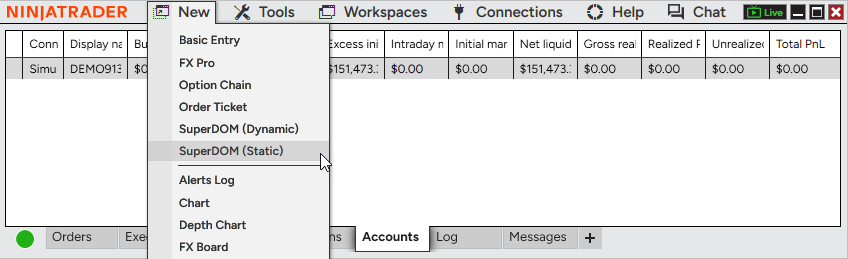     Use the Static SuperDOM without additional fees or entitlements. It’s now freely available to all users, making it easier to access a familiar depth-of-market trading experience. The Static SuperDOM also now supports all instrument types, no longer limited to futures. Access the Static SuperDOM from the New menu in the Control Center. |
| Faster last price updates on charts Feature # 31708   Charts now feel more responsive with 5X faster visual updates to the last price marker. The last traded price refreshes every 50ms rather than every 250ms, so you can track fast-moving markets with greater confidence. This improvement applies automatically and does not change overall chart performance or behavior. |
| Scroll wheel zoom for charts Feature # 36683     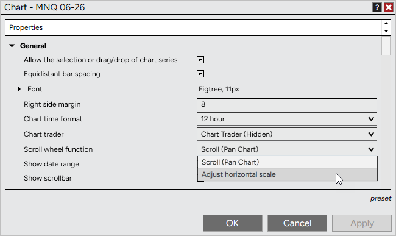     Customize how your mouse scroll wheel behaves on charts. In addition to panning, you can now use it to adjust the horizontal scale, making it easy to zoom in and out of price action with precision. To configure, go to Chart Properties > General > Scroll wheel function and select your preferred behavior. Default remains Scroll (Pan Chart). |
| Calendar window with Economic events Feature # 30178     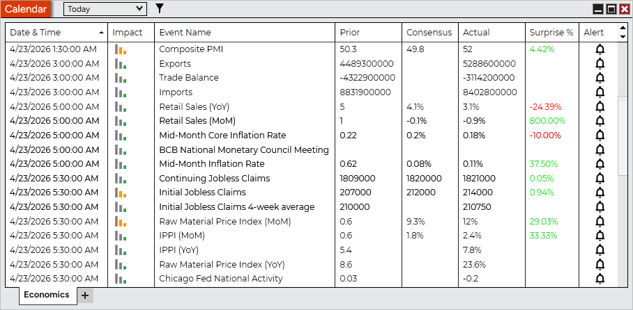     Stay informed with the new Calendar window, featuring an Economic tab for tracking upcoming market events. View key data like impact, consensus, actual values, and surprise percentages to better understand how events may influence the markets. Filter events by timeframe or impact level to focus on what matters most. Access the Calendar from the New menu in the Control Center. |
| Improved indicator descriptions Feature # 38605          Understand indicators more easily with enhanced descriptions in the Indicator Properties window. The dedicated panel provides clearer, better-structured explanations along with improved formatting and support for helpful links. Access descriptions directly within Indicator Properties, no additional clicks required. |
| Market Analyzer price change highlighting Feature # 37768     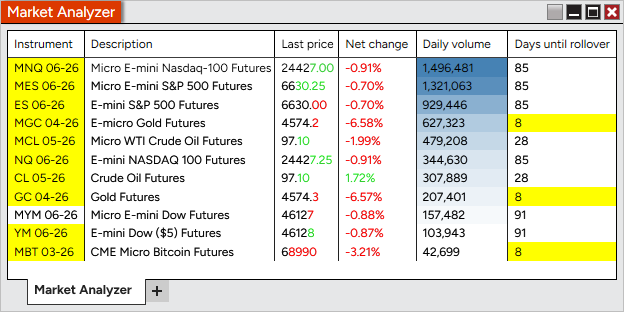     Spot price movement instantly with new highlighting in Market Analyzer. Price changes can now flash and persist on updated digits, making it easier to see direction and magnitude at a glance. Enable, disable, or customize this in Column Properties > Visual > Highlight changes for Last, Bid, or Ask prices. Enabled by default for Last price in new windows; Bid and Ask remain off. Existing workspaces are unchanged. |
| Hover highlight for Market Analyzer rows Feature # 38210     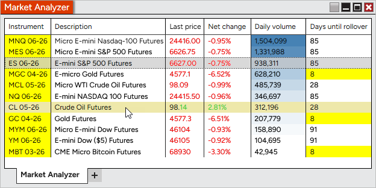     Quickly scan Market Analyzer without changing your selection. Rows now highlight on hover, making it easier to inspect values without triggering instrument linking. Customize the highlight color in Market Analyzer Properties > Colors > Hover highlight. |
| Updated default workspace experience Feature # 35980     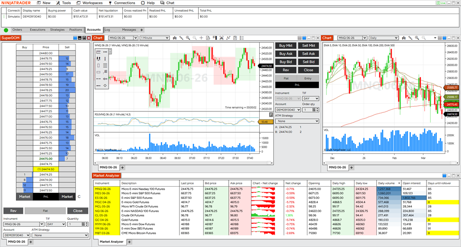     Get started faster with redesigned default workspaces that highlight key platform features in a clean, approachable layout, or check out the advanced workspace for additional settings and features. New users are now introduced to common workflows with improved organization and visual consistency. |
| Trade lines for all chart orders Feature # 32888     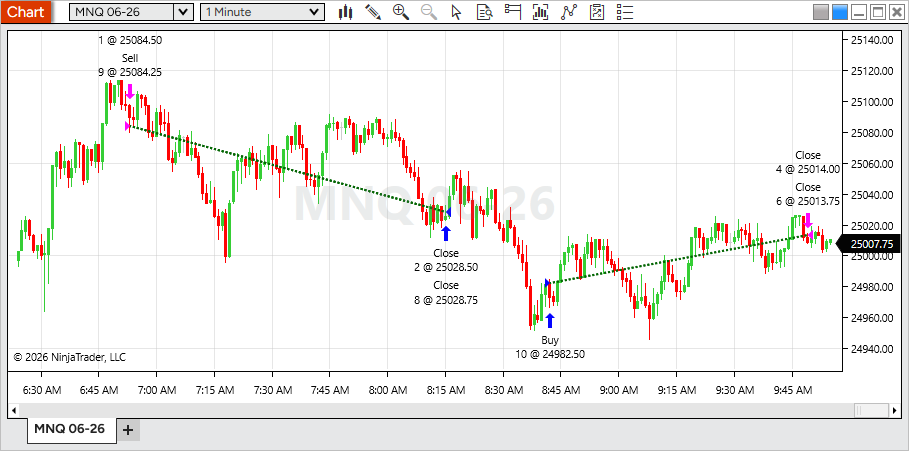     Track performance more clearly with profitable and unprofitable trade lines now available for all chart orders, not just NinjaScript strategies. This brings consistent visual feedback to both manual and automated trading. To configure, open Data Series > Trades and adjust trade line settings or toggle Show trade lines. Enabled by default; uncheck to hide. |
| Data Series watermark on charts Feature # 35780     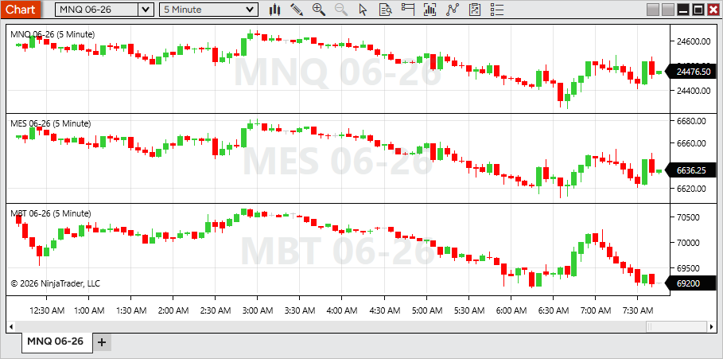     Display key chart details more clearly with a new Data Series watermark. Show instrument, period, and more as large, centered text on each panel—making it easy to identify charts at a glance. To configure, open Chart Properties > Data Series watermark and insert tokens or custom text. Delete the current values to disable. Enabled for new panels by default. Existing workspaces remain unchanged. |
| Time marker for vertical lines Feature # 37003     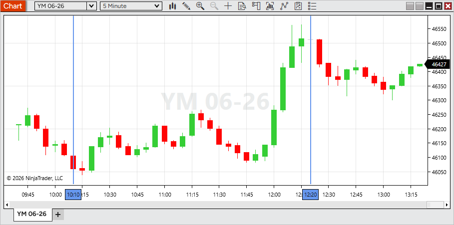     Vertical lines include a new time marker, making important reference points easier to identify at a glance. To enable, oping Vertical line Properties and check Time marker Existing drawings remain unchanged. |
| Enhanced color picker Feature # 32786     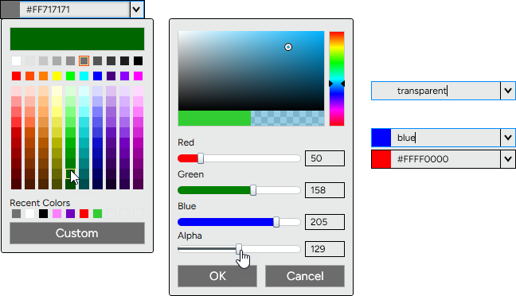     Choose colors more easily with a redesigned color picker. A new grid layout with organized tints, shades, and grayscale options makes it faster to find the exact color you need. For more control, use Custom to access sliders for color, RGB values, and alpha to set opacity.  You can still enter color names (Blue, LimeGreen, Transparent, etc) or hex values, with custom selections now defaulting to hex for greater flexibility. |
| Additional indicators from Web now available in Desktop Feature # 38623     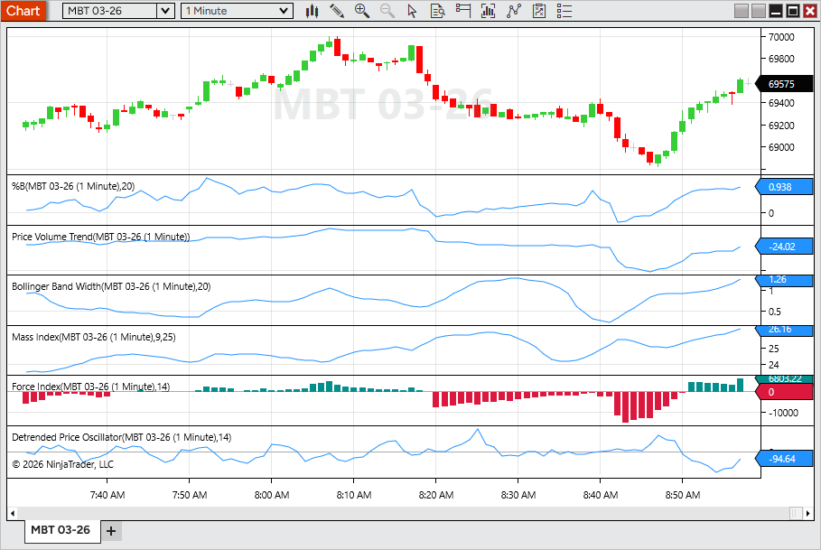     Bring more of your analysis workflow into Desktop with additional indicators now available. This update expands indicator parity across platforms, giving you access to more familiar tools and a more consistent experience between Web and Desktop. New indicators include Performance, %B, Price Volume Trend, Bollinger Band Width, Mass Index, Force Index, and Detrended Price Oscillator. Access them from the Indicators window when configuring a chart. |
| Fair Value Gap indicator enhancements Feature # 38618     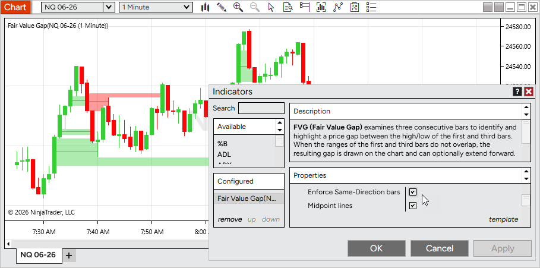     Refine your Fair Value Gap analysis with two new optional settings. Filter for stronger setups by requiring same-direction bars, and track key levels with midpoint lines drawn through each gap. To enable, open Fair Value Gap > Properties and toggle Enforce Same-Direction Bars or Midpoint lines. Both are disabled by default. |
| Market Watch Lookback view Feature # 36954     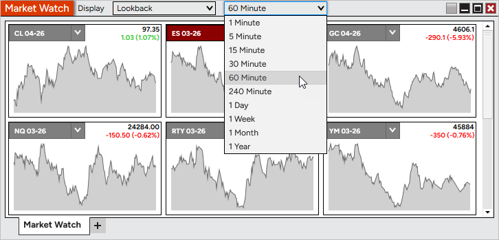     Enhance Market Watch with a new Lookback display mode. View rolling mini-charts directly within tiles to quickly understand recent price movement. Use the Display dropdown in Market Watch to switch between Net Change and Lookback, and select a lookback interval. |
| Heat Map display for Volume Profile Feature # 31516     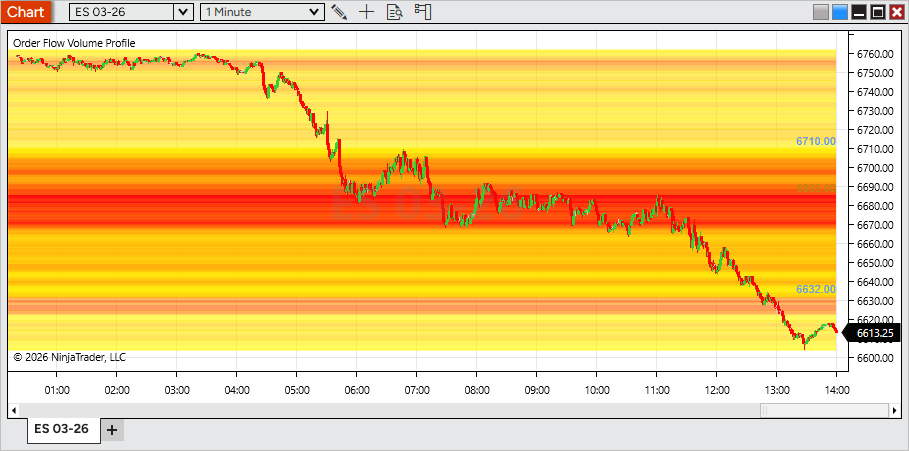     Visualize volume distribution more clearly with the new Heat Map display mode for Order Flow + Volume Profile. A color gradient highlights high- and low-volume price levels across the entire session, making key areas stand out at a glance. To enable, open the Volume Profile indicator settings and set Display mode > Heat Map. |
| Platform volume control Feature # 29787     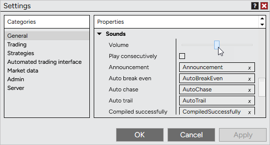     Control platform sound levels directly in NinjaTrader with a new volume setting. Adjust alerts, order fills, and other system sounds without changing your system-wide audio. To configure, go to Control Center > Tools > Settings > Sounds and adjust the Volume slider. Changes apply instantly, with a short test sound played as you adjust for quick feedback. |
| Enhanced MACD histogram coloring Feature # 34885     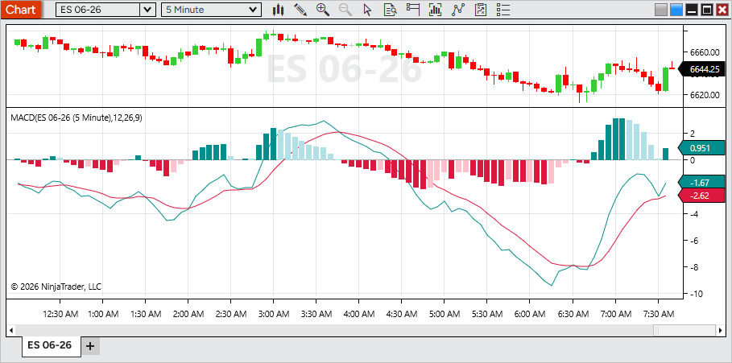     Read momentum more clearly with enhanced MACD histogram coloring. The Diff plot now uses four color states to reflect both direction (positive/negative) and whether momentum is increasing or decreasing, making shifts easier to spot at a glance. To customize, open MACD > Diff > Properties and adjust the color settings. |
| User-friendly text variables Feature # 29260     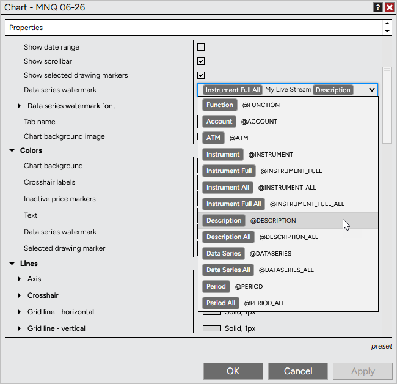     Use dynamic text more easily across the platform with improved variable handling. Variables for items like instrument, price, or data series now appear as clear, human-readable tokens instead of script-like text, making them easier to recognize and edit. Tokens can be combined with custom text and are supported in areas such as tab names, chart watermarks, and alerts, automatically updating based on what’s loaded or selected. |
| Customizable chart toolbar Feature # 29757     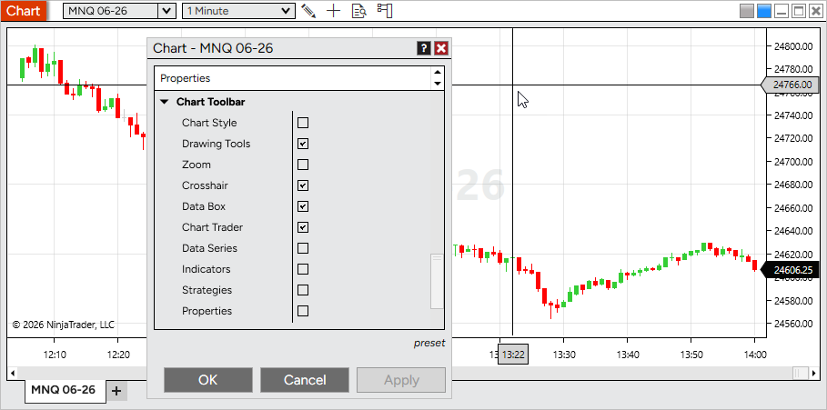     Tailor your chart by hiding toolbar icons you don’t use. This helps reduce clutter and keeps only the tools relevant to your workflow within easy reach. To customize, open Chart Properties > Chart Toolbar and toggle icons on or off. All items are enabled by default. |
| Customizable drawing tools menu Feature # 33055     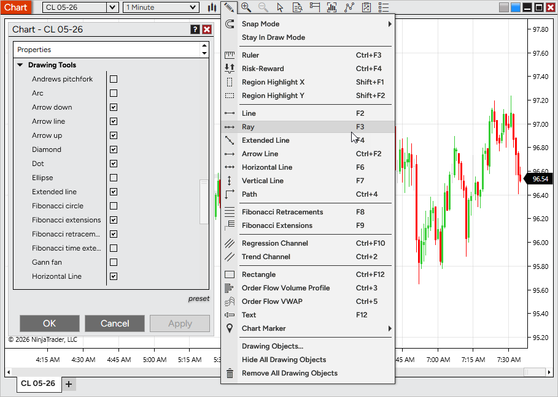     Streamline your chart interface by hiding drawing tools you don’t use. This helps keep menus focused and makes it faster to access the tools that matter most to your workflow. To customize, open Chart Properties > Drawing Tools and toggle tools on or off. All tools are enabled by default. Disabling a tool does not remove existing drawings from your chart. |
| Multiple Playback accounts Feature # 31845     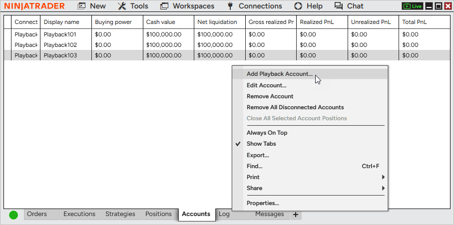     Simulate trading more realistically with support for multiple Playback accounts. Create and manage separate accounts to mirror real-world setups, test different strategies, or assign instruments across accounts. Playback accounts can be selected anywhere account selection is available during Playback. At this time, Multi provider mode must be enabled to add a additional Playback accounts |

 

| Issue # | Status | Category | Summary |
| --- | --- | --- | --- |
| 27678 | Fixed | Chart | Real-time bars could form outside of custom trading hours |
| 33975 | Fixed | Chart | Selecting a template from the right-click menu removed drawing objects set to display on all charts |
| 32655 | Fixed | Chart, Drawing Tool | Delayed data notifications made it difficult to move Drawing Tools tiles |
| 36022 | Fixed | Charts | Renko timestamps were not equal and sequential, causing related errors |
| 21507 | Changed | Control Center | Updated the remote support utility |
| 36482 | Fixed | Control Center | Message Support unexpectedly prompted a close confirmation when sending a message |
| 36617 | Fixed | Control Center | Update icon had poor visibility on dark skins |
| 32075 | Fixed | Drawing Tool | Extended Trend Channel lines did not extend correctly in certain scenarios |
| 35456 | Fixed | Drawing Tool | Selected drawing markers did not match the chart’s time format |
| 37669 | Changed | Drawing Tools | Reduced selection highlight fill opacity between markers |
| 38619 | Changed | Drawing Tools | Added mid-edge selection points to the Rectangle tool for easier vertical and horizontal adjustments |
| 38407 | Changed | Indicators | Improved indicator reference line naming and ordering for clarity |
| 32711 | Changed | Installer | Optimized the auto-installer flow to improve speed and performance |
| 33049 | Changed | Instruments | Changing instruments no longer requires a double-click |
| 34191 | Changed | Interactive Brokers | Updated connection properties to better support default ports and prevent auto logon with paper accounts |
| 34189 | Fixed | Interactive Brokers, Chart | Unsupported instruments continuously displayed a loading state |
| 33743 | Fixed | Interative Brokers | A pending account blocked connection despite other available accounts |
| 34730 | Changed | Log In | Added a descriptive error message when a passkey is required but not supported on Desktop |
| 25966 | Changed | Log, NinjaTrader Connection | Added additional network diagnostics information |
| 36016 | Fixed | Market Analyzer | Net Change Display was available as a column indicator despite being incompatible |
| 36958 | Changed | Market Analyzer | Renamed chart column property labels for improved clarity and consistency |
| 35264 | Changed | NinjaScript | Bar plots now match data series width by default for improved visibility |
| 30286 | Changed | NinjaScript Editor | Moved compile error messages to a more intuitive and accessible area |
| 30444 | Fixed | NinjaTrader Connection | Last Close values updated before market close, impacting Net Change values |
| 32981 | Fixed | NinjaTrader Connection, Order | Rejected orders were incorrectly shown as trigger pending |
| 36228 | Fixed | Order | Duplicate cancel events did not properly check if an order was already canceled |
| 37187 | Fixed | Order | Repeated order rejection modals only displayed the first message |
| 32675 | Fixed | Order Flow + | Volume Profile could hinder chart navigation |
| 35504 | Changed | Order Flow + | Replaced the unused VWAP plot color with above/below price color settings |
| 37401 | Fixed | Order Flow + | Volume Profile set to Price had an unexpected rendering where the POC was |
| 32248 | Changed | Pulse | Added right-click menu options: Remove tile, Send to, and Add instrument(s) |
| 32908 | Changed | Pulse | Improved messaging when no valid account is selected |
| 33173 | Fixed | Pulse | Selected account was not saved in the workspace |
| 33241 | Changed | Pulse | Removed the Send to FX Pro option |
| 33920 | Fixed | Pulse | Opening a second Pulse window did not load data |
| 29141 | Changed | Regionalization | Completed a translation pass for improved localization |
| 28732 | Changed | Skins | Adjusted colors on dark themes for improved visual consistency |
| 27343 | Fixed | Strategy | Rejected orders incorrectly counted toward EntriesPerDirection, preventing new orders |
| 35054 | Changed | Strategy | Reduced render cycles for order updates to improve performance |
| 29195 | Fixed | Strategy Analyzer | Enum values were sorted alphabetically during optimization |
| 35084 | Fixed | Strategy Analyzer, Workspaces | Custom performance metrics did not persist after workspace reload |
| 26982 | Fixed | Strategy Builder | Duplicate names were allowed for variables and custom series |
| 31240 | Fixed | Strategy Builder, Indicator | IchimokuCloud Value plot could not be selected |
| 33566 | Fixed | Strategy, Tick Replay | IsExitOnSessionCloseStrategy was ignored with Tick Replay enabled and CalculateOnBarClose |
| 37761 | Changed | SuperDOM | Added a triangle indicating when price is out of view |
| 32632 | Changed | Time & Sales | Added presets to Quotes |
| 35964 | Changed | Trade Mode | Updated styling for improved usability |
| 37967 | Fixed | Trade Performance, Skins | Dark text appeared on a dark background after switching themes |
| 34415 | Fixed | Vendor Licensing | Editing popup messages caused a 24-hour licensing server lockout |
| 35980 | Changed | Windows | Added a Dodger linking color |
| 30289 | Fixed | Windows | First maximize extended beyond the visible monitor area |
| 30721 | Changed | Windows | Updated the default font |

 

8.1.7.1 Release Date

June 3, 2026

| Issue # | Status | Category | Summary |
| --- | --- | --- | --- |
| 44015 | Fixed | Calendar | Economics tab could send out more HTTP calls than expected |
| 33975 | Fixed | Instruments | Added support for the Bitnomial exchange |

 

8.1.7.2 Release Date

June 17, 2026

| Issue # | Status | Category | Summary |
| --- | --- | --- | --- |
| 45396 | Fixed | Calendar | Reduced repeated authentication attempts following an authentication failure |
| 44274 | Fixed | Control Center | Restored non-overlapping notification sounds when Play consecutively is disabled |
| 41282 | Changed | NinjaTrader Connection | Improved authentication token renewal reliability to prevent connection interruptions after extended uptime, sleep/wake events, and network disruptions |
| 43809 | Fixed | Market Watch | Newly added instruments now respect the selected display mode instead of always loading in Net Change mode |
| 45540 | Fixed | Orders | Improved position update responsiveness in scenarios where available system resources were limited |
| 43657 | Changed | Regionalization | Added translations for indicator descriptions in supported languages |
| 45285 | Changed | Vendor Licensing | Updated certificate handling to maintain compatibility with future certificate changes |