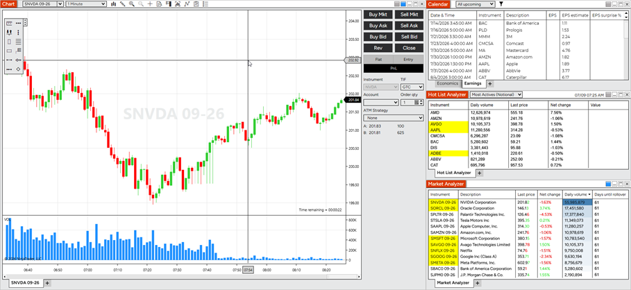
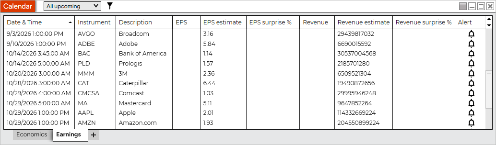
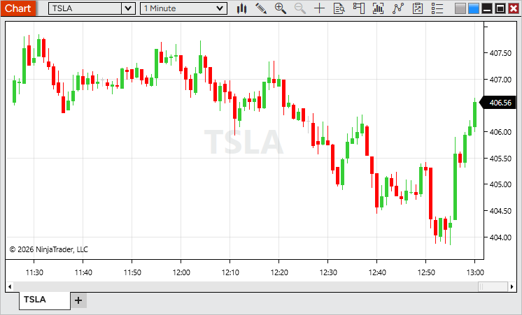
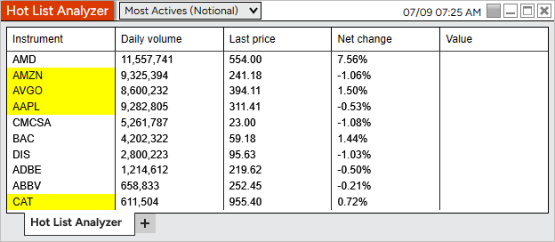
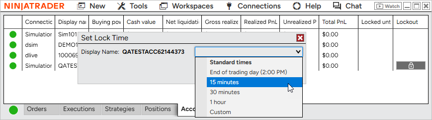

# Release Notes - NinjaTrader 8.1.8



    Release Notes > 8.1.8

8.1.8

See additional patch notes at the bottom

 

8.1.8.0 Release Date

July 21, 2026

 

| Features |
| --- |
| Single Stock Futures are here Feature # 27879          Trade leading U.S. stocks with the flexibility of futures - go long or short, benefit from lower capital requirements, and nearly 24/6 market access. |
| Single Stock Futures default Workspace Feature # 46280          Explore Single Stock Futures with a new built-in workspace designed to help you get started quickly. It includes a chart, Calendar with Economics and Earnings tabs, Stock Hot Lists, and a Market Analyzer preconfigured with popular Single Stock Futures for a complete market overview.   Access it from Control Center > Workspaces > Default Workspaces > Single Stock Futures. |
| Calendar Earnings tab Feature # 30178          Stay ahead of earnings announcements with the new Earnings tab in the Calendar. View upcoming and recent earnings, including estimated and reported EPS and revenue, along with earnings surprise percentages to quickly see how results compared to expectations.   You can also create alerts for upcoming earnings events, making it easy to stay informed about the companies you follow.   Access the Calendar from the New menu in the Control Center. |
| Stock Data Feature # 31315          Access real-time stock market data directly within NinjaTrader. Live account users can now receive data for underlying stock instruments, enabling features such as Single Stock Futures and stock market analysis.   If the required market data agreement has not been accepted, stock data will be delayed until the agreement is completed. |
| Stock Hot Lists Feature # 30181          Discover market opportunities faster with new stock Hot Lists. Track the most active stocks, top gainers, top losers, and gap up/down movers, with lists refreshed every minute to keep you up to date throughout the trading day.   Available in the Hot List Analyzer. |
| Manual lockout for prop accounts Feature # 41593          Take greater control of your trading with manual account lockout for Prop accounts on the NinjaTrader connection. Lock an account for a preset duration, until a specific time, or through the end of the trading day to help enforce your trading plan.   Starting a lockout automatically cancels working orders, flattens open positions, and prevents new orders until the lockout expires. Locked accounts are clearly indicated throughout the platform, including the Accounts tab and account selection menus.   Available from the Accounts tab in the Control Center. |
|  |

 

| Issue # | Status | Category | Summary |
| --- | --- | --- | --- |
| 46032 | Fixed | Alerts | Alerts had no sound if Windows Media Player Legacy wasn't enabled |
| 36493 | Changed | Messages | Enhanced in-app messages with rich content, including images, action buttons, and support for the Messages tab |
| 41658 | Changed | NinjaTrader Connection | Added support for upcoming connectivity improvements for certain prop providers |

 

8.1.8.1 Release Date

July 24, 2026

 

| Issue # | Status | Category | Summary |
| --- | --- | --- | --- |
| 48260 | Fixed | Alert | Improved audio alert stability during periods of high alert activity, such as when multiple alerts trigger in rapid succession |
| 47733 | Fixed | Chart | Candlestick Data Series appearance settings could reset or become uneditable after compiling NinjaScripts |
| 47550 | Fixed | General | Resolved an issue where NinjaTrader could occasionally remain running after exit |
| 47498 | Fixed | Vendor Licensing, Strategy Analyzer | Reduced unnecessary license validation requests during optimization runs |

 

8.1.8.2 Release Date

August 11, 2026

 

| Issue # | Status | Category | Summary |
| --- | --- | --- | --- |
| 49279 | Fixed | Auto Update | Clearing a skipped version now allows update notifications to appear again as expected |
| 49750 | Fixed | NinjaTrader Connection | Addressed unknown instrument messages affecting a small number of Single Stock Futures symbols (Note: Inaccessible means not enabled for trading) |
| 49515 | Changed | Continuum, CQG | Added support for Single Stock Futures |
| 50027 | Changed | Workspaces | Added a Micros tab to the Market Analyzer in the Single Stock Futures Workspace |
| 50036 | Fixed | Hot Lists | Improved Hot List stability when a connection is interrupted and re-established |
| 50086 | Fixed | Calendar | Row text now uses a theme-appropriate color, keeping it clearly readable in the Dark theme |