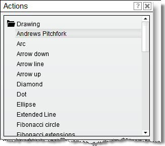
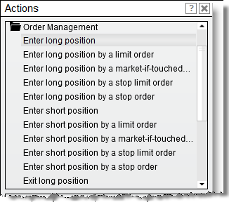
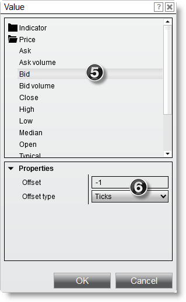
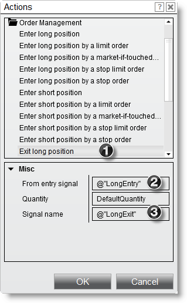
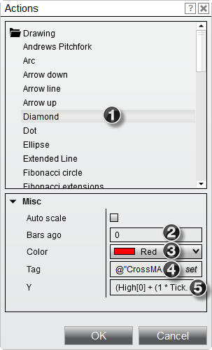
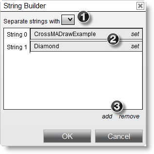
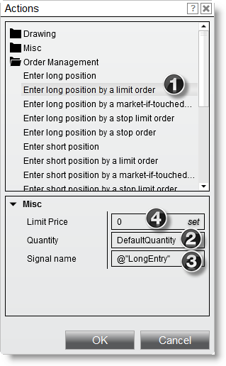
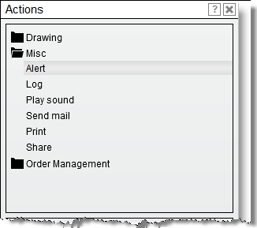
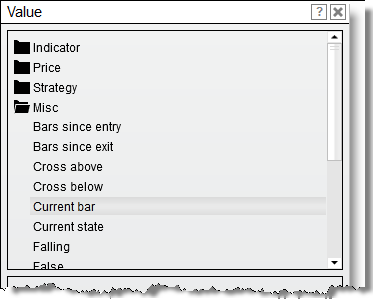

# Actions

The **Actions** window allows you to select actions to execute when a strategy condition is true, for example executing an order or visualizing outcomes via drawing objects.

---

## Understanding the Actions Window

The Actions window can be accessed via the [Conditions and Actions](strategybuilder_condition_builder.md) screen in the Strategy Builder. Within a NinjaScript strategy you can invoke miscellaneous actions, submit various order types for entering and exiting market positions, and access various drawing methods.

---

## How to Enter a Market Position

Using the various Order Management actions, you can enter a position using market, limit, market-if-touched, stop limit, and stop market orders.

Following is an example representing one of many possible combinations:

1. Expand the **Order management** category and select **Enter a long position by a limit order**.
2. You can optionally set the number of contracts/shares in the **Quantity** field, or leave it set to the default `DefaultQuantity` value which allows you to set the quantity when starting a strategy.
3. Set the **Signal name** property to any user-defined value to identify the entry (you can also leave this name blank) — here we use `LongEntry`.
4. Click the **set** button in the **Price** field to open the **Price** window.
5. Signal names are important because they are used as unique identifiers if you have more than one unique entry in a strategy. By providing unique entry signal names for each entry on a strategy, you can then identify which position you want closed via the exit position methods. Signal names are also used to identify executions on a chart visually.
6. Set the price to **1 tick below the Bid price** (see the [Condition Builder](../operations/condition_builder.md) page for more information).

When the **OK** button is pressed, an action is created that translates to:
> *"Enter a buy limit order at a price 1 tick below the current bid price to enter a long position"*

---

## How to Exit a Market Position

Using the various Order Management actions, you can exit a position using market, limit, stop market, and stop limit orders.

Following is an example representing one of many possible combinations:

1. Expand the **Order management** category and select **Exit long position** (exits via market order).
2. Set the **From entry signal** property to a named entry signal within the strategy (e.g. `LongEntry`). Providing a value will exit only the quantity associated with the position created by the named signal. Leaving it blank will exit the total net position.
3. Set the **Signal name** property to any user-defined value to identify the exit (e.g. `LongExit`, or leave blank).

When the **OK** button is pressed, an action is created that translates to:
> *"Enter a sell market order to exit from entry signal 'Long Entry'"*

---

## How to Draw on a Chart

Using the various Drawing methods, you can draw lines, text, shapes, and markers on a chart. You can review detailed information on supported drawing methods in the [Drawing Tools](../drawing_tools/drawing_tools.md) section of this Help Guide.

Following is an example representing one of many possible combinations:

1. Expand the **Drawing** category and select **Diamond**.
2. Set the **BarsAgo** parameter to `0` which will draw the diamond at the current bar's X location.
3. Set the **Color** parameter to any desired color.
4. Set the **Tag** parameter to a user-defined name that identifies this drawing object. Providing a tag is essential if you plan to draw more than one object of the same type on the same bar. By default, the builder sets this to the script name plus the draw object type. Pressing the **set** button displays the **String Builder** window to customize this further.

When the **OK** button is pressed, an action is created that translates to:
> *"Draw a red diamond above the high of the current bar plus one tick"*

### String Builder Customization

If you want to customize the drawing object tag dynamically, the **String Builder** window offers the following options:

1. Select your string separator here (possible values are `-`, `;`, `:`, or blank/default).
2. Add dynamic string components (such as Current Bar number, Timestamp, or custom labels) from the **Value** window.

3. Use the Add/Remove buttons to configure string fields.

