# Creating the Strategy via the Wizard

1. Press the "Add" button to display the "Condition Builder" window as per the image below

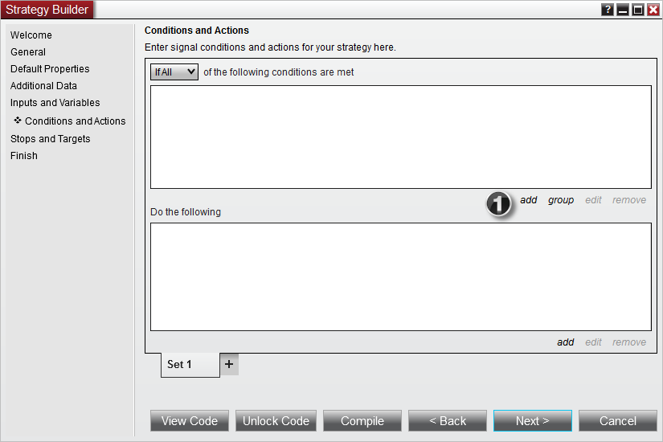

2. Expand the "Indicator" section to be able to select an indicator plot for your condition

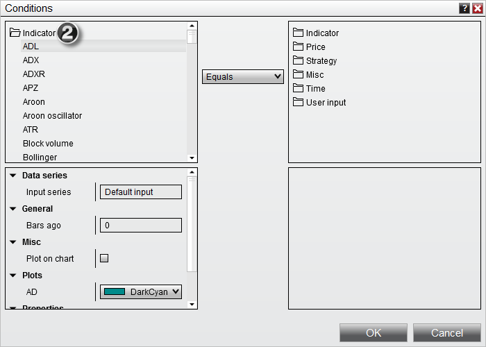

3. Scroll down and select the SMA indicator

4. Click the set menu item when your mouse is over the Period input field to select our User Defined Input parameter

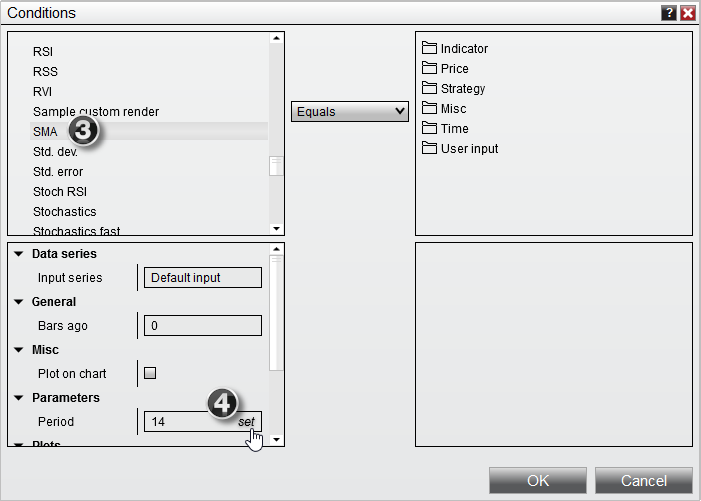

5. Select User Input > Fast to select the Fast Period user input we created, then click OK

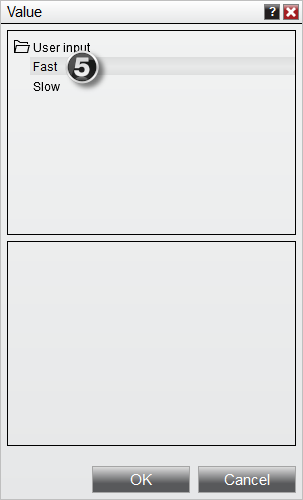

6. Enable this indicator to be plotted on a chart

7. Select "CrossAbove" and set the look back period to a value of "1"   
8. Select "SMA" indicator in the right window

9. Set the "Slow" period (just like you did for Fast in step 4)

10. Enable this indicator to be plotted on a chart, then click OK to close the Condition Builder

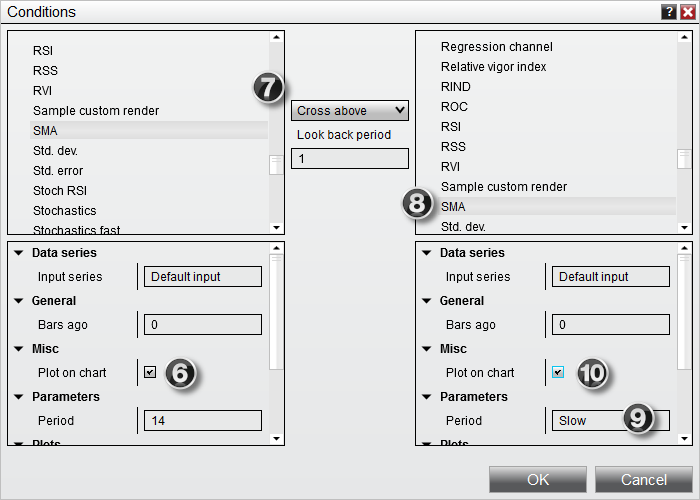

If you look at the image above, you just created an initial condition. The condition is "if the fast simple moving average crosses above the slow simple moving average".

11. Click the add button under actions to add an action for this condition

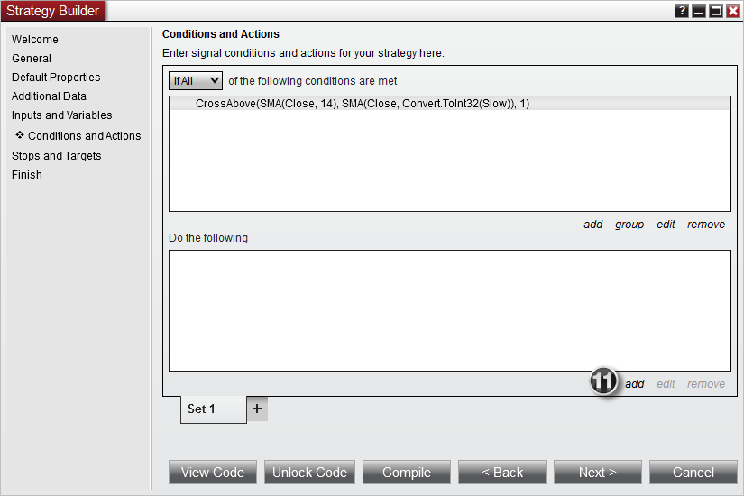

12. Select Order Management > Enter long position to have this condition fire a Buy Market Order

13. Select the OK button to add the action to the condition

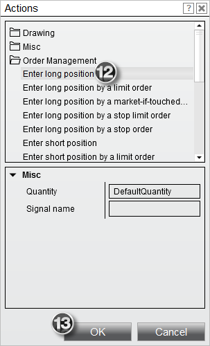

14. Right click on the "Set 1" tab and select Duplicate in New Tab to make a copy of this condition and action set

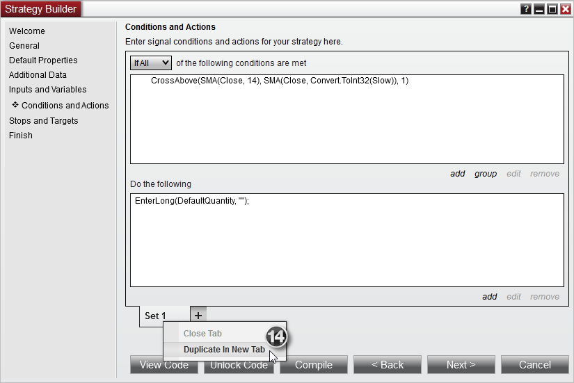

15. We will automatically be moved to the "Set 2" tab. From here, select the condition and click edit

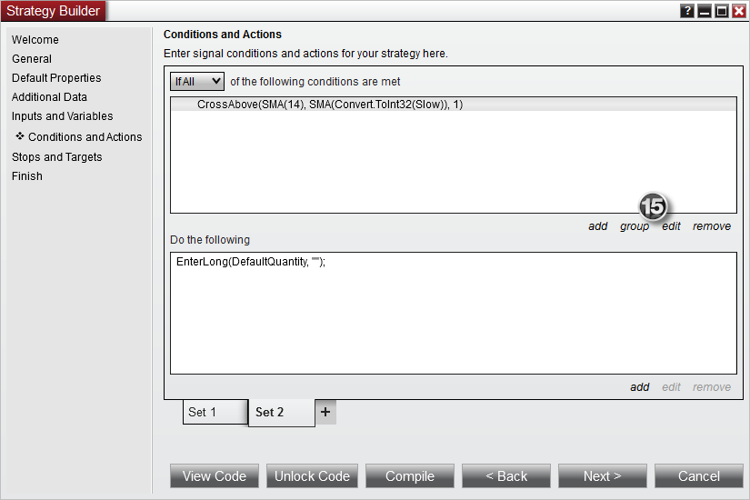

16. Change this Condition to use "Cross Below" so we can create a condition that triggers when the moving averages switch sides, then click OK

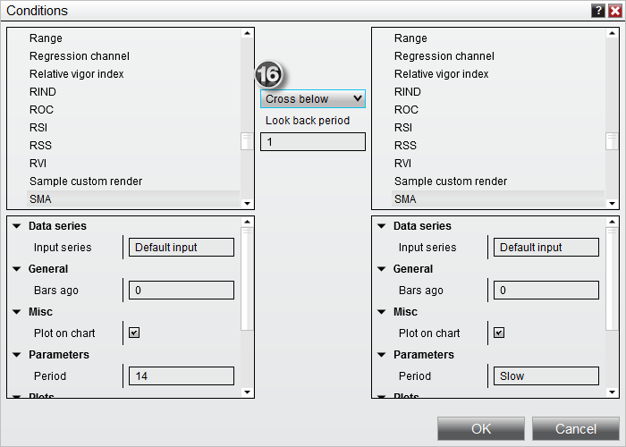

17. Click the action in the Condition Builder, and then select edit to edit the action. We will want to change this action so we sell instead of by for the reversed condition

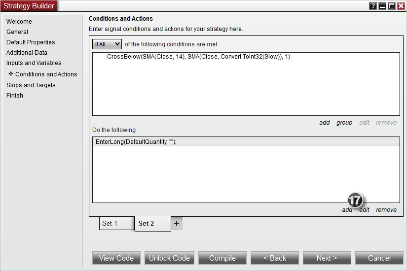

18. Under Order Management, select Enter short position to have the strategy submit a Sell Market order, then click OK.

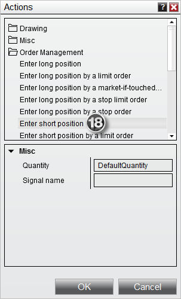

Once finished, we will have condition sets that look like the following:

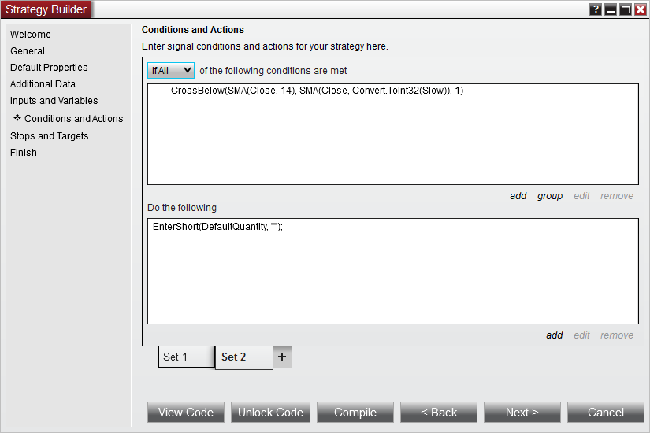