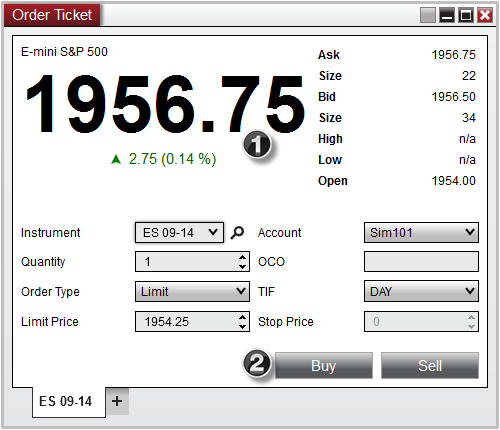
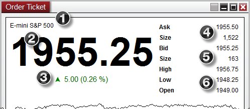
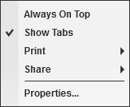
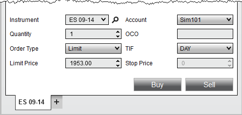

# Display Overview

To open the Order Ticket Window, select the New menu from the NinjaTrader Control Center. Then left mouse click on the menu item Order Ticket.

The image below shows the two sections in the of the Order Ticket window:

1. Market Display

2. Order Entry

> **Note:** Positions and orders will only display for the selected Account and Instrument.

> Market Display The Order Ticket will display current market data information for the selected instrument.   Market Display Definitions 1.Instrument Description  2.Last Price  3.Current day net change  4.Best ask price and ask size  5.Best bid price and bid size  6.Current day high, low, and open    OrderTicket_1

## Understanding the order control section

Order Entry Controls The Order Control region of the Order Ticket is used to specify several attributes for a pending order to be submitted.    OrderTicket_2

---

Instrument

Sets the Instrument

Account

Sets the Account

Quantity

Sets the order Quantity

OCO

Sets a user defined OCO ID

Order Type

Sets the order type to be submitted

TIF

Sets the Time in Force

Limit Price

Sets the order Limit price

Stop Price

Sets the order Stop price

Buy

Submits an order to buy

Sell

Submits an order to sell

## Understanding the right click menu

Right Click Menu Right mouse click on the Order Ticket window to access the right click menu.    OrderTicket_4

---

Always On Top

Sets if the window should be always on top of other windows

Show Tabs

Sets if the window should allow for tabs

Print

Displays Print options

Share

Displays Share options

Properties

Sets the [Order Ticket properties](properties_order_ticket.md)

