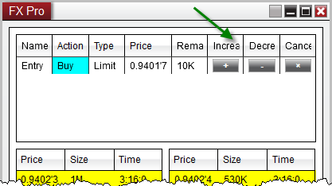
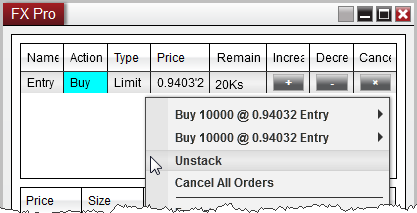
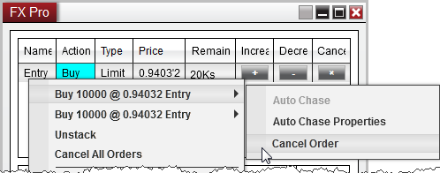
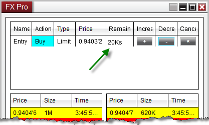

# Modifying and Cancelling Orders

You can modify an existing order's quantity, price, or cancel an order entirely from Order Grid display of the FX Pro window.

| Name / Option | Description |
| --- | --- |
| Changing the Price of an Order 1.You can increase the price of an order in tenth-pip increments by right mouse clicking on the order in the order grid and selecting "Increase Price".   2.You can decrease the price of an order in tenth-pip increments by right mouse clicking on the order in the Order Grid and selecting "Decrease Price".  3.  Double clicking on the Price field will enable the price editor which will allow you to type in a new price manually, or use the scroll wheel on your mouse to select a relative price. Tip:    Hold down the CTRL key when scrolling in the price editor to change the price in half-pip increments. Enabling Increase and Decrease ColumnsYou can optionally enable columns on the Order Grid display which will allow you to increase or decrease the price of an order using a button click. To enable these columns:  1.Right click on the FX Pro Window and select Properties  2.Expand the "Columns" section  3.Check the "Increase" and/or the "Decrease" options  4.Press "OK"  FXPro_18 1. You can increase the price of an order in tenth-pip increments by left mouse clicking on the "+" button. Holding the CTRL key down while pressing the "+" button will modify the order by half-pip increments, and holding the ALT key will modify the order by one full pip.2. You can decrease the price of an order in tenth-pip increments by left mouse clicking on the "-" button. Holding the CTRL key down while pressing the "-" button will modify the order by half-pip increments, and holding the ALT key will modify the order by one full pip. Changing the Quantity of an OrderYou can change the size of an order by double left clicking in the "Remaining" column, typing in a new quantity value and pressing the "Enter" key on your keyboard. You can also use the scroll wheel on your mouse, or left mouse click on the up/down arrows in the remaining field using the up/down arrows to scroll to a new size by 1K (1000).  |  

> **Tip:** Holding down the CTRL key and scrolling will change the FX order size by 100K (100,000)

  Changing the quantity of an existing order will submit a new order the same price to preserve your place in queue.  Your orders will now show up as "stacked" indicated by the small letter "s" next to the order. FXPro_19 If you would like to break up these orders to manage individually, you can right click on the Order and select "Unstack" FXPro_20 |

## Cancelling orders

> Cancelling an Individual Order 1. You can cancel an order by left mouse clicking on the "X" button.  2.  You can also right click on the order itself and press the "Cancel Order" menu item   Cancelling Stacked Orders If you have stacked orders, indicated by the small letter "s" in the Remaining column, you can cancel one of the orders, and leave the other remaining using the steps below:    1. Right click on the stacked order row  2. Move your mouse over the order individual order  3. Select "Cancel Order"    FXPro_21

