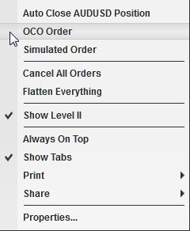
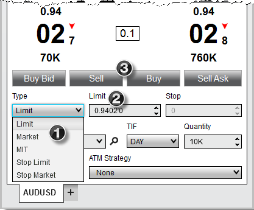
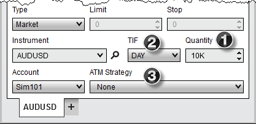
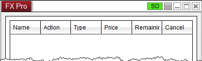
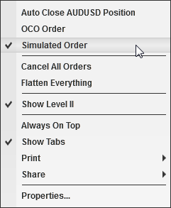
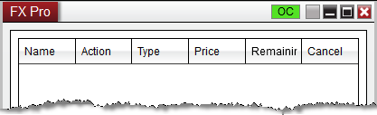
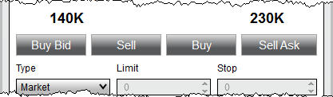

# Submitting Orders

The FX Pro window is designed for efficient order-entry. In addition to entry and exit orders, the FX Pro window also offers access to NinjaTrader's ATM Strategies. For more information on ATM Strategies, please see the [Advanced Trade Management](../operations/advanced_trade_management_atm.md) page or attend one of our [free live training events](https://ninjatrader.com/futures/livestreams).

> How to Select an Instrument There are multiple ways to select an Instrument in the FX Pro window.
- Select the Instrument Selector to open a list of recently used instruments or instruments contained in a predefined list
- With the FX Pro window selected begin typing the instrument symbol directly on the keyboard. Typing will trigger the Overlay Instrument Selector.  For more Information on instrument selection and management please see [Instruments](../language_reference/instruments.md) section of the Help Guide.   How to Select an Account A list of all connected accounts will be listed in the "Account" drop down list. To change the account select the account you wish to trade through via this drop down list.

> To Submit an Order 1.Set the order "Quantity" field ([info](../addons/quantity_selector.md))  2.Set the "TIF" (Time in Force) field ([info](../addons/tif_selector.md))  3.Set the "ATM Strategy" ([info](atm_strategy_parameters.md))  4.Enter an order with any of the methods described below  FXPro_10

## How to submit orders with quick buttons

Quick Buttons You can enter orders rapidly by pressing on any one of the quick order buttons.    FXPro_11

---

Buy Bid

Submits a Buy Limit order at the best bid price

Sell

Submits a Sell order based on the current Order Controls configured

Buy

Submits a Buy order based on the current Order Controls configured

Sell Ask

Submits a Sell Limit order at the best Ask price

## How to submit custom orders

| Name / Option | Description |
| --- | --- |
| Custom OrdersYou can place a custom order by setting order parameters.1. Select the order Type2. Set the Limit price if applicable3. Set the Stop price if applicable4. Left mouse click either the BUY or SELL button FXPro_12  |  | | --- | | Tips: 1.You can quickly retrieve the current bid or ask price in the Limit and Stop price fields using the following commands:
- CTRL + middle click in the filed to retrieve the best ask price
- ALT + middle click in the field to retrieve the best bid price   2. Hold down the CTRL key when increasing/decreasing limit/stop prices to change the price in steps of one-pip increments (10 tenth-pips)  3. Left clicking on a price in the [Level II](display_overview_fx_pro.md) panel will load that price into the limit and stop price fields automatically. | |

## Understanding the OCO (One Cancel Other) function

| Name / Option | Description |
| --- | --- |
| OCO Orders (One Cancels Other)Stop Loss and Profit Target orders (submitted automatically via an [ATM Strategy](atm_strategy.md)) are always sent as OCO, however, you can submit entry or exit orders as OCO orders as well. Why? The market may be trading in a channel and you wish to sell at resistance or buy at support, whichever comes first by placing two limit orders at either end of the channel. To place OCO orders, press down on your right mouse button inside the FX Pro window and select the menu name "OCO Order or use the short cut key CTRL+Z. FXPro_13 The "OC" (OCO indicator) will light up green at the top of the FX Pro window. All orders placed while this indicator is lit will be part of the same OCO group. Once any order of this group is either filled or cancelled, all other orders that belong to this group will be cancelled. FXPro_14 If you want each OCO order to create it's own set of Stop Loss and Profit Target orders ensure that the ATM Strategy control list is set to either <Custom> or a strategy template name before you submit each OCO order. After you have placed your orders, it is advised to disable the OCO function via the right click menu, or use the short cut key CTRL+Z. |  

> **Warning:** On 8.1.2.1 and older, after placing two orders within the same OCO group, it is important to disable OCO functionality before submitting any other orders. If you wish to place another set of OCO orders immediately after placing an initial set, first disable, then re-enable OCO before placing the second set of orders. This will generate a new OCO ID, rather than adding the new orders to an existing OCO group. On 8.1.3.0 and newer, OCO IDs will be reset when two orders have been placed with the same OCO ID, an order an OCO is canceled or rejected, and when an order with an OCO is filled.

 Break Out/Fade Entry ExampleOne of the great features of NinjaTrader is its ability to submit two entry orders, one of which will cancel if the other is filled.You can accomplish a breakout/breakdown approach by:
- Right clicking in the FX Pro window and selecting the menu item "OCO Order" to enable the OCO function
- For your first order, select the desired option from the "ATM Strategy" drop down list
- Submit your stop order to buy above the market
- For your second order, select the desired option from the "ATM Strategy" drop down list
- Submit your stop order to sell below the market

- CRITICAL: Right click in the FX Pro window and select the menu item "OCO Order" to disable OCO for future orders. For a market fade approach just substitute limit orders for stop orders. |

## How to submit Simulated Stop Orders (Simulated Order)

> Simulated Stop Orders (Simulated Order)To submit a Simulated Stop Order (entry and exit NOT Stop Loss; simulated Stop Loss orders are enabled via an [ATM stop strategy](stop_strategy.md)) you must enable Simulated Order mode via the right mouse click context menu by selecting the Simulated Order menu item.. FXPro_15 The "SO" (Simulated Order indicator) will light up green at the top of the FX Pro window. All stop orders placed while this indicator is lit will be submitted as a [Simulated Stop Orders](simulated_stop_orders.md). FXPro_16

