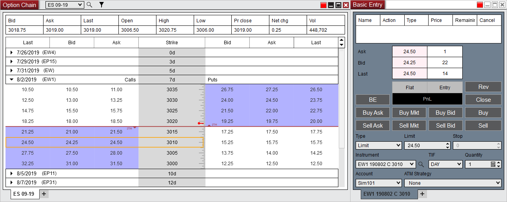

# Submitting Orders

Submitting options orders is done by linking an order entry window then clicking on a bid or ask price within the options quotes section of the Option Chain. For more information on the order entry windows please see the [[[Order Entry](order_entry.md) section of the user help guide.

> You can link the Option Chain window to an order entry window by  1) Setting a link color in the Option Chain window  2) Then setting a matching link color in an order entry window    For more information on window linking please see the [[[Using Window Linking](../operations/linking_windows.md) section of the user help guide.    OptionsChain8    To load the desired options in the order entry window  3) Click on the Bid or Ask price within the options quotes at the desired Strike price on the Calls or Puts side  4) The options instrument will then automatically be populated into the Instrument drop down menu of the order entry window    OptionsChain9
