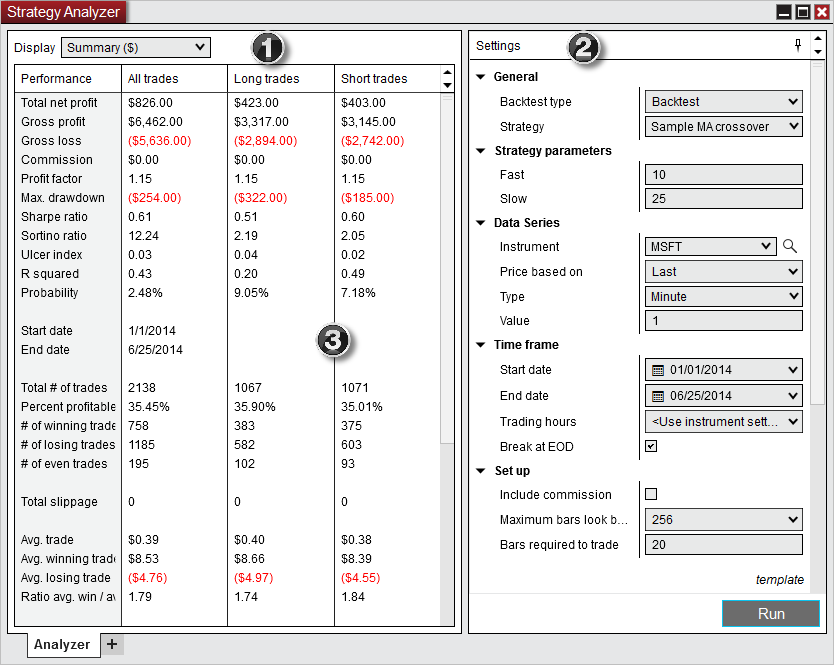
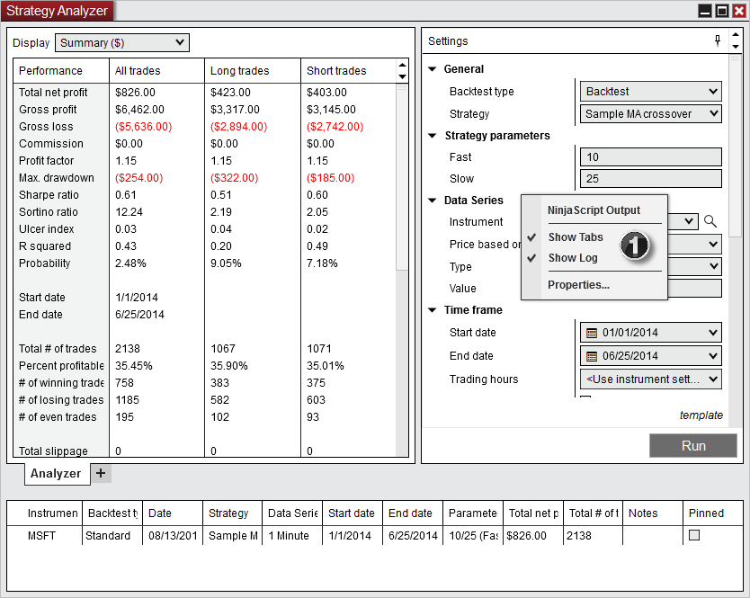

# Strategy Analyzer Layout

> playVideo

## Layout

The Strategy Analyzer window contains the following items:

1. The Display Selector sets what performance results to view and the format to view the results in.

2. The Settings panel sets the parameters to be used for the strategy backtest.

3. Where [Performance results](performance_displays.md) are displayed based on the display selection.

## Log Grid

You can toggle the log to be displayed, this shows summary details from all previous strategy backtests.

1. To show the log right click on the Strategy Analyzer and select "Show Log".

2. The Log will be made visible as shown below.

