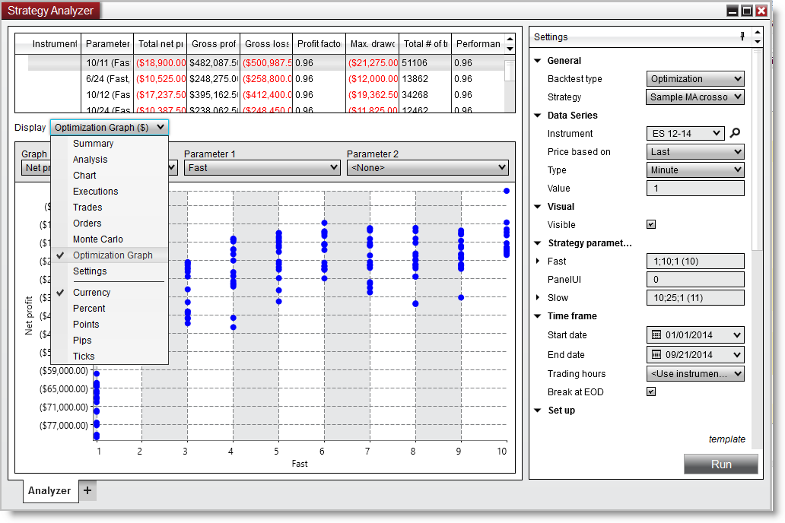


Operations \> Strategy Analyzer \> 2D \& 3D Optimization Graphs
Optimization Graphs
| \<\< [Click to Display Table of Contents](2d__3d_optimization_graphs.md) \>\> **Navigation:**     [Operations](operations.md) \> [Strategy Analyzer](strategy_analyzer.md) \> Optimization Graphs | [Previous page](running_a_monte_carlo_simulati.md) [Return to chapter overview](strategy_analyzer.md) [Next page](discrepancies_real-time_vs_bac.md) |
| --- | --- |
The Optimization Graph can only be selected in the Display selector only after an optimization has been run. The optimization graph can be displayed in a 2D or 3D graph. A 2D graph is used when only graphing a single parameter. If you graph 2 parameters then a 3D graph is displayed.
 

| Understanding the 2D Optimization Graph The 2D optimization graph displays each and every test run for the optimization. This allows you to see the entire range of results produced from an optimization run. Allowing you to take a look over the entire solution domain to determine if your top results are stable. Instead of choosing the absolute best parameter set that might be an outlier you may instead desire to choose a parameter that has a gradual build up which may indicate stability in the result set.    The 2D Optimization graph will be displayed when you have only selected a single parameter and is the default graph view.      | Note: Selecting a 2nd Parameter will switch to the 3d graph. | | --- |      Using the 2D Optimization Graph Each dot signifies a backtest result, graphed by the X\-Axis and the Y\-Axis. The X\-Axis can be changed by selecting the Graph parameter. |
| --- | --- |

| StrategyAnalyzer_OptimizationGraph3d   Understanding the 3D Optimization Graph The 3D optimization graph expands upon the 2D optimization graph by allowing an additional axis to place an additional parameter. You must have at least 2 parameters being optimized and with the 'Parameter 2' combo box select the secondary parameter. This will trigger the display of the 3D optimization graph. Select 'None' to return to the 2D optimization graph.    Using the 3D Optimization Graph Using the following mouse controls you can interact with the 3D optimization graph.     | Pan | Press the Middle Mouse Button to pan the graph | | --- | --- | | Orbit | Pres the Left Mouse Button to rotate / orbit the graph | | Zoom | Use the Scroll Wheel to zoom in / out | |
| --- | --- | --- | --- | --- | --- | --- |
