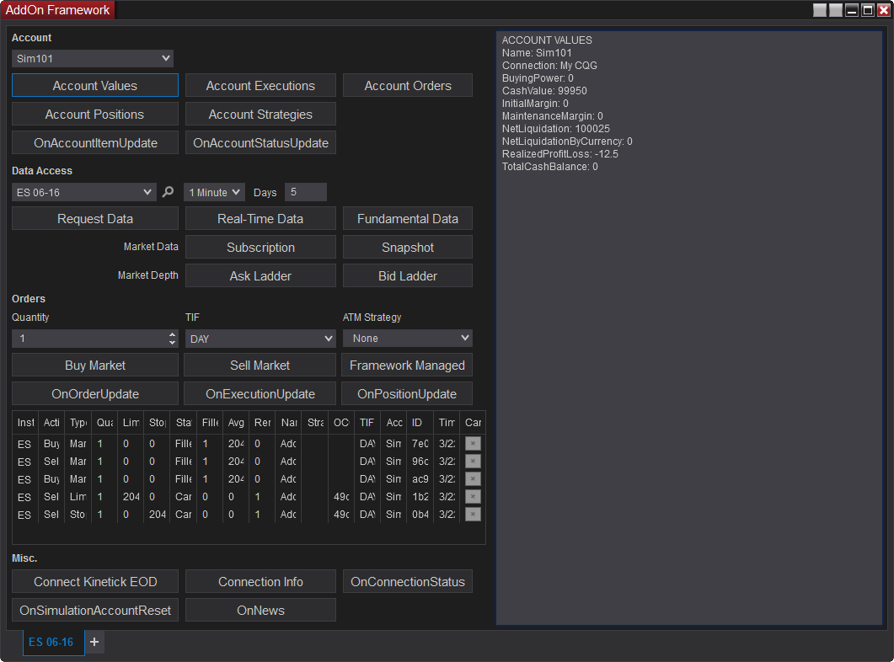
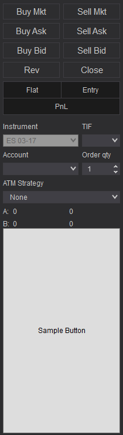


NinjaScript \> Educational Resources \> AddOn Development Overview

AddOn Development Overview
| \<\< [Click to Display Table of Contents](addon_development_overview.md) \>\> **Navigation:**     [NinjaScript](ninjascript.md) \> [Educational Resources](educational_resources.md) \> AddOn Development Overview | [Previous page](educational_resources.md) [Return to chapter overview](educational_resources.md) [Next page](developing_add_ons.md) |
| --- | --- |
## AddOn Development Basics
The NinjaScript AddOn framework provides functionality reaching across the NinjaTrader platform while granting access to certain core methods and properties not contained within the NinjaScript namespace. In addition to creating your own independent window or modifying the user interface and functionality of existing NinjaTrader windows (charts, etc.), AddOns can also subscribe to live market data, access account information, and more. 
## 
| Note: Most of the topics covered on this page and its sub\-pages can be seen in a fully functional example of the AddOn Framework accessible on this page.  There are two versions deployed when you can access depending on your desired development environment.  The pros and cons of each approach are described in the following section.  In either version, the heavily commented code in the example can supplement the information on these pages to provide deeper insight. |
| --- |

## 
## NinjaScript Editor Development Environment (NinjaScript Basic)
The NinjaScript Editor can be used to create and write custom AddOns in C\#
## 
Pros
- Use the familiar [NinjaScript editor](editor.md) (if you are uncomfortable with Visual Studio)

- Changes to the AddOn are reflected immediately upon NS Editor Compile and does not require restart

 
Cons
- If you wish to design a custom NTWindow, XAML files cannot be edited in the NinjaScript editor.

- NinjaScript editor lacks support of common development and debugging tools available in an IDE's like Visual Studio

 
Below is a NinjaScript Editor compatible zip file (which also contains a XAML file)
- Download [AddOn Framework NinjaScript Basic](https://ninjatrader.com/support/helpGuides/nt8/samples/Addon_Framework_NinjaScript_Basic.zip) file to your desktop

- From the Control Center window select the menu Tools \> Import \> NinjaScript

- Select the downloaded file

 
Once imported, the AddOn can be launched via the New menu in the Control Center
## 
## AddOn Development Environment (Visual Studio Advanced)
Since AddOns can include multiple classes, unique user interfaces, and various file types (XAML, sounds, etc.), the recommended development environment for AddOns differs from other NinjaScript Types. Following the guidelines below to set up an AddOn development environment can help to streamline the process.
 
Pros
- Use Visual Studio or a comparable IDE to create a solution linking all project files together

- Use your IDE to build a DLL, rather than exporting through NinjaTrader

- This will allow you to bundle XAML and other files into the DLL

- Set a post\-build event to place the DLL into the appropriate folder (NinjaTrader 8/bin/Custom)

- Set a Debug Start Action to launch NinjaTrader

 
Cons
- NinjaTrader needs to be restarted in order to re\-load the compiled DLL after changes

 
If you use this setup and build a DLL with your IDE, the IDE will automatically place it where it needs to be and immediately launch the platform for testing any changes.
 
Below is a complete Visual Studio project with this setup in place. Simply unzip the contents of this archive to your desired location, then open the "NinjaTraderAddOnProject.sln" solution in Visual Studio.
 
[Download Visual Studio Solution for AddOn Development](https://ninjatrader.com/support/helpGuides/nt8/samples/NinjaTraderAddOnProject.zip)
 
| Notes:  - This Visual Studio solution cannot be imported into NinjaTrader.  It must be opened in Visual Studio.- The default behavior of the project file uses the following path in the Start Action: C:\\Program Files (x86\)\\NinjaTrader 8\\bin64\\NinjaTrader.exe. If you have installed NinjaTrader in a different directory, you will need to adjust the file path accordingly.- The solution targets .NET 4\.8 with NinjaTrader Release R23 or higher, if you open it in a lesser .NET version Visual Studio will prompt you to download the required higher version SDK. |
| --- |

 
## Creating Your Own AddOn Window
NinjaScript developers can utilize the AddOn framework to create free\-standing, independent windows to provide custom functionality. Helper classes are available in the framework to instantiate windows styled the same as pre\-built NinjaTrader windows, including familiar functionality such as window linking, the tabbed interface, and the ability to save the window and its state in workspaces. In addition, general WPF user interface elements and XAML can be used to style and modify windows using the .NET framework. 
 
For a detailed walkthrough of creating your own window using NinjaScript helper classes, see the [Creating Your Own AddOn Window](creating_your_own_addon_window.md) page.
 

 
The image above shows a completely new window created by a custom AddOn.
 
## Other Uses for an AddOn
An AddOn does not require its own window to function. It can instead be used to accomplish non\-UI\-driven functionality across the platform, such as monitoring market data or accessing account, position, and order information. AddOns can also be used to add functionality or interface elements to other NinjaTrader windows, such as charts. 
 
For detailed information on other common uses of an AddOn, see the [Other Uses for an AddOn](other_uses_for_an_addon.md) page.
 

 
In the image above, the custom "Sample button" button has been drawn on a chart window using an AddOn.
