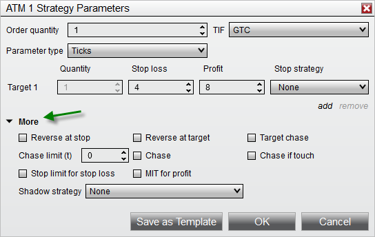


Operations \> Advanced Trade Management (ATM) \> ATM Strategy \> Advanced Options
Advanced Options
| \<\< [Click to Display Table of Contents](advanced_options.md) \>\> **Navigation:**     [Operations](operations.md) \> [Advanced Trade Management (ATM)](advanced_trade_management_atm.md) \> [ATM Strategy](atm_strategy.md) \> Advanced Options | [Previous page](tutorial_atm_strategy_example2.md) [Return to chapter overview](atm_strategy.md) [Next page](auto_chase.md) |
| --- | --- |
All NinjaTrader order entry windows that offer ATM Strategies also include the Advanced Options.  The Advanced Options include: [Shadow Strategy](shadow_strategy.md), [Auto Chase](auto_chase.md), and [Auto Reverse](auto_reverse.md) features.  You will find the Advanced Options from the [ATM Strategy Parameters](atm_strategy_parameters.md) window by clicking on the More text (see the green arrow in the image below) which will expand these additional features.
 
 
 
| Reverse at Stop | This will enter a position in the opposite direction, using the same ATM parameters, when a stop loss is hit |
| --- | --- |
| Reverse at Target | This will enter a position in the opposite direction, using the same ATM parameters, when a profit target is hit |
| Target Chase | This will cause a profit target to move towards the market price, as price moves away from the target |
| Chase | This will cause a Limit entry order to move towards the market price as it moves away |
| Chase if Touch | Enables the Chase function only if the order has been touched |
| Stop Limit for Stop Loss | When enabled, this will cause Stop Limit orders to be used for stop losses (default is unchecked, so Stop Market used) |
| MIT for Profit | When enabled, this will cause MIT orders to be used for profit targets (default is unchecked, so Limit is used) |
 
| Note: The "Stop Limit for Stop Loss" will not apply to Equities or Forex instruments \- if this property is enabled when trading a stock or forex instrument, Stop Market orders will be used, instead. |
| --- |

