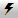



Operations \> Advanced Trade Management (ATM) \> ATM Strategy \> ATM Strategy Selection Mode

ATM Strategy Selection Mode

| \<\< [Click to Display Table of Contents](atm_strategy_selection_mode.md) \>\> **Navigation:**     [Operations](operations.md) \> [Advanced Trade Management (ATM)](advanced_trade_management_atm.md) \> [ATM Strategy](atm_strategy.md) \> ATM Strategy Selection Mode | [Previous page](atm_strategy_parameters.md) [Return to chapter overview](atm_strategy.md) [Next page](stop_strategy.md) |
| --- | --- |

Most of the NinjaTrader order entry screens have three modes that you can set to determine the behavior of the ATM Strategy selection control list upon submission of an order that enters the market/initiates an ATM Strategy. You can set this mode via the order entry screen's Properties dialog window that is accessible via the right mouse click context menu.

 

Before reviewing this section you should have a thorough understanding of how the strategy control list determines what actions (if any) to take when a submitted order is filled. Please review the video and content in the preceding page [ATM Strategy Parameters](atm_strategy_parameters.md).

 

| playVideo |
| --- |
|  |

 

As a quick reminder, when the strategy control list is set to:

\<None\> \- Orders submitted take no action once filled or part filled (no stops or targets are placed)

\<Custom\> \- Orders submitted will initiate the custom defined ATM Strategy (submission of stops and targets) once filled or part filled

\<My Strategy Template Name\> \- Orders submitted will initiate your user defined ATM Strategy (submission of stops and targets) once filled or part filled

\< 

 

There are three available ATM Strategy Selection Modes:

•Select Active ATM Strategy on Order Submission

•Keep Selected ATM Strategy Template on Order Submission

•Display Selected ATM Strategy Only

        [Understanding the "Select Active ATM Strategy on Order Submission" mode](javascript:HMToggle('toggle','UnderstandingTheselectActiveAtmStrategyOnOrderSubmissionMode','UnderstandingTheselectActiveAtmStrategyOnOrderSubmissionMode_ICON'))

| Select Active ATM Strategy on Order Submission This mode will automatically select the newly created active ATM Strategy on entry order submission in the ATM Strategy control list. This is the default setting upon initial NinjaTrader installation.   Who is this mode designed for? This mode is designed for traders who want the existing strategy Stop Loss and Profit Targets to be automatically amended when they scale into or out of a position being managed by an ATM Strategy by default.   Example (see image below) 1\. A user defined ATM Strategy is selected. 2\. Once the entry order is submitted, the ATM Strategy selection control automatically selects the active ATM Strategy that you just created (\< active_atm My Strategy Template Name \- X\>).    ATM_12   ATM_13     | Note: When using multiple tabs, all tabs will select the same ATM or their own active ATM. With Select Active ATM Strategy on Order Submission, once you place an order your active ATM will be selected. Since the other tabs with different instruments would not be using that same active ATM, they will be set back to None or their own active ATM. | | --- | |
| --- | --- |

        [Understanding the "Keep Selected ATM Strategy Template on Order Submission" mode](javascript:HMToggle('toggle','UnderstandingThekeepSelectedAtmStrategyTemplateOnOrderSubmissionMode','UnderstandingThekeepSelectedAtmStrategyTemplateOnOrderSubmissionMode_ICON'))

| Keep Selected ATM Strategy Template on Order Submission This mode will keep the currently selected ATM Strategy template selected in the strategy control list upon order submission.   Who is this mode designed for? This mode is designed for traders who by default, want to always create a new set of Stop Loss and Profit Target brackets (new ATM Strategy) with each new order placed. An example of this would be a trader who wanted a single bracket placed with a Stop Loss of four ticks and a Profit Target of eight ticks. The trader wants to place two entry limit orders, the first at a price of X and the second at a price of X \- 2 ticks. The purpose is to scale into an overall position but have the brackets be submitted and calculated from each individual fill price of the two orders.   Example (see image below) 1\. A user defined ATM Strategy is selected. 2\. Once the entry order is submitted, there will be no change in selection in the ATM Strategy control list. It will continue to look like the upper right image as the same ATM Strategy is automatically reselected after each order.   ATM_12   ATM_14 |
| --- |

        [Understanding the "Display Selected ATM Strategy Only" mode](javascript:HMToggle('toggle','UnderstandingThedisplaySelectedAtmStrategyOnlyMode','UnderstandingThedisplaySelectedAtmStrategyOnlyMode_ICON'))

| Display Selected ATM Strategy Only This mode is an advanced mode and should only be used once you have become very familiar with the NinjaTrader application.   Who is this mode designed for? This mode is designed for traders who want to run concurrent ATM Strategies (trades) in the same market. This mode will visually separate all concurrent running ATM Strategies thereby allowing you to have multiple SuperDOMs open, tracking the same market but displaying different trade strategies. A practical example might be that you have taken a day long intra day swing trade against a fifteen minute chart for five contracts. Throughout the day, you scalp the same market on a one minute time frame. This mode allows you to have two SuperDOMs open, one allocated to manage and only display your day long intra day swing trade, the other used to manage and only display your scalp trades.   Example (see image below) In the image right, you can see two separate SuperDOMs monitoring the same ES 09\-14 market. In the ATM Strategy control list, there are two different ATM Strategies running and each is displayed separately in an individual SuperDOM. Orders, positions, average entry and unrealized profit are displayed individually for each separate running ATM Strategy. •When running multiple concurrent ATM Strategies by changing the selected active strategy in the strategy control list you can change which strategy will be displayed •When you select \<None\> in the strategy list, all working orders and ATM Strategies will be displayed •The position display will display the number of contracts being managed by the ATM Strategy and then your net position size. The box is color coded to the ATM Strategy's market position. So if your ATM Strategy is long, the box will be colored green. Using the first image on the right as an example, it shows "3 \- 4L" in a green box. Green indicates the ATM Strategy is long, the number 3 indicates that there are 3 contracts being managed by that ATM Strategy and 4L indicates the account actually holds 4 contracts long. What it is saying is; that we are running a long ATM Strategy that is managing 3 of 4 contracts that are held long in my account. The image on the right is managing 1 of the 4 long contracts. •When you do not have any active ATM Strategies selected, the SuperDOM position display will display your net account position •Pressing the "CLOSE" button while an active ATM Strategy is selected will close only that ATM Strategy. If anything else is selected, it will close the entire account position including all other working ATM Strategies.   ATM_15     | Critical: When a SuperDOM is set to this mode, it will only display orders associated to the active selected ATM Strategy in the ATM Strategy control list. This means that if there are other orders working in the selected market that are not associated to the ATM Strategy, you will not see them displayed. The risk is that you could have orders working, you forget about them or did not even know they were still working, they are filled and you could damage your trading account. Please fully understand how to use this powerful feature before putting it to use. | | --- | |
| --- | --- |

