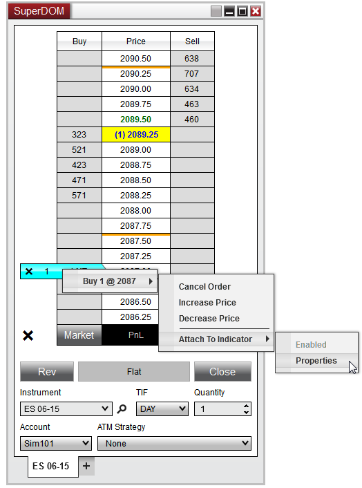


Operations > Order Entry > Attaching Orders To Indicators

Attaching Orders To Indicators
| << [Click to Display Table of Contents](attachingorderstoindicators.md) >> **Navigation:**     [Operations](operations.md) > [Order Entry](order_entry.md) > Attaching Orders To Indicators | [Previous page](order_entry.md) [Return to chapter overview](order_entry.md) [Next page](simulated_stop_orders.md) |
| --- | --- |
## Indicator Tracking
Adding indicators to the SuperDOM or Chart Trader gives you the ability to "attach" a working order to the Indicator price level, which will automatically modify the price of the order as your indicator values change.  The frequency of the modifications will depend on the Calculate settings of the indicator.
   

After you have configured an indicator to be displayed on the SuperDOM or Chart Trader, right clicking on a working order will now have a right click menu option called "Attach to Indicator".  This feature will be available for both manually placed Entry/Exit orders as well as pre-configured [ATM Strategy](atm_strategy.md) Stop Loss and Profit Target orders.
## 
| playVideo |
| --- |
|  |

 
| Note: ATM Strategies will only work with Attach to Indicator for stop orders which do not have a [Stop Strategy](stop_strategy.md) configured.  Enabling Attach to Indicator on an ATM Strategy which has an associated Stop Strategy will disable the Stop Strategy and will then be managed by the indicator instead. |
| --- |

 

        [Attaching an order to an indicator](javascript:HMToggle('toggle','AttachingAnOrderToAnIndicator','AttachingAnOrderToAnIndicator_ICON'))
| Configuring Attach to Indicator Properties To setup the parameters to Attach to Indicator:   1.Right mouse click on a submitted order2.Hover your mouse cursor over the order details3.Navigate to the Attach to Indicator menu4.Left mouse click on the Attach to Indicator Properties menu item  This will open an Attach to Indicator Properties window which will allow you to define the following properties:     | Indicator | Selects the indicator plot* which is used for the indicator tracking | | --- | --- | | Offset (ticks) | The number of ticks (+/-) the order will follow the indicator value | | Modify toward last price only | Enables / Disables the ability to hold the order price and only modify should the indicator change to a price closer to the last traded price.  This prevents orders from modifying to price that would be worse than the previous value. |      SuperDOM_41   After you have configured your desired settings, pressing the OK button will automatically enabled Attach to Indicator on the order you configured which will immediately modify the order price if necessary.   SuperDOM_42     | Note:  Many indicators will have multiple plots.  Please ensure you are selecting the correct plot and that the current values would be valid for the order you are attaching to the indicator to prevent unwanted fills or order rejections.  For example, attaching a Buy Limit order to the Upper Band of a Bollinger indicator that is currently above the current market price will automatically modify that order to above the market price resulting in an immediate fill. | | --- | |
| --- | --- | --- | --- | --- | --- | --- | --- |

        [Disabling indicator tracking](javascript:HMToggle('toggle','DisablingIndicatorTracking','DisablingIndicatorTracking_ICON'))
| Disabling Indicator Tracking Orders that are attached to an indicator will be 100% managed by the Attach to Indicator feature.  Should you attempt to manually modify an order, you will receive a prompt reminding you that this order is being managed by an Indicator.  If you wish to manually modify the order, you can select "Yes" to on this prompt to disable the indicator management and allow you to change the order price if desired.   SuperDOM_43   You can also disable Attach to Indicator through the right click menu on the order itself allowing you to re-configure your Attach to Indicator Properties if desired.   1.Right mouse click on a submitted order2.Hover your mouse cursor over the order details3.Navigate to the Attach to Indicator menu4.Uncheck Enabled which will disable indicator tracking  As long as the order has not been filled/cancelled, you can always go back to this menu and re-check enabled to turn the Attach to Indicator  feature back on. |
| --- |
