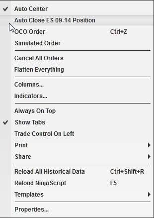


Operations \> Advanced Trade Management (ATM) \> Auto Close Position
Auto Close Position
| \<\< [Click to Display Table of Contents](auto_close_position.md) \>\> **Navigation:**     [Operations](operations.md) \> [Advanced Trade Management (ATM)](advanced_trade_management_atm.md) \> Auto Close Position | [Previous page](manage-server-side-atm-templat.md) [Return to chapter overview](advanced_trade_management_atm.md) [Next page](alerts.md) |
| --- | --- |
## Automatically Closing Positions at a Specific Time
Auto Close Position is a strategy that will automatically close your position at an user defined time. A position will be closed using the NinjaTrader close algorithm. The user defined close time can be set via the "Auto  Close Position \- Time" property located in the [Trading](options_trading.md) category of the [General Options](options.md) menu. You can enable or disable this strategy via any NinjaTrader order entry screen's right mouse click context menu.
 

 

